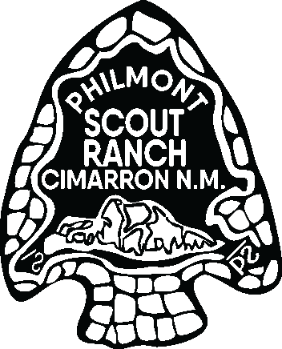

# ADVISOR’S GUIDEBOOK

## PHILMONT SCOUT RANCH

## 2025

---

#### TABLE OF CONTENTS

Welcome …………………………………………………………………………………………………………………………………………….
2
General Information …………………………………………………………………………………………………………………………… 3
Scouting America Registration ..………………………………………………………………………………………………………….. 4
Co-ed/Female Crew Leadership Requirements …………………………………………………………………………………… 5
Philmont Crew ……………………………………………………………………………………………………………………………………. 6
Tenting Policies …………………………………………………………………………………………………………………………………… 7
Advisors ………………………………………………………………………………………………………………………………………………
7
Youth Leadership ………………………………………………………………………………………………………………………………… 8
Practicing the Patrol Method ……………………………………………………………………………………………………………… 11
Advisor’s Packet …………………………………………………………………………………………………………………………………. 11
Philmont Camping Gateway ………………………………………………………………………………………………………………… 12
Expedition Number ……………………………………………………………………………………………………………………………… 13
Financial Fees ……………………………………………………………………………………………………………………………………… 14
Scholarships ………………………………………………………………………………………………………………………………………… 15
Refund Policy ………………………………………………………………………………………………………………………………………. 16
Crew Budget ………………………………………………………………………………………………………………………………………… 17
High Adventure Committee …………………………………………………………………………………………………………………. 18
Suggested Program for Parent Rally ……………………………………………………………………………………………………… 20
Expedition Training & Planning ……………………………………………………………………………………………………………. 23
First Aid & Health ………………………………………………………………………………………………………………………………… 24
Wilderness First Aid & CPR Training ……………………………………………………………………………………………………… 25
First Aid Kit …………………………………………………………………………………………………………………………………………… 27
Scouting America Annual Health & Medical Record (AHMR) ………………………………………………………………… 27
Height & Weight Restrictions ………………………………………………………………………………………………………………. 28
Philmont Scout Ranch Horseback Riding Policy ……………………………………………………………………………………. 29
Medical Conditions ………………………………………………………………………………………………………………………………. 30
Risk Advisory ………………………………………………………………………………………………………………………………………… 32
Travel & Transportation ………………………………………………………………………………………………………………………… 33
Philmont Days ………………………………………………………………………………………………………………………………………. 33
Meals Provided by Philmont …………………………………………………………………………………………………………………. 34
Transportation Services ………………………………………………………………………………………………………………………… 35
Lodging In & Around Cimarron ……………………………………………………………………………………………………………… 37
Fishing Licenses ……………………………………………………………………………………………………………………………………. 38
Pack Rental ……………………………………………………………………………………………………………………………………………. 39
Shipping Procedures ……………………………………………………………………………………………………………………………… 39
Crew Lockers & Security ………………………………………………………………………………………………………………………… 39
Smartphones …………………………………………………………………………………………………………………………………………. 40
Drones …………………………………………………………………………………………………………………………………………………… 40
Day One at Philmont ……………………………………………………………………………………………………………………………… 40

---

#### 2025 Advisor Guidebook

###### Welcome to Philmont Scout Ranch!

This Guidebook is designed to assist units and council contingents in planning a successful Philmont adventure. Your
journey has already begun, and proper preparation now will result in a smoother, more enjoyable expedition.

It is important that each adult Advisor becomes familiar with every aspect of the trip. Equally important is sharing
information with participants and their parents. Philmont is not like your local Scout camp, and we understand that
Philmont might not be for everyone.

Philmont is hard! The stamina required to hike Philmont is much greater than you may be used to due to the distances
traveled, elevation changes, and the overall duration of the trek. It is important that everyone is aware of potential
hazards, so every participant should understand Philmont’s Risk Advisory, which can be found in the Scouting America
Annual Health and Medical Record.

###### Refer to: https://www.philmontscoutranch.org/philmonttreks/trekrequirements/risks/.

Philmont places emphasis on physical preparation including a detailed Annual Health and Medical Record. Crews should
carefully select participants, taking height/weight and medical conditions into consideration.

A Philmont trek is a crew-based, youth-led activity. Youth crew members fill the leadership positions; the adult crew
members provide advice and guidance to them. Advisors provide this to the entire crew, not just their own children.

Philmont and Scouting America expect that all participants will conduct themselves in a Scout-like manner. An
estimated 22,000 participants attend Philmont every summer from across the nation and the world. While this provides
an enriching experience for participants, it also requires a great deal of respect for each other. Let the Scout Oath and
Law guide your crew in ALL situations.

Please read this guide carefully and distribute it to your other advisors. Both experienced and new Advisors will find the
answers to many of their questions regarding their upcoming Philmont trek within the following pages. Good luck as
you continue to prepare for the trek of a lifetime! We look forward to serving you and your crew.

Matt Hart | Director of Camping
SCOUTING AMERICA
Philmont Scout Ranch
17 Deer Run Road
Cimarron, NM 87714
P 575.376.2281 | F 575.376.2636

www.PhilmontScoutRanch.org
www.PhilmontTrainingCenter.org
www.facebook.com/philmontscoutranch

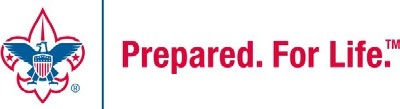

##### “Delivering Wilderness Adventures that Last a Lifetime"

# Welcome

---

#### 2025 Advisor Guidebook

Who may participate?
In keeping with the policies of Scouting America, rules for participation are the same for everyone without regard to
race, color, national origin, religion, age, sex, gender, sexual orientation, marital or familial status, genetic information,
citizenship status, protected activity, or any other status or classification protected by applicable federal, state, and/or
local laws.

Participants must be registered members of Scouting America who will be 14 years of age OR have completed 8th grade
and be at least 13 years of age prior to participation. DO NOT request or expect any exceptions to this rule.
Some special programs allow for individual person registration and participation. A crew must have a majority of its
members under age 21. Each participant must be capable of participating in the backpacking or horseback riding trek.
Please note that specific programs may have additional requirements for participation including but not limited to a 210
lb. weight limit for Cavalcades and horse rides. Each participant must meet the health requirements as outlined in the
Annual Health and Medical Record.

Harassment, Hazing, Initiations, & Discipline
Philmont and Scouting America prohibit language or behavior that belittles or puts down members of the opposite sex,
unwelcome advances, racial slurs, chastisement for religious or other beliefs, or any other actions or comments that are
derogatory of people. Any form of hazing, initiation, ridicule, inappropriate teasing, or bullying is prohibited and will not
be allowed. Participants who do not meet these expectations may be asked to leave.

Conduct
The Scout Oath and Law should serve as the guide in all interactions with other participants and staff. Philmont serves
groups from many different backgrounds, and it is important that each group respects each other. This includes co-ed
and female crews and female staff, members of various religious organizations, Scouts and Scouters of all gender
identities and sexualities, and those of different ability. It is not acceptable to act in a manner which belittles, harasses,
or makes others uncomfortable.
Each group should develop a procedure regarding unacceptable behavior and conduct. The best method to accomplish
this is to outline expectations before the trip, as well as consequences if a participant chooses to act in a way that is
contrary to the established guidelines. Parents and guardians must be informed of these guidelines.
Remember, Advisors are responsible for their participants at all times — Philmont cannot provide supervision should a
participant be removed from the trail for discipline reasons. They will be sent home at their own expense.

Tobacco, Alcohol, & Drug Abuse
Our Scout Oath reminds us to keep ourselves physically strong. The use of smokeless or smoking tobacco, including
vaping and E-cigarettes adversely affects the body and causes cancer. Because of the ever-present wildland fire danger,
smoking is not permitted on Philmont trails. If adults must smoke in the backcountry, do so in an established camp near
an unused fire ring. Smoking is not permitted in Camping Headquarters except in the designated area of the Advisors
Lounge. Please refer to: www.scouting.org/health-and-safety/gss/gss04/.

Photo (Talent) Release Information
All Philmont Scout Ranch participants are informed that photographs, film, video tapes, electronic representations
and/or sound recordings may be made during their visit to Philmont Scout Ranch. These images may be used for training
and promotion purposes for Philmont Scout Ranch and other projects approved by Scouting America. Each participant,
by completing the Annual Health and Medical Record “Part A: Informed Consent, Release Agreement, and
Authorization”, will fulfill the necessary Photo (Talent) Release requirements for Philmont Scout Ranch. (For complete
statement please refer to Part A of the Annual Health and Medical Record.)

# General Information

---

#### 2025 Advisor Guidebook

Introduction
This guide has been extensively reorganized, rewritten, and checked for the summer of 2025. Unit and/or contingent
leaders as well as Crew Advisors should read it and become familiar with its contents. Hopefully, the guidebook will not
only take some of the mystery from preparing for a Philmont adventure but will also serve as a reference as you get
ready to come to Philmont.

Scouting America Registration
Lead Advisors must verify that all adult Advisors and youth participants are registered members of Scouting America.
Verification is also required that all participants 18 years and older have a current certification of Youth Protection
Training (within the past two years). The expiration dates for Scouting America Registration and Youth Protection
Training must be after the last day of the trek.
Youth Protection Policies
Philmont takes Youth Protection very seriously. Some of the Youth Protection policies that apply to participants at
Philmont (and throughout Scouting) relate to registration and training. The complete set of Youth Protection policies
may be found at https://www.scouting.org/health-and-safety/gss/.

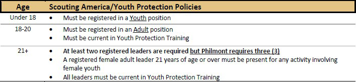

All registered adults must have current Scouting America Youth Protection Training (certified within the past two years
and not expiring until after the end of the trek). This means all participants 18 years and older who are registered in any
unit in Scouting America, or as an adult volunteer must have current Youth Protection Training. Due to the great
concern Scouting America has for the issue of child abuse in our society, the Youth Protection program has been
developed to help safeguard both our youth and adult members. Adult Scouting America Registration requires
verification of Youth Protection Training. All adults participating in a Philmont trek must be registered.

###### Youth Protection Training and documentation are available at your local council or online at
https://www.scouting.org/training/youth-protection/.

Philmont will strictly enforce Youth Protection policies, which include the Scouting’s Barriers to Abuse.
(https://www.scouting.org/health-and-safety/gss/gss01/#a)
Adult Leadership
Philmont requires that each crew participates with THREE adult Advisors (FOUR if a co-ed crew – at least one female).
This provides flexibility if an adult Advisor needs to leave the trail. If a youth participant must come off the trail for any
reason, their parent cannot accompany them if it would result in the crew becoming a Substandard Crew. All advisors
should understand they function as advisors for the entire crew, not just their own children! They are responsible
for ensuring the crew follows all Scouting America and Philmont rules. The exception to this would be for an adult who is
caregiver for a special-needs or disabled Scout; they are expected to work directly with that Scout to ensure their safety
and successful trek completion.

# Scouting America Registration

---

#### 2025 Advisor Guidebook

Co-ed/Female Crew Leadership Requirements
Crews with female youth are required to provide at least one adult female Advisor while en route to and from Philmont
and while on trek.
Council Contingent crews may have a mixed registration of Scouting America members, to include Scouts BSA, Venturing,
Exploring, and Sea Scout programs.

###### The guidelines for units to attend as a co-ed Philmont crew per Scouting America policy are below. Your unit can
attend co-ed by one of the two options listed:

1. Attending as a linked male and female Scouting America troop in the same Philmont crew:

 Scouting America is a single-gendered program; as such, male and female Scouts BSA troops can attend
together in the same crew IF each troop provides their own leadership in the Philmont crew. Each troop must
have a minimum of 2 adult leaders age 21+ attending in the crew. This is a total of 4 adult leaders age 21+ for
a Philmont crew composed of 1 female troop and 1 male troop that are linked.
 Units who do not share the same charter partner must have local council and charter partner approval per
the Scouting America Guide to Safe Scouting.
 Scouting’s Barriers to Abuse require buddy pairs to be single gender. However, a third youth/participant
may be added to allow for a mixed gender buddy group of 3. At least 2 youth members of each gender must
be present in each Philmont crew to meet requirements for buddy pairs.
 Scouting’s Barriers to Abuse require 2 adult leaders age 21+ to attend, although Philmont requires 3.
If female youth are present, at least one of those leaders MUST be female.
2. Attending as a Venturing Crew, Sea Scout Ship or Exploring Post

 Venturing, Sea Scouting, and Exploring are coed programs.
 Members of these programs can attend co-ed as long as Scouting’s Barriers to Abuse (below) are met.
 Scouting’s Barriers to Abuse require buddy pairs to be single gender. However, a third youth/participant
may be added to allow for a mixed gender buddy group of 3. At least 2 youth members of each gender
must be present in each Philmont crew to meet requirements for buddy pairs.

Scouting’s Barriers to Abuse require 2 adult leaders age 21+ to attend with each Philmont crew. If
female youth are present, at least one of those leaders MUST be female.
Youth Participants

###### Participants must be registered members of Scouting America who will be at least 14 years old OR have completed 8th
grade and be at least 13 years old prior to participation.

###### Youth participants must be registered members of Scouting America and may participate in a Philmont trek in one of the
following ways:

- As members of a chartered unit—Troop, Crew, Post, or Ship.
•
As members of a council contingent or district contingent with required leadership.
•
As individuals in the Rayado men/women, Ranch Hands, Trail Crew, ROCS, or Order of the Arrow Trail Crew
treks. (Participant age requirements vary for individual treks.)

Each participant must be physically and emotionally capable of participating in the backpacking or horseback riding
trek. Each participant must meet the health requirements as outlined in the Scouting America Annual Health and
Medical Record.

# Co-ed/Female Crew Leadership Requirements

---

#### 2025 Advisor Guidebook

#### Philmont “Crew”

Participant’s ages also come into play in the makeup of a “crew” at Philmont. Note that Philmont treks (12, 9, and 7-
day) and Cavalcades must conform to the policies shown here. Crew makeup for Individual program crews will be
determined by the department responsible for those programs; they will establish the “crews” based on criteria specific
to the program(s).

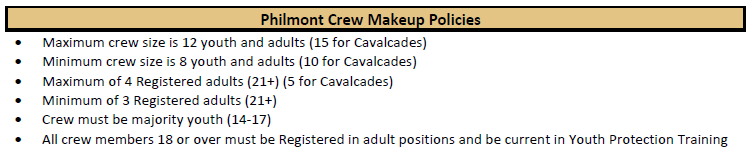

Frequently, crews become Substandard if a youth crew member becomes ill or sustains an injury and is transported to
the Infirmary for care. Removing this single crew member could result in the crew being below the minimum crew size. If
the injured crew member’s parent insists on accompanying the youth to the Infirmary, removing the two crew members
very often makes the crew Substandard.

Parents are permitted to come off the trail with their child only in very limited circumstances. Clearly if the parent is the
caregiver for a child with special needs or is disabled, they are encouraged to accompany them. Otherwise, parents
should only come off the trail with their child if the child is experiencing serious medical conditions such as broken
bones, laceration(s) needing stitches, there is a high potential the child will be transferred from the Infirmary to an
outside medical facility, possible surgical procedures (appendix, etc.), mental health or developmental issues, or other
similar serious conditions. The parent will not be permitted to accompany the child in any event if their leaving would
result in the crew becoming “substandard”. If Philmont can implement steps that rectify the substandard crew issue, the
parent can join their child when the solution is achieved.

When a youth participant is transported to the Infirmary for medical care, they are housed either in the Infirmary or in
Infirmary Tent City. In either facility, adult leadership is provided by Philmont in conformance with Scouting America
Youth Protection policies.

If an adult accompanies their child to the Infirmary, they will be housed in an Advisor tent in Base Camp Tent City and
will be provided with meals in the Camper Dining Hall. They can coordinate with Infirmary Tent City to eat with and
participate in other activities with their child if medically possible.

The Infirmary can release the youth crew member to rejoin their crew or to be sent home. If they are released to home,
Philmont’s Logistics department will assist the parent in making travel arrangements. It is the family’s responsibility to
pay for any needed transportation and lodging after departing Philmont. They must depart Philmont within 24 hours of
being discharged from the Infirmary.

If the Infirmary releases the youth crew member to rejoin their crew, they will be transported to the next staffed camp
on the crew’s Itinerary. Depending on the Itinerary, they may have to remain in Base camp for a day or more until the
crew arrives at a staffed camp.

The youth and the parent should understand that they may not qualify for the Philmont Arrowhead award patch if they
come off the trail during their trek or Cavalcade. This will be dependent on what they had accomplished before the
medical situation occurred as well as what they were able to do after being reunited. They could be ineligible for the

# Philmont Crew

---

#### 2025 Advisor Guidebook

Arrowhead award because they did not complete their trek (went home after being released), did not participate in a
Conservation project, or did not fulfill other requirements for earning the Arrowhead award.

The youth and the parent should understand that they may not qualify for the Philmont Arrowhead award patch if they
come off the trail during their trek or Cavalcade. This will be dependent on what they had accomplished before the
medical situation occurred as well as what they were able to do after being reunited. They could be ineligible for the
Arrowhead award because they did not complete their trek (went home after being released), did not participate in a
Conservation project, or did not fulfill other requirements for earning the Arrowhead award.

Tenting Policies
Tenting arrangements at Philmont (both in Base camp and in the backcountry) follow Scouting America's tenting
requirements ( www.scouting.org/health-and-safety/gss/ ) and must meet the requirements shown below.

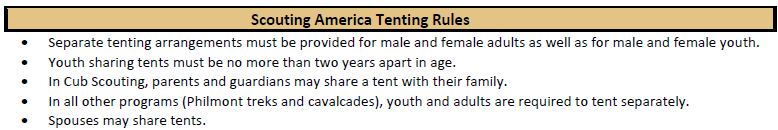

### Be aware that:

- The same tent sharing should be used in base camp tent city and in the backcountry.
• It is important that crews determine their tenting requirements before coming to Philmont.
- Crews should utilize 2-person tents wherever possible. If a crew member cannot share a tent because of the rules
above, they should bring a one-person tent to minimize weight. Three-person tents may require more space than is
available in some backcountry camps.
•
Crews should use the minimum number of tents permitted with the crew makeup and the Scouting America
tenting rules above.
•
Philmont backcountry camps have limited space; fewer tents will make the best use of this space.
•
Philmont can provide the crew with 2-person tents at no charge. No 1-person or 3-person tents are available.
•
Philmont cannot provide stakes or ground cloths for tents.

Crew Organization
A “crew” at Philmont is made up of youth and adult participants. There are several Scouting America and Philmont
policies that must be followed for adult advisors and youth leadership “positions” for each crew. For a multi-crew
reservation (unit or council contingent), one person must be the designated “Contingent Advisor”.
Advisors
“Advisors” are the adult leaders of the crew. All Advisors must be physically capable of hiking and camping for the
entire length of the trek. Each Advisor is expected to reflect high moral standards established by custom, traditional
values, religious teaching, and following the Youth Protection guidelines.

Philmont recommends that groups identify alternate adult leadership who are available to step in at the last minute in
the event an adult Advisor is unable to attend. Philmont CANNOT provide staff to meet Scouting America’s two-deep
leadership requirement.

# Tenting Policies & Advisors

---

#### 2025 Advisor Guidebook

An Advisor’s main role is to coach, mentor, and support the Crew Leader, Chaplain’s Aide, and Wilderness Pledge
Guia. By doing this, the youth leaders will gain leadership experience throughout the trek and will be able to help all
members of the crew develop into a strong team.

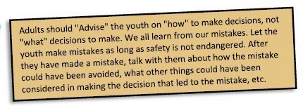

As stated earlier, all advisors should understand they function as advisors for the entire crew, not just their own
children! They are responsible for ensuring the crew follows all Scouting America and Philmont rules. The
exception to this would be for an adult who is caregiver for a special-needs or disabled Scout; they are expected
to work directly with that Scout to ensure their safety and successful trek completion.

###### Advisors should ensure the safety and well-being of each crew member through:

First aid treatments.
Supervision any time a stove is in use.
Administration of required medications.
Guidance and support in emergency situations.
Proper water purification.

Advisors also help foster positive crew dynamics, help settle disputes between members of the crew, assist with
administering proper discipline if required, and ensure that the crew operates following all Youth Protection guidelines.

Adult Advisors must make every effort to help youth leaders succeed. By coaching and mentoring, adults can play a
critical behind-the-scenes role. Adults make sure that safety procedures are followed and that Youth Protection policies
are practiced.

Youth Leadership
A trek at Philmont is a “youth-led” activity. This is why the rules for crew makeup require a majority of youth
participants. The leadership of the crew while at Philmont comes from these youth participants, not the adult advisors!

Throughout the history of the Ranch, the leadership growth of each youth member while practicing the Patrol Method
has been a critical part of the total experience. Key leaders practicing servant leadership ensure that the crew has an
enjoyable and successful trek. This is particularly true for the Crew Leader, Chaplain’s Aide, and Wilderness Pledge
Guía.

Crew Leader
A well-qualified Scout should be elected as Crew Leader before training begins. The Crew Leader is responsible for
organizing the crew, assigning duties, making decisions, and recognizing the capabilities of each crew member. They
lead by example and discuss ideas and alternatives with the entire crew to arrive at a consensus before acting. This
responsibility requires someone with leadership ability who is respected by everyone. The adult Advisors will work
closely with this individual.

# Youth Leadership

---

#### 2025 Advisor Guidebook

###### The Crew Leader’s responsibilities include:

- Incorporate the principles of the Scout Oath and Law into the trek experience.
•
Follow the assigned itinerary.
•
Complete and manage a crew duty roster.
•
Adhere to all Philmont bear and wildlife procedures.

Crew Leaders will receive more information/training in a meeting with other Crew Leaders on the day of your crew’s
arrival at Philmont (Day 1). Please print the Crew Leader’s Orientation sheet and give it to your Crew Leader as soon as
they are elected (https://www.philmontscoutranch.org/treks/expeditions/2024crewpacket/ )

Chaplain’s Aide
Each crew should also select a Chaplain’s Aide; perhaps a member of the crew who has received a religious award in
Scouting. The Chaplain’s Aide is responsible for assisting the crew in being reverent during their time in the
backcountry, as well as working with the Crew Leader and Lead Advisor to ensure the smooth operation of the crew
The Chaplain’s Aide will be asked to lead daily devotionals from the Eagles Soaring High booklet, lead grace before
meals, and encourage participation in religious services. The Chaplain’s Aide will guide the crew’s participation in the
Duty to God program and will certify completion of the Duty to God Award requirements for each crew member.
(Awards will be available to purchase at the Tooth of Time Traders at the conclusion of the trek; proceeds support the
Chaplain Program at Philmont).
The Chaplain’s Aide’s responsibilities include:

- Set a good example by living the principles of the Scout Oath and Law.
•
Teach the Philmont Grace to crew and use it before meals.
•
Lead Roses, Buds, and Thorns each night.
•
Assist the Crew Leaders and Advisors in conflict resolution.
•
Provide support to fellow crew members that are having difficulties.
•
Encourage fellow crew members in their own personal walk with God.
•
Lead crew in daily reflections from Eagles Soaring High booklet.
•
Encourage the crew to attend chapel services in Base Camp and in the backcountry if services are available on
the crew’s itinerary.

A packet of worship resources (including the Eagles Soaring High booklet) will be provided for use along the trail during
a training session on the day of your crew’s arrival at Philmont (Day 1). The Chaplain’s Aide will certify completion of the
Duty to God Award requirements for each crew member. Awards may be purchased at the Tooth of Time Traders at the
conclusion of the trek; proceeds support the Chaplaincy Program at Philmont.

###### Please print the Philmont Chaplain’s Aide Orientation sheet and give it to your Chaplain’s Aide as soon as they are
elected (https://www.philmontscoutranch.org/treks/expeditions/2024crewpacket/ )

Wilderness Pledge Guía
Each crew will select a Wilderness Pledge Gíia (Guide). This individual will help the crew understand the principles of the
Philmont Wilderness Pledge and Leave No Trace principles. This person helps the crew focus on camping practices that
adhere to wilderness ethics outlined in the two approaches and ensures that the crew follows all Philmont camping
practices. With more than 20,000 participants camping each summer at Philmont, it is important that each person do
their share to ensure that we protect Philmont and our neighbors’ properties for generations to come.

# Youth Leadership (continued)

---

#### 2025 Advisor Guidebook

###### The Wilderness Pledge Guia’s responsibilities include:

- Learn the principles of Philmont’s Wilderness Pledge and Leave No Trace
•
Assist the crew in implementing Philmont’s Wilderness Pledge and Leave No Trace principles throughout your
trek.
•
Guide the crew in discussions about wilderness ethics by focusing on a different principle of Leave No Trace for
seven days on the trail.
•
Help the crew follow all camping practices as outlined by their Ranger and strictly follow Philmont’s bear and
wildlife procedures.
•
Help crew members earn the Wilderness Pledge Achievement Award with the help of the
Ranger/Horseman/Wrangler.
•
Lead the crew in preparation and completion of the scheduled conservation project while on the trail.

The Wilderness Pledge Guia will receive more information/training in a meeting with other Wilderness Pledge Guias on
the day of your crew’s arrival at Philmont (Day 1). The Wilderness Pledge Guia will certify completion of the Wilderness
Pledge Achievement Award requirements for each crew member. Awards may be purchased at the Tooth of Time
Traders at the conclusion of the trek; proceeds support the Sustainability Program at Philmont.

Crew Size
The maximum and minimum crew sizes (minimum of 8 and maximum 12 campers for treks and minimum of 10 and
maximum of 15 for Cavalcades) are strictly enforced. Crews with fewer than the minimum for their activity type will not
be permitted on the trail. Crews with more than the maximum must determine how to reduce their numbers to the
maximum for their activity type.

These crew sizes are the best sizes for Philmont crews. This is due to Youth Protection and safety reasons – if a crew
member is injured, a team of 4 will be sent to obtain assistance. This team must meet Youth Protection rules as do the
crew members remaining with the injured person. Philmont’s itineraries have been developed with these numbers in
mind and campsites are designed to comfortably accommodate a maximum of 12 campers (campsites used for
Cavalcades can accommodate larger crews).

Council contingents and other large groups should organize their crews according to hiking and camping abilities. Each
crew can then choose an itinerary that corresponds to the abilities of its participants and travel at an appropriate pace.

Philmont reserves the right to combine smaller crews within contingents or multi-crew groups to maximize staff
resources. Should something happen to one of the Advisors, other adult Advisors need to be prepared to move to
another crew within the contingent or multi-crew group. This may involve being moved to a different itinerary if
necessary. If a crew goes below the minimum size while on the trail and it is not possible for Philmont to absorb that
crew in another crew, the crew that is smaller than the minimum size may have to come off the trail and be sent home.

Because of the minimum number of adult Advisors required and/or the minimum crew size, it is imperative that adult
leaders stay on the trail with their crew in the event their child is transported to the Infirmary. If the child’s
injury/illness is severe, we understand that a parent should be with their child. In that event we will make every
effort to ensure the remainder of the crew can stay on the trail with adequate adult leadership or crew size. This may
require combining the crew with another crew (and changing to their itinerary) or other options. Be aware that this is
not always possible, and the crew may have to come off the trail and depart Philmont.

# Crew Size & Youth Experience

---

#### 2025 Advisor Guidebook

Youth Experience
Philmont Scout Ranch is designed to be a youth experience. Waite Phillips set forth the following statement at the time
of his gift to the Boy Scouts of America:

“These properties are donated and dedicated to the Boy Scouts of America for the purpose of perpetuating
faith, self-reliance, integrity, and freedom—principles used to build this great country by the American
pioneer. So that these future citizens may, through thoughtful adult guidance and by the inspiration of
nature, visualize and form a code of living to diligently maintain these high ideals and our proper destiny.”

###### Waite Phillips wanted the Philmont experience to focus on the youth participants!

Practicing the Patrol Method
Your Philmont Trek will provide you with an opportunity to practice many skills that you have learned while participating
in your Troop, Crew, Post, or Ship. This experience brings to focus the importance of the Patrol Method. Each crew is a
small group of participants much like a patrol. The crew members are close in age and experience level and working
together helps them develop a sense of pride and identity. The participants elect their Crew Leader, divide the jobs to
be done, and share in the satisfaction of accepting and fulfilling group responsibilities.

Three members of the crew will have a leadership responsibility that lasts the duration of the trek: Crew Leader,
Chaplain’s Aide, and Wilderness Pledge Guia. Positions descriptions are provided earlier in this guidebook. In addition,
all members of the crew will serve in some leadership role each day, either as the primary or the assistant. Examples of
rotated leadership responsibilities for the crew include navigator, cook, dishwasher, bear bags manager, water gatherer,
and fire watchman.

The camping methods practiced at Philmont Scout Ranch support the Patrol Method
concept. Two examples of this include cooking and washing dishes
as one group. Members of the crew will rotate throughout
the trek and fulfill these important responsibilities. This
allows crew members to practice servant leadership as they
take on a task that will support the entire crew.

Some of the current wilderness camping methods focus on
the individual. In support of Scouting America, Philmont will
focus on the crew and the accomplishments that they can
achieve by working together as a team.

The Ranger/Horseman/Wrangler assigned to the crew will help
the entire crew achieve the most from their Philmont Adventure!
Advisor’s Packet
In March, each registered Lead Advisor will be sent a packet of materials for the crew. Included will be The Guidebook to
Adventure (a copy for each member of the crew), an overall Philmont map, insurance pamphlet, and a letter from the
Camping Director. The Lead Advisor’s packet contains all the information needed for your Philmont trek. If lead advisors
are not entered into the Camping Gateway, the advisor packet is mailed to the reservation contact of the expedition.
This person will be responsible for distributing a packet to each crew’s Lead Advisor.
Please notify Philmont if a change occurs in the Reservation Contact or if their address or email changes, as updates are
emailed occasionally.

# Practicing the Patrol Method & Advisor's Packet

---

#### 2025 Advisor Guidebook

Philmont Camping Gateway
The Philmont Camping Gateway is an online platform specially designed to help units register and plan for a successful
Philmont trek. If you registered your unit to attend Philmont, then you have already accessed the Camping Gateway.
After registration, units can access the Camping Gateway to find updates such as waitlist position and payment
schedules.

After Philmont records the first payment for a reservation, the Camping Gateway will send a special email to the
Reservation Contact with a link to access their invoice. A link to the crew’s Roster will be emailed in September. The
Camping Gateway will walk the Reservation Contact through selecting their crew Lead Advisor(s). Each Lead Advisor will
be responsible for entering participant information for each member of their crew.

The Gateway is accessible by email invitation link only. If you are a Lead Advisor or Reservation Contact, look for an
email from rosters@registerphilmont.org and you’ll find a link to access the Gateway Roster.

Reservation Contact
This person created the initial Philmont reservation and has been the primary contact for payments and planning.
Sometimes the reservation contact also plays the role of a Lead Advisor. Once inside the Philmont Camping Gateway,
Reservation Contacts have the option to view and modify information for every crew roster in their reservation.

Lead Advisor
One Advisor in each crew is designated the “Lead Advisor”. This person is the principal Advisor responsible for
coordinating a successful Philmont experience for each member of the crew. This adult organizes their crew and enters
information for each crew member into the Philmont Camping Gateway prior to arriving at Philmont. In addition to
participant information, the Lead Advisor also submits their planned Philmont arrival and departure travel information.
All adults support the Lead Advisor in accomplishing the duties of an Advisor.

Crew Roster
Every crew attending Philmont for a trek or Cavalcade must submit important participant information (Crew Roster)
using the Philmont Camping Gateway. The complete crew roster must be entered no later than May 1 of the year you
are attending. Each entry made after May 1 will be subject to a $150 late addition fee.
Crew member information on the crew roster can be updated any time. This permits the Lead Advisor to change crew
members without incurring the late addition fee.

Travel Plans
Arrival and Departure plans must be submitted in the Camping Gateway at least two weeks prior to your arrival at
Philmont. Any last-minute changes to arrival information can be made by emailing Logistics at
philmont.logistics@scouting.org or by calling (575) 376-2281 and asking for the Logistics Transportation Manager.
Philmont participants have found public carriers to be reliable transportation to the Ranch. Contact the representative of any
of the carriers on the list for scheduling information and costs. You may also find the list of carriers at
https://www.philmontscoutranch.org/treks/travelingtophilmont/companies/ .

Itinerary Selection
In mid-December, the Itinerary Guidebook will be published for crews to download and review. Lead Advisors will
receive an email regarding itineraries and itinerary selection. Starting in mid-January, Lead Advisors can begin to submit
itinerary preferences within the Gateway. These preferences can be modified until mid-February, when the Gateway will
process all selections and make assignments using a random and fair process. You will be notified via email after your
itinerary has been assigned. For more information on Itinerary Selection, please see the Itinerary Guidebook.

# Philmont Camping Gateway

---

#### 2025 Advisor Guidebook

Sister Crew
All crews on 12, 9, and 7-Day treks will have the option to request to share an itinerary with another crew on a
matching length trek with a matching arrival day. Lead Advisors may select a Sister Crew as soon as they access their
crew roster through the link received via email. Once a Sister Crew arrangement has been confirmed by both crews,
either crew’s Lead Advisor may submit itinerary preferences for both crews when Itinerary Selection opens in January.
Please be aware that sister crews must function as independent crews. They do not hike or camp together and
members may not move between crews. Sister crews can do evening activities together and, potentially program
activities in staffed camps.

Expedition Number
Crews at Philmont are identified by an “Expedition Number”. This is because crews come from units from all over the world
— there may be multiple Troop 101’s or Crew 101’s at Philmont at any time. The expedition number provides a unique
identification for each crew. All correspondence regarding the crew and all phone callers should use the crew’s expedition
number.

For all crews, the first three digits are in the form of “mdd” where m is the Month and dd is the Day of the crew’s “Arrival”
date at Philmont (Day 1). e.g., “715” represents July (7) fifteenth (15).
When the crew reservation is made, a temporary Expedition number is assigned in the form of “mdd-nnn”
Where: “nnn” is a three-digit unique number.
When the first crew payment is made, the reservation Expedition Number is changed to a permanent Expedition Number.
Expedition numbers are in different forms for different types of programs. They include:

####  12-Day Treks: mdd-X(-nn)
 9-Day Treks: mdd-9X(-nn)
 7-Day Treks: mdd-7X(-nn)
 Cavalcade: mdd-yy
Where:

X = a unique one or two alphabetic character identifier assigned after the first crew payment is accepted.
(-nn) is a unique crew number for multi-crew reservations. This is not present for single crew reservations.
-yy is used for Cavalcade Crews:

###### “CV” & “CW” designate Southern Itinerary cavalcade crews.
“CX” & “CY” designate Northern Itinerary cavalcade crews.

###### Examples:

624-120 Reservation for crew arriving June 24 (has not made Reservation payment)
624-C 12-Day Expedition arriving June 24
624-BB 12-Day Expedition arriving June 24
624-K-03 12-Day Expedition for third crew in a reservation (“K”) arriving June 24
702-9B 9-Day Expedition arriving July 2 (9-Day treks arrive on Fridays)
701-7B 7-Day Expedition arriving July 1

# Expedition Number

---

#### 2025 Advisor Guidebook

Emergency Messages from Home or Work
Philmont Emergency Telephone Number: (575) 376-2281
While at Philmont, your crew will be in the backcountry and will NOT be able to receive messages from home or work.
In the event of an emergency, call Philmont at (575) 376-2281. This number is answered 24-hours a day, 7-days a
week. If it is possible to get a message to a crew member, it may take up to a day to deliver the message. It may not
be possible for the crew member to return the message. Because of this, all crew members should make appropriate
arrangements for others to conduct their business for the duration of the trek.

Mail to Campers at Philmont
Mail can be sent to campers while they are at Philmont. Mail and packages will be delivered to the Philmont Mail Room in
Base Camp. Be sure to include the Expedition Number! Please ship packages at least two weeks prior to arrival to allow
ample time for delivery.
The US Postal Service or UPS may be used but be aware there is NO “overnight” delivery available!

#### Camper’s Name, Expedition Number
47 Caballo Rd
Cimarron, NM 87714
Financial Fees & Expedition Budget

The 12-Day expedition fee is $1,675 for each participant in 2025, youth or adult. A deposit of $150 per participant
(including adult Advisors) is required to hold your arrival date. Refer to your last invoice for your specific payment
schedule.

ALL fees (Reservation, Advance and Balance as indicated in the payment schedule) are NON-REFUNDABLE and NON-
TRANSFERABLE to the balance of fees in the event of cancellation. Be cautious of making reservations or paying fees
for those who have not made a financial commitment.

Philmont must commit financial resources to employ staff, purchase food and supplies, and prepare for summer
operations. Participants are therefore also required to make a financial commitment to attend. Be conservative in
making reservations to avoid losing fees due to cancellations. Additional crew participants can be added to fill a crew
of 12 members. Fees for additional participants can be included with your advance payment due October 1. The
balance payment is due March 1.

SEND FEES TO:
Camping Registrar
Philmont Scout Ranch
17 Deer Run Road
Cimarron, NM 87714

#### 2025 Fee Payment Schedule
Be sure you have completed and submitted the Reservation Form with the initial fee payment.

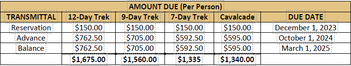

###### There is a Late Addition Fee of $150 for any name added to the roster after May 1, 2025.

# Financial Fees

---

#### 2025 Advisor Guidebook

### Scholarships

It is the vision of Philmont Scout Ranch to continue to positively impact the lives of young people and their Scouting
leaders through inspiring and effective delivery of the finest Scouting possible through backcountry adventures and Philmont
Training Center experiences. Philmont receives many donations from all over the country from those who have had the
opportunity to experience Scouting Paradise in God’s Country and want to share that opportunity with others. There are
several financial need-based scholarships available from Philmont, your local council or elsewhere. Scholarship funding is
limited so please apply quickly.
Waite Phillips Scholarships
Philmont offers scholarships to young people through the generosity of a gift made by Waite Phillips in the 1960s. The
funds are distributed by two primary methods:

1. Funds are allocated to each council with a contingent participating at Philmont. If you have young people who need
financial assistance, contact your local Scout Service Center about the availability of scholarship money. Youth apply
to the council and the award amount is credited after the certification form is received by Philmont.
2. Individual units (Scouts BSA Troops, Venturing Crews, Sea Scout Ships, and Explorer Posts) may apply for a Waite
Phillips scholarship. Each crew may apply for one scholarship worth $400. Application forms are emailed to
Reservation Contacts and are due back to Philmont by February 1 prior to the upcoming summer. This scholarship is
to help make it possible for a youth member to participate who might not otherwise be able to experience Philmont.

Donor Scholarships
The Donor Scholarship application can be found on our website: www.philmontscoutranch.org/philmonttreks/fees/.
Donor Scholarships are based on need and can vary in endowment. Scholarship funding is limited so please apply quickly.
Donor Scholarships are available to youth and advisors. Multiple members from a crew may apply. If you have questions about
Philmont scholarships, please contact Philmont.Camping@Scouting.org.

# Scholarships

---

#### 2025 Advisor Guidebook

#### Refund Policy

Philmont must commit financial resources to employ staff, purchase food and supplies, and prepare
for summer operations. Participants are, therefore, also required to make a financial commitment to
attend. Please be conservative in making reservations to avoid losing fees due to cancellations.

###### Payment Schedule – Crews are responsible for knowing, understanding, and adhering to this
payment schedule. Failure to pay will result in cancellation. Deposits are non-refundable.

- A $150 deposit per individual is due within 30 days upon receiving reservation. Minimum crew sizes apply.
•
Advance payment (1/2 of remaining fees) per individual is due October 1, the year prior to trek.
•
Final payment (final 1/2 of fees) per individual is due March 1, the year of trek.

###### Cancellation/Refund Policy- Please notify Philmont immediately if your crew intends to cancel. Fees
are not transferrable to a subsequent year.

- The $150 deposit per individual is not refundable.
•
Crews/individuals cancelling between deposit and first ½ payment will forfeit 100% of fees.
•
Crews/individuals cancelling after first ½ payment will forfeit 100% of fees.
- Crews/individuals cancelling after final payment will forfeit 100% of fees.
Refunds
- Medical –100% minus deposit
•
Military Deployment – 100% refund
- Death -100% (1st Degree Relative)
•
Job Situations – 100% minus deposit

###### Refund decisions made by the Director of Camping

- Family Emergency – 100% minus deposit
•
Arrived overweight– 50% of fees paid, no
exceptions
- School Related – 70% of fees paid
•
Sick/injured on trail – Prorated less deposit
and any extraordinary fees

###### Refund Request Procedures

##### Refund requests must be submitted with proper documentation related to the circumstances, no later
than August 15 of the trek year. Refund requests after that date will not be considered.

###### Below is the information required to request a refund:

1. Expedition Number (i.e. 609-A)
2. Name of person requesting refund
3. Reason for not participating-illness, injury, school, military, etc.-official documentation to

support the request
4. Email to: Philmont.Camping@scouting.org

Our policy on approved refunds is as follows: If approved by the Director of Camping Services, the refund request is
filed in the expedition file. When the crew has completed their trek, the Registrar processes the paperwork and the
refund authorization is sent to the National Scouting America Office in Irving, TX where a check is disbursed to the Unit
in care of the Reservation Contact for the Expedition on behalf of the person who requested the refund. It can take
approximately 6 to 8 weeks to process after the crew has departed Philmont.

# Refund Policy

---

#### 2025 Advisor Guidebook

#### Crew Budget

###### In establishing the actual fee for each participant, please review the budget worksheet found below. It is important to
include all expenses.

FEE & DESCRIPTION
PARTICIPANT CHARGE
TOTAL CREW FEES ($)
Philmont Fees
Covers all Philmont meals, tents, cooking gear, program
resources, camper’s insurance, Advisor’s packets, medical
care, chaplain services, use of horses and burros, Philmont
Arrowhead patch, crew photo, etc.

#### Transportation
Transportation costs to and from Philmont. Be sure to check
insurance coverage on packs and gear in transit.

Meals & Lodging
All meals and lodging en route to and from Philmont (use of
military bases helps cut down expenses). Include gratuities
and occasional treats along the way.

#### Training
Meals and other incidental costs for weekend training
events.

#### Promotion
Costs for promotion including production of all material,
postage, etc. including hats and/or t-shirts.

Equipment – Purchase or Rental
Include purchase or rental of any equipment or supplies
required by expedition. Expeditions are required to bring
backpacking stoves. (Crews using commercial transportation
must ship their stoves and fuel bottles using ground service
only prior to their arrival).

#### Side Trips & Tours
During travel to and from Philmont

#### Contingency
Allowance for any contingency during the trip that may
require unexpected expenditures. Refund at the end of the
trip if unused.

Philmont Scholarship
Waite Phillips Scholarships are available from Philmont by
two primary methods—your local council or directly through
the reservation contact/lead advisor. There is also a general
scholarship available, Deduct if you have a
participant who receives financial assistance.

#### TOTAL
$
$

# Crew Budget

---

#### 2025 Advisor Guidebook

Contingency Fund
Groups should have a contingency fund to cover unexpected expenses such as emergency transportation, roadside
repairs, equipment failure or additional luggage fees.
High Adventure Committee
Planning and preparing for a successful Philmont expedition require careful consideration of several different aspects of
trip planning and execution. To accomplish these tasks efficiently, it helps to have a committee of interested individuals.
The responsibility of planning and executing this experience should not rest in the hands of one or two people who
also serve as adult Advisors on the trek. Responsibilities should be divided among members of this “Philmont Scout
Ranch High Adventure Committee”. Regardless of whether the expedition is reserved as a Unit (single or multiple crews)
or as Council Contingent (single or multiple crews), a committee will ensure that all required tasks are accomplished.

#### Committee Member Prospects

- Council/district volunteers or members of a unit committee with an interest in High Adventure.
•
Past participants—youth and adult. Youth participants who have been to Philmont within the last ten years are
great resources, and they are eligible to serve as adult Advisors if they’re over 21.
•
Past Philmont staff members
•
Parents of participants
•
Adult Advisors
•
Philmont Ambassadors

#### Committee Assignments

- Leadership

o Select adult Advisors for each crew and identify alternates in the event of last-minute cancellations.
o Support the selection of youth leadership roles for each crew (Crew Leader, Chaplain’s Aide, and
Wilderness Pledge Guia (Guide)).
o Work with Lead Advisors and provide support in using the Philmont Camping Gateway and selecting
itineraries.
•
Promotion/Marketing

o Develop a recruiting program to ensure that all available participant slots are filled. All crews that arrive
with the maximum capacity of 12 participants will receive the “La Docena Adventurado” Award.
o Conduct Philmont information sessions at the local troop, district, and council levels. These can be done
at events such as summer camp, camporees, training events, and roundtables.
o Include information about additional Philmont opportunities, such as individual programs, for youth
who cannot join the crew due to schedule conflicts.
o Utilize all marketing channels available such as unit, district, and/or council websites, newsletters, and
social media platforms.
o Continue marketing to and recruiting potential alternate participants in the event of last-minute
cancellations (both youth and adult).
o Conduct parent information nights and be prepared to address any questions and/or concerns.
o Be prepared to organize a “Welcome Home” event to share the crew’s adventure with friends and
family following the trek. Use this as another opportunity to promote individual programs at Philmont
for participants that are eager to return to Philmont.
•
Finance

###### o Develop a budget. Explore as many travel options as possible to find the most cost-effective means of
travel and lodging for your crew(s).

# High Adventure Committee

---

#### 2025 Advisor Guidebook

o Include a contingency fund in the planning process to help cover emergencies that might arise during
travel to and from Philmont as well as during your trek.
o Utilize available scholarships. Philmont participants can apply for the Waite Phillips Scholarship,
which assists approximately 750 Scouts every year and grants approximately $300,000 annually.
Philmont Donor Scholarships are available at https://www.philmontscoutranch.org/treks/fees/.
Look for other local scholarship opportunities as well.
o Plan and support fundraising activities to help participants raise the funds needed for their travel and
expedition expenses.
•
Transportation

###### o Develop travel plans that include the following:


Overnight accommodations

Meals

Side trips and tours
o Arrange transportation to and from Philmont Scout Ranch (Cimarron, NM) via:


Private vehicles

Public transportation

Charter services
o Ensure the trip plans and accommodations abide by “The Sweet Sixteen of Scouting America Safety” and
the policies and guidelines outlined in the “Guide to Safe Scouting.” (https://www.scouting.org/health-
and-safety/resources/sweet16/)
o Submit arrival and departure plans in the Camping Gateway. (Found on your roster page.)
•
Equipment

o Help and support each crew member in securing the correct equipment for the experience.
o Coordinate the selection and procurement of all crew equipment required for the expedition.
o Coordinate special items such as crew t-shirts.
o Coordinate special food needs for medical and/or religious requirements.
o Assist with organizing and procuring food, equipment, permits, and reservations needed for weekend
shakedown training trips.
•
Training

o Ensure that the crew meets the requirements for Wilderness First Aid and CPR training. (At least THREE
individuals must upload current training certifications in the Gateway. These can be youth or advisors.)
o Ensure that all your adult leaders have up-to-date Youth Protection training.
o Conduct at least two weekend shakedown training events.
•
Health & Fitness

o Assist all members of the crew in completing their Annual Health and Medical Record. Work with the
Lead Advisor to ensure that all participants meet the Philmont requirements, including the
height/weight requirements.
o Review all Annual Health and Medical Records to be sure they are complete, and that each participant
has included a copy of their health insurance information with their medical record.
o Develop and implement a physical fitness program for all members of the crew. This may include
physical performance “mileposts” each crewmember must achieve in preparation for the trek.
o Track fitness activities to encourage all members of the crew to be ready for the physical demands of a
Philmont trek.

# High Adventure Committee (continued)

---

#### 2025 Advisor Guidebook

#### SUGGESTED PROGRAM FOR PHILMONT PARENT RALLY

#### Purpose of Meeting

- To acquaint parents and youth with Philmont and the Risk Advisory.
•
To share the calendar of events leading up to departure for Philmont.
•
To inform them of procedures regarding payment of fees, Scouting America Annual Health & Medical Records,
equipment needs, travel itinerary to/from Philmont, and any other trek requirements.
•
Introduce expedition leadership, both adults and youth if the latter has been determined.
•
Introduce the physical fitness plan and shakedown training plan.

#### Meeting Agenda

- Opening
o Philmont maps posted; photos of previous Philmont trips (if applicable).
o Display of snapshots, souvenirs, mementos, etc. from Philmont.
o Display of personal equipment needed with explanation of gear.
•
Meeting
o Welcome & Introductions
o What is Philmont?

o Presentation by a youth or Advisor who has been to Philmont on a previous trek. Include a brief
history of Philmont and use Philmont’s promotional videos from
www.youtube.com/philmontscoutranch.
o Keep it brief (no more than 30 minutes).
o Administrative Details

o Explain the budget and what contributes to all costs associated with it.
o Emphasize deadline of fee payments and the commitment required by each participant.
o Review refund policies.
o Travel Plans

o A uniform is highly recommended for travel and Base Camp.
o Backpack (for ALL trek related gear); mention the opportunity to rent a backpack at Philmont.
o Day pack for travel essentials.
o Boots (sturdy, comfortable, and broken in).
o Guide for spending money during travel, at Philmont, and on the trail.
o Review organization of crews and plans for shakedown training.
o Physical Preparation

o Review and distribute Risk Advisory to all parents.
o Scouting America Annual Health and Medical Record.
o Discuss height/weight requirements, as they are strictly enforced.
o Share fitness plan.
o Discussion about the importance of parents engaging and supporting their child’s success at Philmont
o Review the plan for team building and communication
o Distribute any forms and collect fees
o Question & Answer Session
•
Closing
o Introduce the Philmont Hymn
•
Notes
o Additional parent informational/organization meetings may be necessary.
o Suggestion: Plan a cookout using dehydrated/freeze-dried menus and invite parents; review additional
fitness suggestions.

# Suggested Program for Parent Rally

---

#### 2025 Advisor Guidebook

#### Recommended Preparation Plan

It is important to have a detailed plan to help organize your crew to prepare for their Philmont adventure. This plan
provides a breakdown of tasks and actions by quarter and month. A space is available to insert the name of the person
responsible for completing the item.

PERSON
RESPONSIBLE
Winter
2023/Spring/Summer
2024

MONTH/SEASON

SUGGESTED ACTION

Recruit a Philmont High Adventure Committee; conduct monthly meetings
(CC, U)

Conduct critique with previous years’ expedition Advisors (CC)

Council Philmont Kick-Off (CC)

Determine attendance objective for councils & districts (CC)

Establish schedules for mailings, meetings, promotions (CC)

Confirm three-deep leadership per crew with at least one alternate (CC, U)

Announce details in council bulletin and provide Philmont updates, noting
leadership participation, trip details, age/grade requirements and
height/weight requirements for participation (CC)

Share Philmont plans with Camping Committee (CC)

Share Philmont plans with Unit Committee (U)

Promote Philmont at Roundtables (CC)

Recruit participants and collect Reservation Fee Payment from each
participant (CC, U)

Transmit Reservation Fee Payment to Philmont (U – Dec. 1, CC – Jan. 31)

Enter Crew Roster on the Philmont Camping Gateway; Lead Advisors will be
able to enter, update, or modify information (CC, U)

Fall 2024
Continue recruiting members of the Philmont High Adventure Committee;
conduct monthly meetings (CC, U)

Collect Advance Fee Payment from each participant (CC, U)

Transmit Advance Fee Payment to Philmont (due Oct. 1) (CC, U)

Philmont High Adventure Committee meets with all selected expedition
Advisors and reviews plans (CC)

Conduct Philmont Parents’ Rally (CC, U)

Sign up 100% of quota (CC)

Share Risk Advisory Statement with parents (CC, U)

Arrange transportation and overnight accommodations to and from
Philmont (CC, U)

Make plans for training and the second parents’ meeting (CC, U)

When the Itinerary Guidebook is published, begin reviewing itineraries with
crew to determine top choices. (CC, U)
Download Scouting America Annual Health & Medical Forms online (CC, U)

(U) – Unit, (CC) – Council Contingent

# Parent Rally (continued)

---

#### 2025 Advisor Guidebook

PERSON
RESPONSIBLE
September 2024 to
December 2024

MONTH/SEASON
SUGGESTED ACTION

Submit Scholarship Certification Form to Philmont (due Jan. 1) (CC)

Apply for Waite Phillips and General Scholarship (due Feb. 1) (U)

Each participant should schedule a medical exam; review completed medical
forms prior to shakedown training (CC, U)

Continue updating Philmont news in council bulletin (CC)

Begin physical fitness plan (CC, U)

Conduct shakedown training weekends (at least two recommended) prior to
arrival at Philmont; start moderate and gradually increase pack weight and
difficulty (CC, U)
Review “Sweet 16 of Scouting America Safety” (CC, U)

January to April 2025
Conduct Philmont High Adventure Committee meeting monthly (CC, U)

12-Day, 9-Day, and 7-Day reservations complete the online Itinerary
Selection through the Camping Gateway (CC, U)

Transmit Final Fee Payment to Philmont by March 1 (CC, U)

Receive Advisor’s Packet: includes The Guidebook to Adventure, insurance
pamphlet, and an overall Philmont map (CC, U)

Continue physical fitness training (CC, U)
Share Accident and Sickness Insurance information, Risk Advisory Statement,
Expedition Number and Philmont Address & Emergency Phone Number with
parents (CC, U)

Complete and confirm details for travel plans (CC, U)

Continue physical fitness training (CC, U)

May 2025
Conduct Philmont High Adventure Committee monthly meeting (CC, U)

Complete Crew Roster and Arrival & Departure Information online in the
Camping Gateway. Rosters must be fully populated by May 1 to avoid a $150
Late Addition Fee. Travel plans must be entered at least two weeks prior to
arrival (CC, U)

###### Prepare a press release story for your local news publications; press release
forms can be found online at
www.philmontscoutranch.org/pressrelease.aspx (CC, U)

Continue physical fitness training (CC, U)

June/July/August 2025
BRING TO PHILMONT: Photo ID will be checked at Registration for anyone 18
or older.(CC, U)

###### Email philmont.logistics@scouting.org or call Logistics at (575) 376-2281
with any last-minute changes to arrival plans (CC, U)

# Parent Rally (continued)

---

#### 2025 Advisor Guidebook

Following your trek
Conduct Philmont High Adventure Committee Meeting to review the
experience & evaluate preparation for the next High Adventure experience
(CC, U)

Plan family follow-up event to share photos and stories (CC, U)

(U) – Unit, (CC) – Council Contingent

Expedition Training & Planning
To ensure the success and enjoyment of a Philmont trek, proper training and planning needs to occur. Each crew should
conduct several backpacking trips to prepare each member physically and mentally and to mold the unit into an efficient
camping crew. Philmont encourages crews to conduct at least two shakedown weekend trips. These shakedown
activities should be for the three-fold purpose of improving physical abilities, practicing camping skills that will be used
at Philmont, and developing a cohesive crew that works together. Shakedown Guides can be found at
https://www.philmontscoutranch.org/philmonttreks/shakedown/.

Participants on most Philmont treks are eligible to earn the 50-Miler Award. Ten hours of conservation service are
required to earn the award. Each participant will complete three hours of conservation service during their trek. Crews
are encouraged to conduct an activity that allows time for seven hours of conservation service prior to their trek. By
completing the additional service prior to the trek, each member of the crew will be eligible to receive the 50-Miler
Award upon their return home. There is the opportunity to select a 50-Miler Award trek that allows crews to complete
10 hours of conservation while at Philmont.
Physical Preparation
To enjoy the Philmont experience participants must be physically prepared to carry a 35- to 50-pound backpack over
steep, rocky trails at elevations ranging from 6,500 to 12,441 feet. A regular program of physical conditioning for at least
three to six months prior to the trek is essential. A longer period of conditioning is required for those unaccustomed to
physical exercise. A program of regular aerobic exercise is highly recommended to become physically conditioned for
Philmont. Plan to exercise for 30 to 60 minutes 3 to 5 times per week.

Jogging, running uphill, climbing long flights of stairs, and hiking with a full backpack are excellent methods of
preparation. How fast you run or how far you go is not nearly as important as regular exercise. Other aerobic exercises
such as swimming, bicycling, stationary cycling, and aerobic exercise classes can supplement your training. Start slowly
and gradually increase the duration and intensity of your exercises. Start a journal to record your progress. If anyone has
questions, have them contact their family physician or exercise physiologist.

Backpacking is the best way to prepare for a Philmont trek. It is highly recommended that everyone in a Philmont crew
review the Backpacking Merit Badge pamphlet as a source of information. The Venturing Backpacking pamphlet also has
excellent tips for preparing for a Philmont trek. Be Prepared!

Select a hilly area for your training. Start with a short hike and a light pack. Increase the mileage and your pack weight as
your training progresses. It is important to hike often enough while carrying a pack and wearing the boots that you will
use at Philmont to toughen your feet and break in your boots. Most of the crews that participate indicate on their
evaluation forms that additional physical training by all members of their crew would have been helpful.

As said earlier, Philmont is hard! The stamina required to hike Philmont is much greater than you may be used to due to
the distances traveled, elevation changes, and the overall duration of the trek.

# Expedition Training & Planning

---

#### 2025 Advisor Guidebook

#### Suggested Conditioning Program

MONTH
CONDITIONING
December/January
Complete health history on individual medical form and get parental approval (signature).

Be examined by a physician or osteopath. Call the physician’s attention to the High-Adventure
Risk Advisory on the back page of the medical form that describes the rigors of a Philmont trek
and to the Examiner’s Certification section that indicates areas of medical concern. Ask the
physician about any special medical needs or areas of concern. If overweight, get a physician’s
recommendation on how to lose weight through dieting and exercise to meet Philmont’s height
and weight requirements.

Walk, jog in place, swim or ride a stationary bike for 20+ minutes at least 3 to 5 times per week.
Gradually increase the length of time and intensity of exercises.

Purchase a pair of quality hiking boots. A pair of boots 6 to 8 inches high with sturdy sole are
recommended. Wear your boots to school or work and when walking anywhere to break them in
and to condition yourself.
February/March
When weather permits, jog, run or walk outdoors. Start with 20-minute sessions and gradually
increase the length and the incline or speed. While walking, begin to carry your backpack and
gradually add weight to it.
April/May
Continue exercising. Schedule a couple of 5- to 10-mile day hikes and at least two overnight
backpacking trips of 10 to 20 miles. Plan the second trek to cover more rugged terrain or increase
the mileage. Whenever possible, hike in the boots that you will use on the trail and carry your
backpack.
June/July
Continue exercising right up to the day you depart for Philmont. Come to Philmont in top physical
and mental condition ready for backpacking with a 35 to 50-pound pack over steep, rugged trails
at high elevations.

First Aid & Health
Philmont Infirmary
Philmont’s Infirmary is an “Infirmary” licensed by the State of New Mexico. It is supported by the Kansas University
Medical School which has provided doctors, nurses, medics, and medical students as summer professional medical staff
for over 60 years.
Treatment
If a participant is injured or becomes ill while at Philmont, they are likely to be treated by the Infirmary. Initial support
will most often come from backcountry staff who will communicate with the Infirmary by radio. Depending on the
situation, the injured person may be transported from the backcountry to the Infirmary for treatment. In other
instances, the person may be treated in the backcountry while remaining with the crew.
For participants brought to the Infirmary for treatment, the objective will be to provide treatment necessary for
recovery and then to reunite them with their crew at the earliest possible time. This will be at the first staffed camp the
crew will be staying at after the participant is cleared to return to the trail. If the participant cannot be cleared to return
to the trail, Philmont’s Logistics department will assist them in making arrangements to return home.

# First Aid & Health

---

#### 2025 Advisor Guidebook

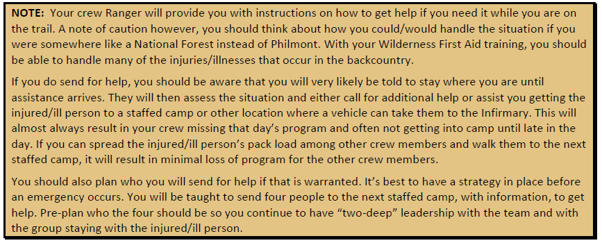

Supervision
The Infirmary does have inpatient beds, but most participants are treated as outpatients. As such, they will be housed in
“Infirmary Tent City”. While there, Philmont provides the adult supervision and “two-deep leadership” required by
Scouting America Youth Protection policies.

Because supervision is provided and space is limited, it is requested that the parent(s) not come off the trail with an
injured or ill youth (and youth not come off the trail with an injured or ill adult). Coming off the trail may result in the
crew falling below minimum size, no longer having adequate adult leadership, and other problems that may have
consequences for the remaining crew members. If the injury/illness is significant, it is recommended that the
parent/youth come off the trail, but this should not occur for routine matters.

Wilderness First Aid & CPR Training
Philmont requires that each crew have 3 participants who have completed Wilderness First Aid and 3 participants that
have completed CPR training or hold a medical license.

Current certification cards must be uploaded to the Gateway to verify this requirement. With 3 Wilderness First Aid and
3 CPR trained members on the trek, the crew will be better equipped to handle emergencies. This requirement can be
met by youth and/or adult participants. Different crew members may hold the certifications – the same person does
not have to be certified in Wilderness First Aid and certified in CPR. The required certifications may be held by 3 to 6
crew members.

CPR Training
Philmont requires that each crew have 3 participants who have completed CPR training. There is no list of approved CPR
courses, but it is highly recommended that the CPR certification include training in Adult and Child CPR, Choking, and use
of an Automated External Defibrillator. Current CPR cards should be uploaded in the registration system prior to arrival
at Philmont.

# Wilderness First Aid & CPR Training

---

#### 2025 Advisor Guidebook

#### Wilderness First Aid

Philmont requires each crew to have 3 participants that have complete WFA training. The approved courses listed
below are a minimum of 16 hours with at least 8 hours taught in person. These certifications usually last for two years
and the classes fill up quickly so get this training done early in your preparations. Any adult or youth 14 years old and up
may take the Wilderness First Aid training. Wilderness First Aid training can be obtained from the following
organizations recognized by the American Camping Association:

- American Red Cross – www.redcross.org
•
American Safety and Health Institute (ASHI) – www.ashinstitute.org
•
Emergency Care and Safety Institute – www.ECSInstitute.org – Wilderness First Aid Advanced Level Course
•
National Safety Council – www.nsc.org – NCS Advanced First Aid
•
National Ski Patrol – www.nsp.org – Outdoor Emergency Care
•
Remote Medical International – www.remotemedical.com
•
Sierra Rescue – www.sierrarescue.com
•
SOLO – www.soloschools.com
•
The Mountaineers – www.mountaineers.org – Mountaineering Oriented First Aid
•
Wilderness Medical Associates (WMA) – www.wildmed.com
•
Wilderness Medicine Institute (WMI) – www.nols.com/wmi/
•
Wilderness Medicine Outfitters – www.wildernessmedicine.com – Distance Learning Course does NOT qualify)
•
Wilderness Medicine Training Center – www.wildmedcenter.com
•
Wilderness Safety Council – www.wfa.net
•
Wilderness Safety & Emergency Response (W.I.S.E.R.) – www.wiser-wfr.com

Scouting America, the American Red Cross, and the Emergency Care and Safety Institute (ECSI) have national
agreements with the primary goal to help councils become self-sufficient in teaching First Aid courses. Check with
your local Council Service center for help in locating a course in your area.

Philmont will accept the following advanced levels of training in lieu of Wilderness First Aid and/or CPR. A copy of
the current license or certification must be shared with Philmont during the registration process. Remember to
bring cards or certifications for verification.

- Wilderness First Responder
•
Outdoor Emergency Care/Ski Patrol
•
EMT-Basic, EMT-Advanced or Paramedic
•
Military Corpsman, Medic or Equivalent Medical Training
•
Registered Nurse
•
Licensed Nurse Practitioner
•
Licensed Physician’s Assistant
•
Licensed Physician, MD or DO

# First Aid Kit & CPR Training

---

#### 2025 Advisor Guidebook

First Aid Kit
Each crew must bring a first aid kit. The Guidebook to Adventure, available in the Advisor packet, will contain recommended
first aid kit supplies. Many over-the-counter medications are available at the Tooth of Time Traders.

Each crew carries its own first aid kit to treat minor cuts, bruises, scratches, and burns. More serious cases must be
treated by Philmont’s medical staff, which includes doctors, nurses, and medical students. All staff camps have two-way
radios for reporting serious illnesses and injuries to the Philmont Infirmary.

Several Philmont employees are certified by the New Mexico State Police to serve as Field Coordinators for search and
rescue operations. When necessary, Philmont can request resources from throughout the state of New Mexico and
adjacent states including trained search and rescue personnel (in addition to the Philmont staff), search dogs, trackers,
helicopters, and other support. Philmont has written plans for managing different types of emergencies that ma arise.

###### The most common injuries and illnesses needing treatment at Philmont are:

- Sprains (knee or ankle)
•
Abrasions/lacerations
•
Altitude sickness
•
Dehydration
- Upper respiratory infections
•
Upset stomach
•
Sore throat
•
Nose bleeds

###### First aid providers should be knowledgeable in recognizing and treating these ailments.

Scouting America Annual Health & Medical Form
All participants in backcountry programs are required to have a current Scouting America Health and Medical Record
completed within 12 months of their arrival at Philmont. The Annual Health and Medical Record parts A, B, and C must
all be completed, and Part C must be signed by a MD, DO, PA, or NP.

The completed Health and Medical Record should be reviewed by the crew’s lead advisor to ensure they are aware of
any medical issues that may arise on the trek and to make sure that it is filled out completely. The completed forms
need to be uploaded into the crew roster on the Camping Gateway in advance of your crew’s arrival at Philmont. Bring a
copy of the form to Philmont with you in case there is a problem with the uploaded electronic version or an emergency
during travel.

###### For more information about completing the Scouting
America Annual Health and Medical Record please visit:
https://www.scouting.org/health-and-
safety/ahmr/medical-formfaqs/

NOTE: An individual should always contact the family
physician first and call Philmont at (575) 376-2281 if
there is a question about the advisability of
participation. Philmont’s Chief Medical Officer and
other medical staff of the Philmont Infirmary reserve the
right to make medical decisions regarding participation
of individuals at Philmont.

The Philmont High Adventure Risk Advisory should be
read by each participant and their parent or guardian.
It should also be shared with the medical provider
completing the medical evaluation. The Philmont High
Adventure Risk Advisory contains helpful information and interpretation.

#### Religious Beliefs & Medical Care
The following is the policy of Scouting America regarding medical requirements:

Medical examinations for camp attendance are required of all campers for the protection of the entire camp
group. The immunization requirement is waived for persons with religious beliefs against immunization. This
form can be obtained at www.philmontscoutranch.org/philmonttreks/healthform/.

# First Aid Kit & AHMR

---

#### 2025 Advisor Guidebook

Immunizations
Scouting America encourages all members of the Scouting community to use available vaccines to fully protect
themselves from infectious diseases that are dangerous for children and adults living in the United States. Participants
who are not immunized are subject to identification so that they may be located in case of a necessity for isolation or
quarantine as required by local public health official directives. Based on risk, a valid (within last 10 years) tetanus
immunization is required to participate. State or local requirements for resident camping may be more restrictive.
• Tetanus, Diphtheria, Pertussis (DTaP or Tdap)
• Measles, Mumps, Rubella (MMR) (if born in 1957 or later)
• Varicella (VAR) (chicken pox) (if born in 1980 or later)
• Polio (IPV)

Although not required, the following immunizations are strongly recommended by both Scouting America and the CDC.
Please review your age-appropriate immunization status with your personal health care provider:
• Tetanus, Diphtheria, Pertussis (DTaP or Tdap)
• Measles, Mumps, Rubella (MMR) (born 1957 or later)
• Varicella (VAR) (chicken pox) (if born in 1980 or later)
• Polio (IPV)
• COVID-19
• Hepatitis A (Hep A)
• Hepatitis B (Hep B)
• Pneumonia (Pneumococcus): PVC13 or PPSV23)
• Influenza (annually)
• Haemophilus Influenza Type B (HIB)
• Human Papilloma Virus (HPV)
• Meningococcus Conjugate (Men ACWY)
• Meningococcus Type B (Men B)
• Shingles — Zoster recombinant (RZV)

###### As new vaccines become available these requirements and recommendations may be modified.

Exemptions to this immunization policy will be accepted for medical reasons as determined for everyone (e.g., those
with congenital conditions, compromised immune systems, or taking certain medications). Scouts and Scouters who
have been exempted from required vaccinations MUST have this documented by their personal health care provider on
their Annual Health & Medical Record form.

Height & Weight Restrictions
Philmont Scout Ranch has established weight limit guidelines. These measurements are used because overweight
individuals are at a greater risk for heart disease, high blood pressure, stroke, altitude sickness, sleep problems and
injury. Each participant’s weight must be less than the maximum acceptable limit in the weight chart.

Participants 21 years and older who exceed the maximum acceptable weight limit for their height at the Philmont
medical recheck WILL NOT be permitted to backpack or hike at Philmont. They will be sent home at their expense.

For participants under 21 years old who exceed the maximum acceptable weight for height, the Philmont staff will use
their judgement to determine if the youth can participate. Philmont will consider up to 20 pounds over the maximum
acceptable weight limit; however, exceptions are not made automatically and discussion with the Philmont Infirmary in
advance is required for any exception. Due to rescue equipment restriction and evacuation efforts from remote sites,
under NO circumstances will any individual weighing more than 295 pounds be permitted to participate in backcountry
programs.

###### Participants planning to participate in the Cavalcade program or horse rides must not exceed 210 pounds. No exceptions
will be made.

# Height & Weight Restrictions

---

#### 2025 Advisor Guidebook

###### Philmont does not have a lower weight limit, but all participants must be able to carry all the required equipment without
exceeding a pack weight of 30% of their body weight.

#### Height/Weight Chart

Maximum
Weight (lbs)
60
166
65
195
70
226
75
260
61
172
66
201
71
233
76
267
62
178
67
207
72
239
77
274
63
183
68
214
73
246
78
281
64
189
69
220
74
252
79+
295
Assessment of body fat percentage:

#### Height
(inches)

#### Maximum
Weight (lbs)

#### Height
(inches)

#### Maximum
Weight (lbs)

#### Height
(inches)

#### Maximum
Weight (lbs)

#### Height
(inches)

Both youth and adults who do not qualify for the exemptions listed above may also seek an exemption by having their
body fat percentage measured. Males must have a body fat percentage less than or equal to 15%, and females must
have a body fat percentage less than or equal to 22%. This testing can be done using a water displacement test, whole
body air displacement testing (e.g., BodPod), or dual energy x-ray absorptiometry (DEXA) scan. Any other methods of
testing such as skin fold testing will not be accepted. Contact your primary healthcare provider to find out where these
tests may be available. Regardless of the result of any displacement testing, no participant will be permitted to
participate in horse programs if they weigh more than 210 pounds and no participant will be permitted to participate if
they exceed 295 pounds.

Philmont Scout Ranch Horseback Riding Policy -- NEW in 2025
To ensure the safety and well-being of riders and horses, Philmont Scout Ranch has established the following
height-to-weight guidelines for all horseback riding activities. Riders must meet the specified height and maximum
weight limits outlined below, in addition to demonstrating the ability to independently mount and dismount a horse.

Height Max Weight
Height Max Weight
56"
125
65"
168
57"
129
66"
173
58"
134
67"
179
59"
139
68"
184
60"
143
69"
189
61"
148
70"
195
62"
153
71"
200
63"
158
72"
206
64"
163
73” & up
210

# Horseback Riding Policy

---

#### 2025 Advisor Guidebook

#### Medical Conditions

Allergies & Anaphylaxis
People who have had an anaphylactic reaction from any cause must contact the Philmont Infirmary before arrival. If you
are allowed to participate, you will be required to have appropriate treatment with you. You and at least one other
member of your crew must know how to administer the treatment. If you do not bring appropriate treatment with you,
you will be required to buy it before you will be allowed to participate.

Asthma
Asthma must be well-controlled before participating at Philmont. Well-controlled asthma may include the use of long-
acting bronchodilators, inhaled steroids, or oral medications such as Singular.

###### In this instance, “well-controlled” means:

- A rescue inhaler is used less than two times per week.
•
Nighttime awakenings due to asthma symptoms occur less than two times per month.

###### You will NOT be allowed to participate if:

- You have asthma NOT controlled by medication.
•
You have been hospitalized or gone to the Emergency Room to treat asthma in the past six months.
•
You have needed treatment with oral steroids (prednisone) in the past six months.

You must bring an ample supply of your medication and a spare rescue inhaler, none of which are expired. At least one
other member of the crew should know how to use the rescue inhaler. Any person who has needed treatment for
asthma in the past three years must carry a rescue inhaler on the trek. If you do not bring a rescue inhaler, you must
buy one before you will be allowed to participate.

Chronic Medical Conditions
Participants with most chronic medical conditions can participate successfully at Philmont if those conditions are well
managed, and the participant has a plan for management prior to the trek. The best way to learn how to manage a
chronic medical condition at Philmont is through progressive shake down hikes before coming to Philmont.

Diabetes
Both the person with diabetes and one other person in the group need to be able to recognize signs of excessively high
or low blood sugar. An insulin-dependent person who was diagnosed or who has had a change in delivery system (insulin
pump) in the last six months is advised not to participate. A person with diabetes who has had frequent hospitalizations
or who has had problems with low blood sugar should not participate until better control of their diabetes has been
achieved. If an individual has been hospitalized for diabetes-related illnesses within the past year, the individual must
obtain permission to participate by contacting the Philmont Infirmary at (575) 376-2281.

If the diabetic person uses an insulin pump and/or continuous glucose monitor, they must ensure they have adequate
supplies and power for these devices for the duration of their trek. There will be no opportunities to recharge devices in
Philmont’s backcountry. If their device(s) communicate with a smartphone, the app used should be duplicated on one or
more other crew members’ smartphones to provide backup.

###### Insulin needed during the trek should be kept cool in an insulin cooling case similar to the FRÍO insulin cooler in a zip-
lock bag in the diabetic person’s backpack.

Hypertension
Upon arrival at Philmont, all adult participants (21 years and older) will have a blood pressure check as part of the
medical recheck process. Participants with a history of hypertension should be well controlled and must have a blood
pressure below 160/95 at medical recheck before being allowed on the trail.

# Medical Conditions

---

#### 2025 Advisor Guidebook

Medications
Philmont participants who need daily, or emergency medications should bring enough medication for their entire trip, it
should be in date and in the original container for medical recheck. Participants who arrive without their medication or
have medications that are expired will be required to get that medication at their own expense before being allowed on
the trail.

Philmont maintains a secure and licensed pharmacy and can store backup medications for participants.
Mental Health
A Philmont adventure can be a stressful and isolating experience for some participants and can be difficult for
participants with a history of mental health illness. Participants should not stop taking any medication prior to coming to
Philmont and should talk with their physician about how these medications may affect them while on the trail.
Participants with a history of mental health illnesses should participate in multiple shakedown hikes with their crew
prior to coming to Philmont to evaluate themselves and how they are feeling during the hikes.

Cell phone service and power are very limited in most of the Philmont backcountry. If a participant relies on a phone
call, text, or games as a coping mechanism during stress those may not be available at Philmont. Learning new coping
mechanisms and time away from electronics before a Philmont adventure will help participants be more successful.

Recent Musculoskeletal Injuries & Orthopedic Surgery
Participants will put a great deal of strain on their joints. Individuals who have significant musculoskeletal problems
(including back problems) or orthopedic surgery/injuries within the last six months must have a letter of clearance from
their treating physician to be considered for approval. Philmont should be contacted in advance of participation.
Permission is not guaranteed. Ingrown toenails are a common problem and must be treated 30 days prior to arrival.

Seizures (Epilepsy)
The seizure condition must be well-controlled by medication. A well-controlled condition is one in which a year has
passed without a seizure. Exceptions to this guideline may be considered on an individual basis and will be based on the
specific type of seizure and likely risks to the individual and/or other members of the crew.

Food Allergies & Dietary Restrictions
Philmont trail food is a high-carbohydrate and high-caloric diet by necessity. It contains wheat, milk products, sugar and
corn syrup, and artificial coloring/flavoring. If an individual in your crew is allergic to any of the food products in our
menu or requires a special diet, suitable replacement food must be purchased at home and brought to Philmont to
replace those items. Food substitutions may be made ONLY for medical (including allergies), religious, or
vegetarian/vegan reasons. All food shipped to the backcountry is subject to inspection to ensure that food is being
substituted for these reasons. There is no fee reduction for individuals who bring their own food.

If you think you may need replacement food, refer to www.philmontscoutranch.org/philmonttreks/dining/ for the menu
and ingredients list. The list for the summer menu will be available online in early May each year. Review the list and
determine which items in each meal would cause a problem and replace with substitute food items. Keep in mind that
Philmont participants need approximately 3,000 calories per day.

All meals are numbered 1 to 10. Meal schedules and labels are determined by the calendar date, rather than a crew’s
day on their trek (for example, every crew eats B1, L1 and D1 on the 1st, 11th, and 21st of each month; every crew eats
B2, L2 and D2 on the 2nd, 12th, and 22nd, etc.). The menu number is shown on the Crew Leader’s Copy form (note that
it shifts by one on August 1 so the crew does not eat the same menu number on consecutive days). Package the
substitutes for each meal together in a plastic bag and label them each with your expedition number, the person’s
name, and the meal that the substitute food bag is needed for (ex: Lunch 5). Do this for all items that need to be
substituted in all meals. The key is to be sure all bags are clearly labeled.

# Medical Conditions (continued)

---

#### 2025 Advisor Guidebook

On the day of your arrival at Philmont, your crew’s Ranger/Horseman/Wrangler, the Crew Leader, an Advisor, and the
individual(s) needing the substitute food should bring their food and the crew’s Crew Leader Copy to Logistics. The
Logistics staff will then group the meals by backcountry commissary and arrange for them to be delivered. At the time of
your backcountry food pickup, both the standard-issue meal bags and the substitute food bags will be available at the
commissary. Everyone is issued the standard meal bags, and it will be the responsibility of the person(s) with food
substitutes to remove the items they cannot eat.

Appropriate substitutions can be arranged for food served in the dining hall by indicating the type of food restriction(s)
on the Camping Gateway and speaking with the Dining Hall Manager at mealtime.

Kosher/Halal Trail Menu
Philmont supports a Kosher/Halal trail menu. To assist crews in identifying which items are Kosher, the menu has an
identification mark by each item that qualifies.

###### Crews or individuals that require a Kosher/Halal trail menu may bring substitutes for items that are not Kosher/Halal for
each meal. These items must be labeled as outlined in the link above.

Philmont provides My Own Meal products which are Glatt Kosher/Halal for dinner entrées only. These meals must be
picked up from Outfitting Services and processed in Logistics at the same time as the substitutes brought from home.
My Own Meals need only to be immersed in boiling water for five minutes to be ready. Philmont has Kosher vessels
(brand new and not used) available. We recommend that Jewish and Muslim Scouts either bring their own trail stove or
purchase one at Philmont so that they do not have to wait for a crew stove to boil their water and as a result, not eat at
the same time as their crew members. Philmont Scout Ranch will do its best to provide specific information to help in
planning meals for Jewish and Muslim Scouts.

Additional Information
You may direct specific questions or concerns to the Philmont Jewish Chaplain or the Philmont Scout Ranch Director of
Camping by emailing philmont.camping@scouting.org.

Risk Advisory
Philmont has an excellent health and safety record and strives to minimize risks to participants by emphasizing
appropriate safety precautions. Most participants do not experience injuries because they are prepared, are conscious
of risks, and take safety precautions. If you decide to attend Philmont, you should be physically fit, have proper clothing
and equipment, be willing to follow instructions, work as a team with your crew, and take responsibility for your own
health and safety.

Philmont staff members are trained in first aid, CPR, and accident prevention. They can assist the adult Advisors in
recognizing, reacting to, and responding to accidents, injuries, and illnesses. Response times can be affected by location,
terrain, weather, or other emergencies and could be delayed for hours or even days in a wilderness setting.

All Philmont participants should understand potential health risks inherent at or above 6,700 feet in elevation in a dry
Southwest environment. These include high elevation; a physically demanding high-adventure program in remote
mountainous areas; camping while being exposed to occasional severe weather conditions such as lightning, hail, flash
floods and heat; and other potential problems, including injuries from tripping and falling, falls from horses, and heat
exhaustion. Native wild animals such as bears, rattlesnakes, and mountain lions usually present little to no danger if
proper precautions are taken.

# Risk Advisory

---

#### 2025 Advisor Guidebook

Risk & Physical Preparedness
The Philmont experience is NOT risk-free. Staff will instruct participants in safety measures. Be prepared to listen to and
follow these measures. Accept responsibility for the health and safety of yourself and others in your crew. Each
participant must be able to carry 25 to 30 percent of their body weight while hiking 5 to 12 miles per day in an isolated
mountain wilderness ranging from 6,500 to 12,000 feet in elevation over trails that are steep and rocky. Weather during
summer and autumn includes temperatures from 30° to 100°F, low humidity (10 to 30 percent), and frequent -
sometimes severe thunderstorms.
Your Philmont trek should not be the first experience with hiking and backpacking for a crew. Physical training and
shakedown hikes in the year leading up to your trek will give you the greatest chance of success. These shakedown hikes
not only help you to build physical fitness but also allow participants to evaluate their gear and clothing to see how it
will function at Philmont, as well as make plans for dealing with any medical emergencies or conditions that may arise
at Philmont.

Insurance
The Philmont camper fee includes insurance coverage for health, accidents, and sickness en route to and from home and
while hiking the trails of Philmont. This policy is an Excess Insurance Plan, meaning that the plan will pay all those
eligible expenses incurred from a covered accident or sickness not paid by any other collectible insurance or pre-paid
health plan in force for you or dependent children. If no other collectible insurance or pre-paid health plans are in effect
at the time of the loss, this plan will pay all eligible covered expenses up to the plan limits. There is no deductible under
this plan. Specific information about the camper’s insurance plan will be included in the Advisor’s Packet. Name and
policy number of the family policy must be noted on each medical form AND a copy of the insurance card (front and
back) must be attached. If no insurance is in force, state NONE on the form.

Travel & Transportation
Arrival & Departure
Many months of planning lead up to the crew’s arrival at Philmont. Arrange your travel itinerary to arrive at Philmont
between 8:00 a.m. and 11:00 a.m. on your SCHEDULED arrival day. It is preferable that you arrive the day before your
scheduled arrival versus arriving later on your scheduled arrival day.

Plan your departure from Philmont after breakfast on the morning following your trek (Day 13 for 12-Day Treks, Day 10
for 9-Day Treks, and Day 8 for 7-Day Treks). For crews needing to depart early on this day, arrangements may be made
in Registration during check-in for a “Continental” breakfast at 5:45 am.

Philmont “Days”
Day 1 is your “arrival date”. It corresponds to the month/date of the first 3 digits of your expedition number. For
example, an expedition number of “704-??” should arrive at Philmont July 4 (“7” / “04”). Crews should plan to arrive at
Philmont no later than 11:00 a.m. that day. Crews traveling by train to Philmont should refer to page 30.

Day 2 is a day when any check-in procedures not completed on Day 1 are done and the crew will depart base camp for
their trek. The actual departure time will be dependent on the time the crew arrives on Day 1.

If a crew finds that their travel arrangements require arriving or departing at times other than on scheduled days,
Philmont recommends that groups utilize other alternatives. If it is necessary to arrive early or depart late, please enter
the information in the Philmont Camping Gateway. All layovers are limited to one night before arrival OR one night
after trek completion.

# Travel & Transportation

---

#### 2025 Advisor Guidebook

To reduce the impact on other crews and program activities, early arrival crews must arrive prior to 7:00 p.m. This might
require making overnight arrangements at other locations and arriving at Philmont in the morning on the regularly
scheduled arrival day.

Scheduled expeditions will have priority when it comes to Base Camp accommodations, over groups arriving early or
departing late. All early arrivals/late departures will be assigned trail tents for lodging unless space is available in regular
7’ x 9’ wall tents on platforms with cots. The charge for extra lodging is $15 per person/per night and additional meals
are $8 per person/per meal.

###### If a crew is delayed en route due to some unexpected situation, please notify Philmont by calling (575) 376-2281 and ask
for the Welcome Center.

#### Meals Provided by Philmont

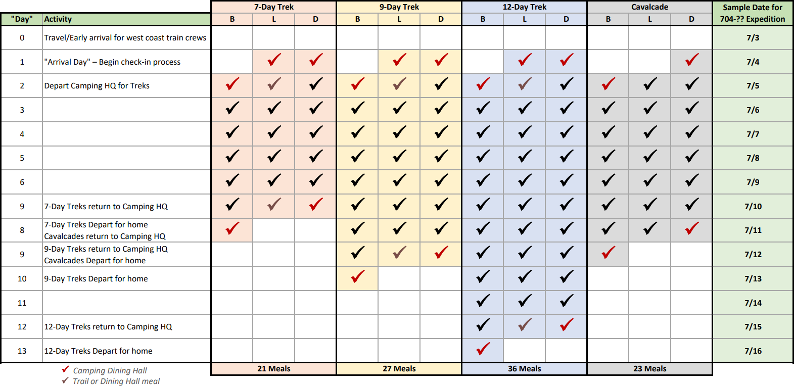

Please refer to your invoice for your specific arrival and departure dates. The Philmont fee for a 12-Day trek covers 36
meals and 12 nights lodging, staff, and program supplies. Prorating for missed meals is not available.

Your expedition begins with lunch on your arrival day (Day 1). For 12-Day treks, you will come off the trail on Day 12 and
depart Philmont after breakfast on Day 13. 7-Day Treks will come off the trail on Day 7 and depart on Day 8. 9-Day Treks
will come off the trail on Day 9 and depart on Day 10. Cavalcades will come off the trail on Day 8 and depart on Day 9.

###### Your arrival time will determine your first meal at Philmont. Meals are served at the following times:

###### A continental breakfast option is available at 5:45 a.m. for groups departing Philmont very early. This must be arranged
at the Registration Office upon arrival at Philmont.

# Philmont Days & Meals

---

#### 2025 Advisor Guidebook

As a courtesy to all groups in Base Camp (homebound and trailbound), please DO NOT plan to depart Philmont prior to
5:45 a.m. Early morning departures impact everyone’s ability to obtain adequate rest. Planning an extra travel day could
allow a crew to leave Philmont at a reasonable time, visit local attractions, and position themselves closer to airports for
early plane departures one day later.

Transportation Services
Philmont does not endorse any agency or vendor listed in this publication but provides this information to assist
groups in making travel and lodging arrangements.

- Airlines to Denver (270 miles from Philmont), Colorado Springs (190 miles from Philmont), Pueblo (159 miles from
Philmont), Albuquerque (220 miles from Philmont) and Amarillo (220 miles from Philmont) – obtain chartered bus directly
to Philmont.
• Charter bus service arranged at home direct to Philmont.
• Amtrak Train to Raton, NM; Philmont bus to and from Philmont – (800-872-7245 or www.amtrak.com).
• Amtrak Train to Denver, CO; obtain charter bus directly to Philmont.

Inquire with airline reservation personnel about the possibility of supplemental chartered airline services offering
packaged plans with reduced group rates. Review baggage fees and other airline related costs to include in the budget.

## Travel Companies Serving Philmont

- Blue Sky Adventures (877-225-8375 or www.blueskyadventures.net) charter service from Albuquerque, Denver, or
Colorado Springs.
• Cornerstone Bus Leasing & Rental (844-496-8287 or www.cornerstonebusleasing.com/philmont-shuttle-rental-discount)

Rental/Leasing of Mini-Bus Chassis from Denver or Colorado Springs.
• Go Shuttle, LLC (888-722-1483/720- 276-9976) van shuttle service from Denver and Colorado Springs.
• Greyhound Charter Services (800-454-2487 or www.greyhound.com or charters@greyhound.com)
• Gray Line of Colorado Springs (719-633-1181 or coloradosprings@grayline.com) provides transfer services to/from
Philmont for groups or individuals from Colorado Springs Airport.
• Gray Line of Denver (303-289-2841 or denver@grayline.com) provides daily transfer services to/from Philmont for groups
or individuals from Denver International Airport and Denver Amtrak.
• Herrera Coaches, Inc (505-242-1108, fax: 505-242-1125 or www.herreracoach.com)
• Leading the Way Tours, Inc (866-696-5073 or christine@leadingthewaytours.com) charter services from Colorado
Springs, Denver, or Albuquerque.
• Pacesetter (303-289-5637) provides service from Denver (airport or Amtrak) and Colorado Springs.
• Premier Charters, Inc (303-289-2222 or ryan@ridepremier.com) provides service from Denver and Colorado Springs.
• Ramblin’ Express (800-772-6254 or 719-590-8687 or service@ramblin.com) service in the Rocky Mountain region.
• MileMarker Van Rentals 15-passenger vans available for group rentals. Our rental depot is located next to DIA, with

a shuttle to and from DIA for your troop’s convenience. Vans are spacious and equipped with plenty of luggage room
and wi-fi.

Private Vehicles
This method of transportation should be used only with full assurance that vehicles are safe, and drivers are reliable.
Make sure there is adequate insurance coverage for each vehicle. Review the Guide to Safe Scouting for information
about automobile liability insurance requirements, motor vehicle and driver checklist, and using automobiles, SUVs, and
vans. Philmont is NOT responsible for vehicles parked in the camper parking areas.

Philmont Bus Service
Philmont provides round-trip bus transportation to and from the bus and train stations in Raton, NM at a cost of $55.00
per person (subject to change). This bus fee is payable on the day your crew checks in at Philmont. Buses are scheduled
upon entering your Arrival Plans through the Camping Gateway. Due to commercial schedules, it may be necessary for
you to eat in Raton prior to arriving at Philmont. If you arrive in Raton after 10:30 a.m. or 5:00 p.m., plan to eat a meal in
town as you will not arrive at Philmont in time for a scheduled meal. The shuttle bus driver will take you to a fast-food
location in Raton. Crews arriving by train should take their arrival time at Philmont into consideration.

# Transportation Services

---

#### 2025 Advisor Guidebook

Amtrak Transportation
Although Amtrak periodically changes its schedules and trains can be delayed, the (current) Amtrak service to/from
Raton (Philmont) is:

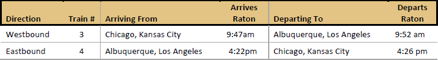

Crews traveling by train from the west coast (Los Angeles) should schedule their travel for the day before their “arrival
date” to be able to complete the check-in process on Day 1. Crews traveling by train from the east coast should arrive at
Philmont on their “arrival date”. They may want to travel a day earlier and spend the night in Raton or Cimarron to be
able to actually arrive on their arrival date should the train be late.

If you travel by Amtrak and cannot arrive/depart Raton on your arrival/departure day, please consider planning to stay
the night outside of Philmont. Space for early arrival/late departure crews is often extremely limited in base camp.
Philmont’s buses will transport you between the train station and motels in Raton or Cimarron and pick you up at the
motel the next morning to continue to Philmont. Email Philmont.Camping@Scouting.org to discuss these options.

When the westbound Amtrak train is on time, Philmont’s buses will stop so crews can have lunch at fast food
restaurants in Raton. They will not arrive at Philmont until mid-afternoon. This may delay the crew’s departure to the
backcountry until late on Day 2.

# Transportation Services (continued)

---

#### 2025 Advisor Guidebook

Lodging In & Around Cimarron, NM
A list of all locations that offer overnight accommodations for groups traveling to Philmont is available at
www.philmontscoutranch.org/philmonttreks/travelingtophilmont/staynear/. Contact locations directly to make a
reservation or seek specific information.

Phone Number
Agency & Address
Location
Distance from Philmont
575-377-6271
Cimarron Canyon State Park
P.O. Box 185
Eagle Nest, NM 87718
www.nmparks.com

Ute Park, NM
20 miles

10 miles SW of Raton
on Highway 64

575-445-3615
NRA Whittington Center
P.O. Box 700
Raton, NM 87740
info@nrawc.org
www.nrawc.org

###### 40 miles

575-376-2343
Ponil Campground
31006 U.S. Highway 64
Cimarron, NM 87714
www.Ponilcampgrouds.com

Cimarron, NM
6 miles

575-445-5607
Sugarite Canyon State Park
HCR 63, Box 386
Raton, NM 87740
www.nmparks.com

Raton, NM
55 miles

575-376-2268
Hikers Cimarron Inn & RV Park
212 E. 10th St., P.O. Box 631
Cimarron, NM 87714
www.hikerscimarroninn.com

Cimarron, NM
5 miles

###### 575-376-2664

St. James Hotel
617 Collison Ave
Cimarron, NM 87714
www.exstjames.com

Cimarron, NM
4 miles

575-425-0005
Blue Dragonfly Inn
600 W. 18th St.
Cimarron, NM 87714
www.bluedrangonflyinn.com

Cimarron, NM
4 miles

575-376-4105
Grand National B & B
609 S. Sherman Ave.
Cimarron, NM 87714
visit@grandnationalbandb.com

Cimarron, NM
4 miles

575-376-2246
Casa del Gavilan Historic Inn
570 N-21
Cimarron, NM 87714
www.casadelgavilan.com

Cimarron, NM
5 miles

# Lodging In & Around Cimarron

---

#### 2025 Advisor Guidebook

#### Other Information

Uniforms
Philmont strongly recommends groups wear the Scouting America field uniform (“Class A”) while in Base Camp,
especially at chapel services, dinner, and Opening and Closing campfires. The uniform is also appropriate for traveling to
and from Philmont. It is NOT required on the trail and may be left in personal vehicles or crew lockers for crews using
public transportation.

Trading Post – Tooth of Time Traders
The Tooth of Time Traders carries gear that will cover all your crew gear and personal equipment needs, as well as
Philmont souvenirs. To sign up for email updates and mailings, go to www.toothoftimetraders.com and register your
account today. If you want further information or have any questions, you can email toothoftimetraders@scouting.org.
The Tooth of Time Traders can produce custom t-shirts for your crew. Information can be found online at
store.philmontscoutranch.org/custom-crew-gear/. They also carry a wide variety of Scouting t-shirts and other clothing.
The use of Philmont logos is permitted provided they are manufactured by a Scouting America licensed vendor.

###### Start shopping at www.toothoftimetraders.com!

Fishing Licenses
All participants 18 years or older planning to fish are required to purchase a fishing license from New Mexico
Department of Game and Fish, either online or at the Tooth of Time Traders. Fishing licenses for participants 18 years
and older are NOT available for purchase in the backcountry.
Fees for non-resident fishing licenses are as follows:

Habitat
Management &

License (2024-2025 NM Game & Fish pricing)

License Charge

Habitat Stamp1

Vendor Charge

Total Charge

Access
Validation

(HMAV)2

1 Day
$12.00
$10.00
$4.00
$1.00
$27.00 or $17.00
5 Day
$24.00
$10.00
$4.00
$1.00
$39.00 or $29.00
Philmont youth (under 18) license3
$ 1.50
n/a
n/a
$0.50
$2.00
Annual
$56.00
$10.00
$4.00
$1.00
$71.00 or $61.00

1 If planning to fish on U.S. Forest Service Valle Vidal land, anglers must purchase a Habitat Stamp ($10.00).

2 All anglers 18 years old or older are required to purchase the HMAV ($4.00).
3 Sold at Tooth of Time Traders, Abreu, and Phillips Junction. These licenses are good for the trek duration and only valid for fishing at
Philmont.
The Habitat Stamp and/or HMAV stamp is only purchased once each license year.

If you are purchasing a one-day, five-day, or Philmont Youth license, we recommend that you do so at the Tooth of Time
Traders after you arrive at Philmont. This is so we may help you align the actual fishing days with your itinerary and
insure you have the required validations (Habitat Stamp or HMAV) before purchasing a non-refundable license. It also
saves time in the backcountry. There is a special online kiosk at the Tooth of Time Traders available to help participants
obtain their licenses.

The New Mexico Department of Game and Fish requires each applicant to create an online account with a username
and password before they can purchase a license. The system will assign the applicant a unique Customer Identification
Number (CIN). Each person in the crew planning to purchase a license should obtain their own Customer Identification
Number. You can speed up the process of purchasing your license at Philmont by obtaining this information before you
leave home — be sure to bring your CIN to Philmont. Adults also must know their Social Security number to purchase
a fishing license.

###### http://www.wildlife.state.nm.us/fishing/licenses-permits/

# Fishing Licenses

---

#### 2025 Advisor Guidebook

Pack Rental
Philmont maintains several different brands of internal and external frame backpacks for rent. This can be helpful for
participants who are not able to purchase a backpack for the trek, find that their pack is not the correct size, or is not
durable enough for Philmont’s trails. Philmont rents packs, with a pack cover, for $30 for the duration of the trek.
Shipping Procedures
There are many different items that you may need to ship to Philmont, some of which may have specific shipping
requirements. Fuel and stoves are some of the most common items shipped to Philmont, but the information below
applies to any item that needs to be shipped to the Ranch.

Philmont requires crews to use backpacking stoves. Visit www.toothoftimetraders.com for information on fuel for your
Philmont Expedition. White gas and isobutane/propane fuel type canisters are available at Camping Headquarters and
trading posts/commissaries along your itinerary in the backcountry. All liquid fuel containers should be spun aluminum
or hard plastic bottles designed to carry fuel.

If you are traveling by commercial transportation, you will need to ship your stoves and fuel bottles by United States
Postal Service (USPS) or United Parcel Service (UPS). Your package must be sent using ground service only. Please plan
ahead and allow two weeks for your items to be shipped to Philmont.

###### If you plan to ship your stoves and fuel bottles, please follow the steps below:

1. Purge stoves with attached tanks until they sputter and go out.
2. Wash fuel bottles with hot, soapy water and air dry for at least 24 hours.
3. Box stoves and fuel bottles. Do NOT ship matches, lighters, compressed fuel canisters or other hazardous materials.
4. Use the following address to ensure that you receive your stove and fuel bottles:

Advisor’s Name, Expedition Number
47 Caballo Rd
Cimarron, NM 87714
5. This address can also be used for participant mail and packages which will be delivered to the Philmont Mail
Room in Base Camp. Be sure to include the Expedition Number! Please ship your packages at least two weeks
prior to your arrival to allow ample time for delivery.
6. If you are using UPS, we strongly recommend that you obtain a prepaid return shipping label. Without a
prepaid return shipping label, Philmont Mail Room staff will assist you in shipping your items home with
either USPS or UPS.
7. At the conclusion of your expedition, the Philmont Mail Room staff will coordinate the shipping of your
items home. Similar steps in preparing your stoves and fuel bottles are required. Stoves with attached tanks
must be purged and fuel bottles must be washed with hot, soapy water. The Mail Room will allow the items
to dry before the boxes are sealed and shipped. This part of the process will usually take place after your
crew has departed. Return instruction sheets are provided when you arrive at Philmont.

Philmont works closely with the local US Post Office and UPS. These procedures must be followed closely to comply with
all regulations to ensure that your stoves and fuel bottles are shipped properly.

Crew Lockers & Security
Philmont provides crew lockers with locks as well as safekeeping storage services for crews. Crew lockers (2’ x 2’ x 3’) are
available for items not needed on the trail. These lockers are limited and groups traveling by private vehicle will be
asked to store items in their vehicles. Crews using lockers will be limited to two lockers based on availability.
Safekeeping storage is available for valuables such as tickets, cash, credit cards, car keys, etc. Items are sealed in
envelopes and placed in a safe located at Camping Headquarters. Never leave valuables in tents or unattended.
Philmont is not responsible for lost or stolen items.

# Pack Rental, Shipping & Crew Lockers

---

#### 2025 Advisor Guidebook

Smartphones
In an age of technology, smartphones are a common tool used in everyday life. While backpacking in the backcountry is
an experience best enjoyed without the distractions of technology, Philmont recognizes that their use is more common
than ever. Photographs and videos can be taken on these phones, and solar chargers are widely available, as well as
several useful outdoor apps. Cell phone service is very limited in Philmont’s backcountry – it is generally available in the
base camp area.

If it is imperative that a smart phone be taken on the trail, ensure that it is being utilized in a way that enhances the
Philmont experience and does not detract from the adventure for your crew or of other crews on the trail. Download
apps that will help the learning experience. Find a good stars/constellation app, an animal tracks/scat/calls app, or
compare bird calls you hear on the trail with a bird call app. Reserve texting and phone calls for emergency use only.
Keep in mind that there are NO OPPORTUNITIES on the trail or in any backcountry camp to ever recharge a smart
phone, camera, or other electronic device.

Drones
Philmont does NOT allow the use of drones by participants for any purpose and restricts the use of drones to only
include the Philmont Marketing Department, the Philmont Conservation Department, and the Philmont Fire
Department.
Day One at Philmont
The first stop at Philmont will be the Welcome Center at Camping Headquarters. Drive in beside the gateway to the
unloading area at the Welcome Center. You will be greeted by a staff member with complete instructions for unloading
and parking. Please follow them carefully.

Crew Check-In
The Day 1 check-in process has several steps. Upon arrival at Philmont’s Welcome Center, the Council Contingent
Advisor or Lead Advisor for a single crew should identify themselves to the Welcome Center staff. After meeting their
Ranger, the first step in the check-in process will be Registration. The Lead Advisors for all contingent crews or multiple-
crew groups MUST report to the Registration Office at the same time. They should be accompanied by every crew
member aged 18 and older for a photo identification card check. Rosters will be verified, and outstanding finances
paid.

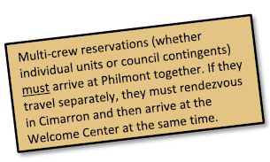

###### The Lead Advisors should also bring the following with them to Registration:

1. Copy of online Crew Roster with any last-minute changes
noted.
2. A check, cash, or credit card for any outstanding fees or charges.

###### After the Contingent/Lead advisor has completed the Registration process,
they can rejoin their crews to complete Base Camp procedures.

# Smartphones, Drones & Day One

---

#### 2025 Advisor Guidebook

Meet Your Ranger
At the Welcome Center, you will meet your Ranger, a well-qualified staff member who has a sincere interest in your
group and has been trained to help your crew get started on a successful Expedition.

###### The Ranger’s job is to lead you through a series of important check-in stops, each designed to help your crew prepare for
your adventure.

###### Stops will include:

- Marketing & Photo Services – Crew Photo
•
Outfitting Services – Gear/Food Issue
•
Philmont Infirmary – Medical Recheck
•
Security – Lost and Found
•
Shakedown
•
Tooth of Time Traders
- Camping Headquarters – Registration
•
Conservation – Site Orientation
•
Emergency Information
•
Laundry
•
Logistics – Trip Planning
•
Mail Room

By planning ahead and using your time wisely, your crew may have time to visit the National Scouting Museum, Seton
Memorial Library, Villa Philmonte, Kit Carson Museum at Rayado, Historic Chase Ranch, and the Tooth of Time Traders.
See The Guidebook to Adventure for more information.
Philmont Check-In

- Start hydrating now! Due to the low humidity and bright sun at Philmont, your body needs significantly more water than you
are likely accustomed to. Typically, it is recommended participants drink 1 liter of water per hour while on the trail. Always
carry a water bottle with you!
- Tent Assignment: You will receive tent assignments at the Welcome Center for your first night at Philmont. Your
Ranger will show your crew to their assigned tents.
- Registration: Your contingent leader or Lead Advisor will meet a registrar in Camping Headquarters. All participants 18 and
older must check in with a current photo ID. Philmont requires that three people in each crew be currently certified in
Wilderness First Aid Basic and CPR. Current certifications will need to be uploaded prior to arrival. A large Safekeeping envelope
will be provided to store locker/ vehicle keys, extra money, credit cards, and/or valuable documents in the safe while your crew
is on the trail. Any outstanding fees will be paid at this time.
Individual crew advisors will need a check, cash, or credit card payment for expedition balance fees, transportation, or any
other potential charges that may be due by the individual crew.
• Crew Photo: A trained Philmont photographer will take your crew photo before you depart for the trail. Most crews elect to
wear their Scouting America uniforms or a crew uniform. Each crew member will also receive a free digital download.
Additional photo merchandise is available at www.philmontphotoarchive.org.
- Logistics: Only your Lead Advisor and Crew Leader will meet one of the itinerary planners at Logistics to finalize arrangements
for your program, food pickups, bus transportation, and conservation sites. Your Crew Leader should bring their Crew Leader
Field Guide and an unmarked Philmont Overall map to mark your route and campsites. Your Crew Leader will receive a detailed
copy of your itinerary for use while on the trail.
- Medical Recheck: A medical recheck, which may include blood pressure and weight check, will be given to all crew

members. Your Ranger will give you the procedures for this required recheck. You will need to bring all medication (in original
containers) with you to the recheck.
To make the medical recheck as smooth as possible, crew advisors should closely check the Annual Health and Medical Record
of each crew member to ensure they are completely and properly filled out and that all medical forms are uploaded to the
Gateway before arrival. Additional information on chronic health issues can be found on the Philmont Website.
A participant whose weight exceeds the maximum allowable on the height/weight chart will not be allowed to
participate and should not attend or they will be sent home at their own expense.

# Day One at Philmont

---

#### 2025 Advisor Guidebook

- Outfitting Services: Outfitting Services is in the Mabee Services Building. Trail equipment including tents, poles, cooking pots,
etc., will be issued to your crew along with your first issue of Trail Meals. The Crew Leader’s Copy of your itinerary must be
presented to draw your trail food. White gas purchases and pack rentals are also handled through Outfitting Services.
- Philmont Mail Room: The Mail Room is also located in the Mabee Services Building near Outfitting Services. Your Adult Advisor
or Crew Leader should plan to check for mail before leaving this area.
- Shakedown: You will unpack everything in a place designated by your Ranger. Your Ranger will review the necessary
items and demonstrate the best methods of packing at Philmont. Store excess items in your crew locker or vehicle.
PLEASE NOTE: After leaving Camping Headquarters, there is NO opportunity to return excess baggage. If you have doubts
about taking certain items, discuss them with your Ranger. Your Ranger is NOT permitted to bring any crew gear you take on
the trail back to Base Camp nor can items be left in a backcountry camp to be delivered and held in Base Camp. You are
responsible for carrying everything you take with you for the duration of your trek.
- Conservation Project and Emergency Boards: Your Ranger will describe these information boards in more detail at their
designated sites in Base Camp.
- Tour Camping Headquarters: As time permits, your Ranger can give you a tour of Camping Headquarters. Visit the
National Scouting Museum and while there, schedule a tour of the Villa Philmonté.
- Tooth of Time Traders (TOTT): Your tour should include a visit to the Tooth of Time Traders where a complete
supply of outdoor gear and equipment, Philmont items (patches, belts, buckles, maps, gift cards, etc.), and other
souvenirs are available. Items are also available online at www.ToothOfTimeTraders.com. The Tooth of Time Cantina, where
snacks and beverages are available, is located adjacent to the TOTT.
- Headquarters Dining Hall: In Camping Headquarters, you will eat in the dining hall. The menus are well-balanced and nutritious.
- Leadership Meetings: Separate meetings will take place for Lead Advisors (all adults should attend), Crew Leaders, Chaplain’s
Aides, and Wilderness Pledge Guías. Topics will include current backcountry conditions as well as tips to improve your
Expedition.
- Religious Services: Chaplains of Jewish, Protestant, Catholic, and LDS faiths conduct services at Camping Headquarters
beginning at 7 p.m. daily. Your crew is encouraged to attend. The Tooth of Time Traders will be closed at this time.
• Contact home: After supper is a good time to write home. Your parents will enjoy hearing from you. (Philmont postcards are
available at the Tooth of Time Traders, Mail Room, and in backcountry Trading Posts).
• Opening Program: Your first evening program at Philmont is a portrayal of the “Philmont Story”, a historic narrative of the
Southwest. Your Philmont adventure begins here. Warm clothing is recommended for this and all evening programs.
• A Good Night’s Sleep: Following the campfire, quietly return to your tent for a good night’s sleep as it will help you adjust to
the altitude and be ready. Tomorrow, you hit the trail! Be sure your crew adheres to the nightly quiet hours. Your actions can
negatively impact others.
• Security, Lost-and-Found, Crew Lockers: Philmont employs a Seasonal Security Staff to assist with Lost and Found, issue crew
lockers, and provide security. Crew lockers are reserved for crews traveling by public transportation.
Crews with vehicles will store belongings in their vehicles. The number of lockers is limited (max 2 lockers per crew). Lockers
are 2’ x 2’ x 3’. When you hit the trail, nothing can be left in your tent. Do not leave valuables in tents while in Base Camp –
Philmont is not responsible for lost or stolen items.
• Laundry: Dirty clothing may be laundered at Philmont’s self-service laundromat. One or more crew members should be
assigned to bring all the crew’s dirty clothes to the laundry. All clothing should be marked with your name in indelible ink and
any loose patches or insignia and supplies should be removed to save time and confusion. Laundry soap and supplies are
available from the Tooth of Time Traders or the laundromat.

# Day One at Philmont (continued)

---

### Philmont Hymn

### Philmont Grace

Silver on the sage,
Starlit skies above,
Aspen covered hills,

For food, for raiment,
For life, for opportunity,
For friendship and fellowship,

Country that I love.
Philmont here’s to thee,

#### We thank thee, O Lord.

#### Amen

Scouting Paradise,
Out in God’s country, tonight.

#### Delivering Wilderness

#### Wind in whispering pines,

Eagles soaring high,
Purple mountains rise,

and Learning
Adventures that

Against an azure sky.
Philmont here’s to thee,

#### Last a Lifetime

Scouting Paradise,
Out in God’s country, tonight.