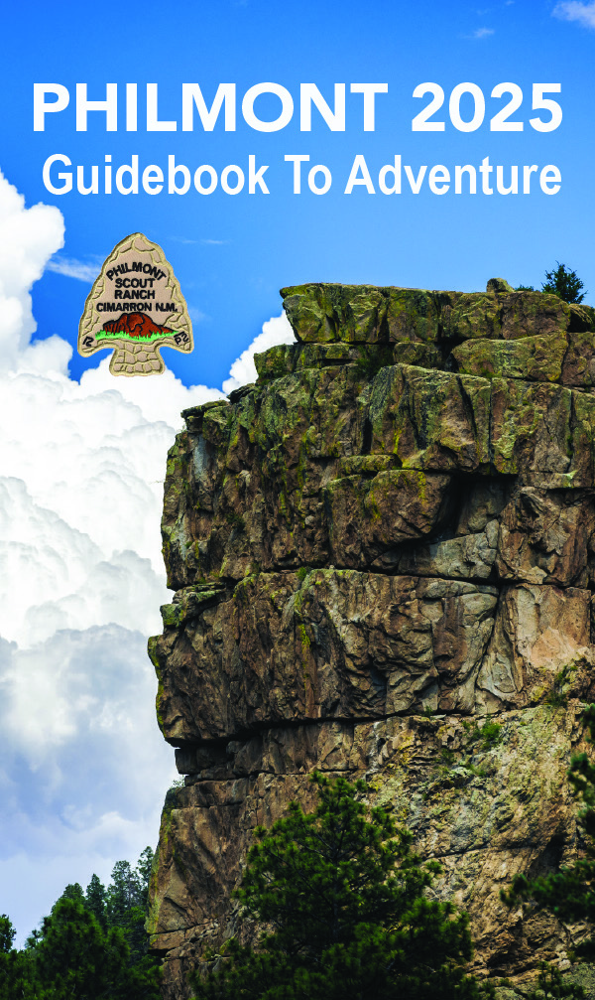
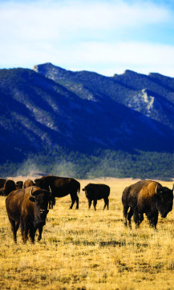
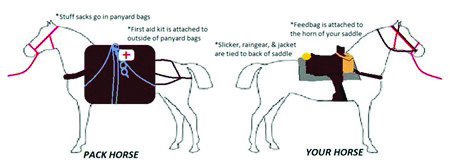
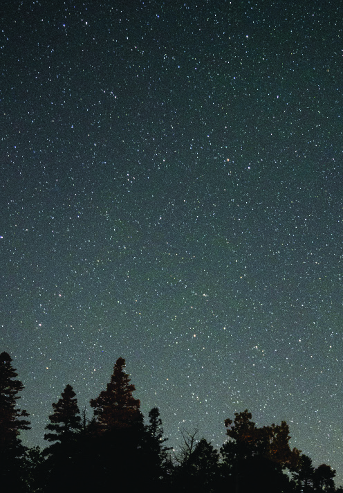

# Cover

---

MISSION OF SCOUTING AMERICA
The mission of Scouting America is to prepare young people to make
ethical choices over their lifetimes by instilling in them the values of
the Scout Oath and Law.
A PICTURE OF THE FUTURE FOR SCOUTING’S SECOND
CENTURY
In Scouting’s second century, we are building the leaders of tomorrow.
Scouting’s dynamic and engaging journey beckons to America’s young
people. Our exciting programs and outdoor adventures inspire lives
of leadership, character, and service. Relevant and adaptive, we are a
trusted advocate for youth. Our adult volunteers and employees are
widely admired for their leadership excellence. True to our mission,
Scouting reflects our nation in its ethnic diversity and shapes our
nation by developing responsible citizens.

VISION STATEMENT – PHILMONT SCOUT RANCH
It is the vision of Philmont Scout Ranch to continue to positively
impact the lives of young people and their Scouting leaders through
inspiring and effective delivery of the finest Scouting possible through
backcountry adventures and Training Center experiences.
It is our further vision that these experiences will be expanded to help
meet increasing demands. All future growth must be accomplished
with minimal ecological impact on resources to ensure the
preservation of this great asset to serve future generations of Scouts.

PHILMONT SCOUT RANCH AND TRAINING CENTER
Delivering Wilderness and Learning Adventures That Last A Lifetime

MY EXPEDITION NUMBER:

Your Expedition Number is assigned by Philmont. It is determined by your
expected arrival date. For example, if your crew is to arrive July 14, your
Expedition Number will begin with 714. Since many crews arrive each day,
letters distinguish different crews (for example, 714-A or B, C, etc.) If your
reservation consists of several crews, numbers are used to designate each
one. Thus, your crew’s complete Expedition Number may be 714-A-02. If you
don’t know your crew’s Expedition Number, ask your Advisor.

PHILMONTSCOUTRANCH.ORG

# Mission & Vision Statement

---

TABLE OF CONTENTS
COMMITTMENT TO SAFETY................................................................ 4
PHILMONT MAGIC.............................................................................. 4
AWARDS.............................................................................................. 6
PREPARING AND TRAINING................................................................. 8
PRACTICE THE PATROL METHOD....................................................... 10
HIKING SKILLS.................................................................................... 11
YOUR PERSONAL EQUIPMENT.......................................................... 14
EQUIPMENT PROVIDED BY CREW..................................................... 17
EQUIPMENT PROVIDED BY PHILMONT..............................................18
TIPS ON EQUIPMENT......................................................................... 19
TIPS ON CLOTHING............................................................................ 22
OTHER USEFUL INFORMATION......................................................... 24
THE ESSENTIALS FOR HIKING............................................................ 26
ARRIVING AT PHILMONT................................................................... 26
DAY ONE AT PHILMONT..................................................................... 27
DAY TWO AT PHILMONT.................................................................... 30
DAY THREE AT PHILMONT................................................................. 30
CAMPING AT PHILMONT................................................................... 30
BEARMUDA TRIANGLE...................................................................... 34
PRESERVING THE PHILMONT WILDERNESS...................................... 34
WILDERNESS PLEDGE........................................................................ 35
REPORT ARTIFACTS........................................................................... 36
SAFE AND HEALTHY CAMPING AND HIKING..................................... 36
MEDICAL TREATMENT....................................................................... 46
PROGRAM FEATURES........................................................................ 48
CAMPS AND PROGRAM FEATURES................................................... 55
PHILMONT MUSEUMS...................................................................... 56
RELIGIOUS SERVICES......................................................................... 57
FINAL PROCESSING AT CHQ............................................................... 58
MORE PHILMONT ACTIVITIES........................................................... 59
FALL AND WINTER PROGRAMS......................................................... 61
STAFF OPPORTUNITIES...................................................................... 62
PHILMONT TRAINING CENTER.......................................................... 62
MEANINGS AND PRONUNCIATIONS.................................................. 63
CAVALCADE GUIDEBOOK.................................................................. 64
INDEX................................................................................................ 73
Copyright © 2025
Philmont Scout Ranch
Scouting America
Cimarron, New Mexico

# Table of Contents

---

Scouting America’s Commitment to Safety
In Scouting, we will not compromise the safety of our youth, volunteers, and
employees. Safety is a value that must be taught and reinforced at every
opportunity. We are all responsible and must hold each other accountable to
provide a safe environment for all participants.

We are committed to abuse prevention by utilizing:
•
Mandatory youth protection training.
•
Criminal background checks.
•
Banning one-on-one adult and youth interactions.
•
Mandatory reporting of suspected abuse to law enforcement.
•
A volunteer screening database.

We are committed to injury and illness prevention by integrating safety
measures in our handbooks, literature, and training materials including the
Guide to Safe Scouting. We expect leaders to use the four points of SAFE
when delivering the program. SAFE Scouting measures include:
•
Youth are Supervised by qualified and trustworthy adults who set the
example for safety.
•
Activities are Assessed for risks.
•
Pre-requisite Fitness and skill levels are confirmed before participation.
•
Appropriate Equipment is utilized and Environmental conditions are
monitored.

When incidents do occur, we expect a timely, clear, and complete incident
report. We are committed to learning from the data and modifying program
guidance for the prevention of future occurrence.

PHILMONT MAGIC
There is a magic spell at Philmont. Long ago, the Native Americans felt it.
Later, Kit Carson, Lucien Maxwell, and other mountain men were captivated
by the land. A century later, the late Mr. Waite Phillips found himself under its
spell. His son, Elliott, and his cousins found it almost a necessity to return to
Philmont during their high school and college summer vacations.
LOCATION and TERRAIN
Philmont is a National High Adventure base, owned and operated by
Scouting America. Philmont is large, comprising 140,711 acres or about 220
square miles of rugged mountain wilderness in the Sangre de Cristo (Blood of
Christ) range of the Rockies in northeastern New Mexico. Over thirty staffed
camps and seventy plus trail camps are operated by the ranch. Philmont has
high mountains which dominate rough terrain with an elevation ranging from
6,500 to 12,441 feet.
Philmont has established special use permits with several neighbors:
•
US Forest Service – Valle Vidal Unit of the Carson National Forest

# Commitment to Safety & Philmont Magic

---

- Barker Wildlife Management Area/New Mexico Game & Fish Dept.
•
Colin Neblett State Wildlife Area
•
UU Bar Ranch
Each neighbor has established specific use requirements. If your itinerary will
pass through these lands, you will receive specific information during your
orientation at Logistics. Each requires use of low-impact camping techniques.
These additional properties add about 110,000 acres for a total use area of
250,000 acres or 390 square miles.
HISTORY
Philmont has a unique history of ancestral Puebloans who chiseled writings
into canyon walls…Spanish conquistadors who explored the Southwest long
before the first colonists arrived on the Atlantic coast…the rugged breed of
mountain men like Kit Carson who blazed trails across this land…the great
land barons like Lucien Maxwell who built ranchos along the Santa Fe Trail...
and miners, loggers, homesteaders, and cowboys. All these people left their
mark on Philmont.
WILDLIFE
Philmont is abundant with wildlife—deer, elk, coyote, antelope, mountain
lion, buffalo, beaver, wild turkey, bear and others. Its hills and canyons teem
with birds and its streams abound with fish. Its cool mountains harbor a
wilderness of botany—trees, shrubs, flowers, and grasses.

BEAUTY
Philmont is rich in natural beauty, including the soaring Tooth of Time…
sunrise from lofty Mount Phillips…the blue water of Cimarroncito Reservoir…
the panoramic sweep of the plains from Urraca Mesa…and sunlight filtering
through aspen along the rippling Rayado.
PROGRAM
Philmont provides an unforgettable adventure in sky-high backpacking
country along hundreds of miles of rugged, rocky trails. Program features
combine the best of the Old West. Horseback riding, burro packing, gold
panning, chuck wagon dinners, and living history provide exciting challenges
each day. Rock climbing, mountain biking, range and target activities, and
more make for an unbeatable recipe of fast-moving fun in the outdoors.

FELLOWSHIP
The opportunities for fellowship at Philmont are incredible from your own
crew to others from across the nation and the world.

STAFF
Philmont has the finest staff in America. Each staff member is carefully
selected and trained. Scouting spirit, knowledge of camping skills, keen
interest in their respective program specialties, and a love for Philmont lead
the staff to deliver a rewarding and memorable experience.
When you come to Philmont, take advantage of these opportunities. It is
one of the best investments you will make—the returns are great!

# Location, Terrain & History

---

WHO MAY PARTICIPATE?
In keeping with the policies of Scouting America, rules for participation
are the same for everyone without regard to race, color, national origin,
religion, age, sex, gender, sexual orientation, marital or familial status, genetic
information, citizenship status, protected activity, or any other status or
classification protected by applicable federal, state, and/or local laws.
Participants must be registered members of Scouting America who will
be 14 years old OR at least 13 years old and completed 8th grade prior to
participation. DO NOT request or expect any exceptions to this rule.
Some special programs allow for individual registration and participation.
A crew must have a majority of its members under age 21. Each participant
must be capable of participating in a backpacking or horseback riding trek.
Please note that specific programs may have additional requirements for
participation including but not limited to a 210 lb. weight limit for Cavalcades
and horse rides. Each participant must meet the health requirements as
outlined in the Annual Health and Medical Record.

Harassment
Philmont and Scouting America prohibit language or behavior that belittles
or puts down members of any sex, unwelcome advances, racial slurs,
chastisement for religious or other beliefs or any other actions or comments
that are derogatory of people. Participants who do not meet these
expectations may be asked to leave.

PHOTO (TALENT) RELEASE INFORMATION
All Philmont Scout Ranch participants are informed that photographs, film,
video tapes, electronic representations and/or sound recordings may be
made during their visit to Philmont Scout Ranch. These images may be used
for training and promotion purposes for Philmont Scout Ranch and other
projects approved by Scouting America.
Each participant, by completing the Annual Health and Medical Record
“Part A: Informed Consent, Release Agreement, and Authorization”, will fulfill
the necessary Photo (Talent) Release requirements for Philmont Scout Ranch.
(For complete statement please refer to Part A of the Annual Health and
Medical Record.)
AWARDS
Philmont Awards can only be earned! They are NOT available to the public.

Two unique awards are presented to participants who successfully meet the
challenge of a Philmont Expedition. They are:

THE ARROWHEAD AWARD
The Arrowhead Award is presented by your Adult Advisor when you have:
1. Attended the opening campfire – “The Philmont Story”.
2. Complete a Philmont-approved itinerary (some exceptions for medical
reasons) with your crew.
3. Completed a 3-hour conservation project at one of several
designated sites on Philmont or neighboring properties (with the

# Awards

---

help of Conservation Department staff) and taken advantage of every
opportunity to learn about and protect our landscape while practicing
the art of backcountry living and travel that minimizes impact to soil,
water, plant life, and wildlife.
4. Fulfill the personal commitment to the Wilderness Pledge.
5. LIVE THE SCOUT OATH AND LAW.

THE “We All Made It” PLAQUE
An award presented by Philmont to each crew that:
1. Demonstrated good camping practices and Scouting spirit.
2. Followed an approved itinerary and camped only where scheduled.
3. Fulfilled the commitment to the Wilderness Pledge.

ADDITIONAL AWARDS THAT MAY BE EARNED DURING YOUR TREK

DUTY TO GOD
Under the guidance of a crew Chaplain’s Aide, each participant may fulfill
the requirements for the Philmont “Duty To God” award. The requirements
include:
1. Attend a religious service while at Philmont.
2. Participate in at least three daily devotionals with the crew.
3. Lead Grace before a meal.
Participants must obtain the Chaplain’s Aide signature to certify completion
of the requirements. Scouts and Leaders may then purchase a “Duty To
God” patch from the Tooth of Time Traders. Proceeds support the Chaplain
Program at Philmont.
WILDERNESS PLEDGE ACHIEVEMENT AWARD
Each participant in the backcountry can earn the Wilderness Pledge
Achievement Award. This award has five requirements. The Wilderness
Pledge Guia will help all members of the crew complete the requirements
and earn the award. A documentation form will be provided at the
Wilderness Pledge Guia meeting held daily for trail-bound crews at the
Conservation pavilion. The Wilderness Pledge Achievement Award patches
can be purchased by submitting the form at the Tooth of Time Traders. Profits
from the purchase of this award will be used to expand the sustainable
initiatives of Philmont Scout Ranch. The requirements include:
1. Take part in Ranger-led training for the Philmont Wilderness Pledge and
the Leave No Trace principles as they relate to your trek.
2. Follow all Philmont hiking and camping procedures on your trek.
3. Practice all Philmont bear and wildlife procedures on your trek.
4. Take part in discussions focusing on the Seven Principles of Leave No
Trace, led by your Wilderness Pledge Guia; find examples of the focus
principle during that day of the trek.
5. Complete your assigned Conservation project while on your trek.

LA DOCENA ADVENTURADO AWARD
The “La Docena Adventurado” Award is presented to each crew that
participates with the maximum number of participants: Backpacking

# Awards (continued)

---

Expeditions = 12 participants and Cavalcade Expeditions = 15 participants. A
ribbon is presented to the Advisor during the arrival registration process.

TRIPLE CROWN AND GRAND SLAM
The Triple Crown Award is available to individuals who have participated in
a high adventure program at three of the four national bases (Philmont Scout
Ranch, Northern Tier, Florida Sea Base, and the Summit Bechtel Reserve).
The Grand Slam Award can be earned by participating in a high adventure at
all four national bases. Logistics will provide documentation to each crew to
certify participation in a Philmont Camping Program and to track participation
at other bases. These awards are managed by the Sommers Alumni
Association. Complete details on qualifying programs and award ordering
information can be found at www.nationalhighadventureawards.com.

50-MILER AWARD
The 50-Miler Award, given by the National Council, may be earned by
members of unit or council contingent groups. Requirements for this award
include hiking at least 50 miles and performing a 10-hour conservation
project. A minimum of 3 hours will be earned at Philmont and the remaining
hours can be completed with your home unit or council. All 12-Day Philmont
itineraries meet the distance requirement, and several itineraries includes
enough conservation program time to earn the award at Philmont. The award
may be ordered through your local council service center or from the Tooth
of Time Traders.
PREPARING AND TRAINING
A Philmont Expedition begins at home. Months before arriving at Philmont,
you should begin planning and training. Several details must be completed
when your Advisor receives the “Advisor’s Packet”, including:

Annual Health and Medical Record/Physical Evaluation
You must have a current Annual Health and Medical Record completed
before departing for Philmont. Physical evaluations by a physician are valid
through the end of the 12th month from the date it was administered by
your medical provider. You are required to have had a tetanus shot or booster
within 10 years. A current measles vaccination is highly recommended.
Advisors should collect the Annual Health and Medical Record form well
in advance of departing on your Philmont trip to ensure that participants
meet all Philmont requirements. Upload the Annual Health and Medical
Record form, along with Wilderness First Aid and CPR certificates, into the
crew roster in the Philmont Gateway. Participants MUST NOT exceed the
maximum acceptance on the height/weight chart at the time of their arrival
at Philmont. A fee will be charged for medical exams and vaccinations for
participants who arrive at Philmont without having the required examination.
Participants who do not wish to have vaccinations or specific medical
treatment due to personal or religious reasons should fill out the vaccination
exemption form and attach it to the Annual Health and Medical Record.
Due to Philmont’s remote location it is imperative that participants have
any emergency medication they may need and know how to administer it.

# Preparing and Training

---

This includes rescue inhalers and EpiPens. Emergency medications will be
checked during the medical recheck process to ensure that the medications
are in date and there is sufficient quantity for your trip. All medications must
be in original containers.
A copy of the Annual Health and Medical Record, High Adventure Risk
Advisory to Health-Care Providers and Parents, Vaccination Exemption form,
and Frequently Asked Questions can be found at http://www.scouting.org/
HealthandSafety/ahmr.aspx.
Height/Weight Restrictions: If you exceed the maximum weight for height
as explained in the following chart and your planned high-adventure activity
will take you more than 30 minutes away from an emergency vehicle/
accessible roadway, you may not be allowed to participate. Review the
Annual Health and Medical Record for additional information regarding the
height/weight restrictions.

Height/Weight Chart (NOT for horserides/Cavalcades. See pg 65)

Height (inches)
Max Weight
Height (inches)
Max Weight

60
166
70
226

61
172
71
233

62
178
72
239

63
183
73
246

64
189
74
252

65
195
75
260

66
201
76
267

67
207
77
274

68
214
78
281

69
220
79 & over
295
Physical Training
All Philmont activities are physically demanding. Steep, rocky trails with
1,000-foot climbs are typical. Also, there is 20 to 35 percent less oxygen at
Philmont elevations than at sea level. Remember, you will be carrying a pack
weighing up to 1/3 of your body weight. Breathing will be labored, especially
at the start of your trek.
A program of regular aerobic exercise that begins six months or more
before you come to Philmont is highly recommended. Exercise for at least
30 minutes 3 to 4 times a week at an intensity that boosts your heart rate
about 75% of your maximum. An average maximum heart rate is 220 minus
your age. If you are older than 40, or have not been very active, consult your
doctor before beginning an exercise program.
Jogging, hiking uphill or up long flights of stairs, and hiking with a full pack

# Physical Training

---

(the weight you expect to carry at Philmont) are excellent preparation. Other
aerobic exercises such as swimming and bicycling can be used to supplement
your training. Start slowly and gradually increase the duration of your
exercise.
Exercise individually or with other members of your crew. Set aside regular
periods of time to do it. Plan to be in top physical shape when you arrive
at Philmont. You will enjoy your experience more and be less likely to have
medical problems. This is a great opportunity to break in boots and other
gear that you will be using on your Philmont trek.
Philmont suggests that you maintain a fitness log of all physical activities.
This will help you stay focused and provide a way to monitor your progress.
By comparing information from your log with other members of the crew, you
will be able to encourage each other to physically prepare for the adventure.

Stretching
Hiking at Philmont can be strenuous. Proper stretching before and after a
hike can make your hike more enjoyable and prevent injuries for young & old.

Your Philmont Itinerary
An important step in preparing for Philmont is for your crew to select your
itinerary. An itinerary is a hiking plan that describes camps and program
features for each day on the trail. Crews will select and confirm their itinerary
online. Instruction for this process will be through the Camping Gateway.
Online selection and confirmation will begin in January. Itineraries will
post to www.PhilmontScoutRanch.org in December in a document labeled
Itinerary Guidebook.

PRACTICE THE PATROL METHOD WITH YOUR CREW
Your Philmont trek will provide you an opportunity to practice the many
skills that you have learned while participating in your Scouts BSA Troop,
Venturing Crew, Sea Scout Ship or Explorer Post. This experience brings in
focus the importance of the Patrol Method. Each crew is a small group of
participants much like a patrol. The crew members are close in age and
experience level and working together helps everyone develop a sense of
pride and identity. The participants elect their Crew Leader, divide up the
jobs to be done, and share in the satisfaction of accepting and fulfilling group
responsibilities.
Three members of the crew will have a leadership responsibility that lasts
throughout the trek: Crew Leader, Chaplain’s Aide, and Wilderness Pledge
Guía. In addition, all members of the crew will serve in some leadership
role each day, either as the primary or the assistant. Examples of rotated
leadership responsibilities for the crew include navigator, cook, dishwasher,
bear bags manager, water gatherer, and fire guard (when fires are permitted).
The camping methods practiced at Philmont Scout Ranch support the
Patrol Method concept. With approximately 20,000 participants each
summer, Philmont has determined that these methods and procedures work
best. Please plan to follow them. Two examples of this include cooking and

# Practice the Patrol Method

---

washing dishes as one group. Members of the crew will rotate during the
trek and fulfill these important responsibilities. This allows crew members to
practice servant leadership as they take on a task that will support the entire
crew.
Some of the current wilderness camping methods focus on the individual.
In support of Scouting America, Philmont will focus on the crew and the
accomplishments that they can achieve by working together as a team, the
Patrol Method.
The Ranger assigned to the crew will help the entire crew achieve the most
from their Philmont Adventure!
HIKING SKILLS
Take time to enjoy the scenic panoramas, delicate wildflowers, rippling
streams, majestic peaks, and towering trees. Some of the most beautiful
scenery is along little-used trails and at remote trail camps. When your crew
is quiet you may see wildlife including deer, turkey, elk, bobcat, coyote,
badger, and bear. Time and effort spent in sharpening your hiking and
camping skills will allow you more time to enjoy the natural beauties and
program features of Philmont. The best way to practice and develop these
skills is to participate in several outings with your crew. Use the Backpacking
Merit Badge pamphlet or the BSA Field Book to guide your preparation and
training. The Philmont Field Guide, available at the Tooth of Time Traders, can
help enhance your experience, also.
Philmont suggests two shakedown weekends. Step by step guides for
shakedown weekends are available at www.PhilmontScoutRanch.org/
shakedown. Be sure to also tune in to the monthly “Philmont Preparedness
Seminars” for a variety of useful planning tips and updates to programs and
procedures. See the website for dates and more information.
Hiking is an important part of the Philmont experience. Navigators and
Crew Leaders will need to study the map and Crew Leader Copy to determine
the best route, the number of miles, and the elevation gain and loss. The
map can provide many clues to help determine hiking times and scenic stops.
Setting the Pace
Hiking on Philmont is often difficult. Weighty packs, steep trails, and
high altitudes challenge even the best backpackers. If you pack properly,
backpacking will be much easier. Practice hikes will help. Your pace is the key
to good backpacking. It should be slow enough to allow everyone to keep
together without bunching up. Single file is the rule. Remember, your trek
is a team effort. Stronger hikers are expected to help weaker ones. Faster
hikers should hike near the end of the line and encourage the slower ones
in front. Always keep your crew together, staying within sight and sound of
one another. This avoids the terrifying experience of someone being lost. A
medical emergency is the only reason to separate your crew.
A steady, constant pace is best. When climbing steep grades, your pace
should be slower, but still constant. Rest stops should be short and frequent.
Any member of the crew can call for a rest stop at any time. Sixty second

# Hiking Skills

---

rests will let you catch your breath. Learn to rest without removing your pack;
if you bend over and loosen your hip strap, you can remove the weight from
your shoulders. Deep breathing works best for high altitude backpacking at
Philmont.
Conserving Energy
Use as many energy-saving techniques as possible; nibble snacks and drink
plenty of liquids to sustain you throughout the day. On steep ascents, use
the “rest step”. Place the sole and heel of one foot flat on the ground. Lean
forward and momentarily lock your knee. For an instant the bones of your leg
and hips will support your weight, allowing the muscles of your thigh and calf
to rest. Repeat this sequence with your other foot. Your pace will be slow, but
you will save energy and make steady progress up the mountainside.
Use “rhythmic breathing” in conjunction with the rest step. To breathe
rhythmically, synchronize your breaths with your steps. On moderate slopes,
take one breath per step; on steep slopes, take two or three breaths per step.
After Dark
Philmont requires that crews hike during daylight with rare exceptions to
travel from a nearby trail camp to a staffed camp for evening campfires.
Due to risks involved, Philmont strongly discourages hiking after dark. Baldy
Mountain, Tooth of Time, and Inspiration Point are popular for viewing our
beautiful sunrises. If your crew decides to hike in the dark, all crew members
must have a headlamp and carry a daypack only.

Gathering Your Equipment
Backpacking requires proper equipment just as any outdoor sport. Without
suitable equipment you will face unnecessary hardships. Take only what you
need. After several overnight preparation hikes you should be able to conduct
your own shakedown to eliminate items that you don’t need. Remember, the
key to successful backpacking is to go lightly. Check your equipment against
the recommended list. This is the maximum. All backpackers can reduce this
list and still be comfortable, clean and safe. All equipment must be able to
hold up to the rigors of a 12-day backpacking adventure. Learn techniques
for taking care of your equipment. For more information about gear check
out www.PhilmontScoutRanch.org and www.ToothofTimeTraders.com. Be
sure to check out the video links on both sites for helpful information about
equipment.

Organizing Your Crew
A well-organized crew gets its chores accomplished quickly and has more
time to enjoy Philmont. Your crew should be organized before you arrive at
Philmont. If your crew is a chartered unit, this should be easy. If your crew is
a provisional council group, it is especially important to be organized.
Elect a Crew Leader several months prior to coming to Philmont. Your
Crew Leader is responsible for organizing the crew, assigning duties, making
decisions and recognizing the capabilities and limitations of each member.
They lead by example and discusses ideas and alternatives with the entire
crew to arrive at a consensus before taking action. This responsibility requires

# Organizing Your Crew

---

someone with leadership ability who is respected by everyone.
Each crew should also select a Chaplain’s Aide, perhaps a member of the
crew who has received a religious award in Scouting. The Chaplain’s Aide is
responsible for assisting the crew in meeting their responsibility to the 12th
point of the Scout Law, as well as working with the Crew Leader and Advisor
to ensure good morale and the smooth operation of the crew.
Finally, every crew will select a Wilderness Pledge Guía (Guide). This
individual will help the crew understand the principles of the Philmont
Wilderness Pledge and Leave No Trace. This person will help the crew focus
on camping practices that will adhere to the wilderness ethics outlined in the
two approaches. With more than 20,000 participants camping each summer
at Philmont, it is important that each person do their share to ensure that we
protect Philmont and our neighbor’s properties for generations to come. Be
sure to record the animals you see on your Wildlife Census Card that is given
to your Wilderness Pledge Guía upon check in.
A Ranger will be assigned to serve as a teacher and resource for your crew.
This person will coach the Crew Leader and the rest of the crew. The Ranger
will work with your crew for the first three days at the Ranch.
Your Adult Advisor counsels and advises your Crew Leader and crew. The
Adult Advisor assists if discipline is required. With the assistance of the
Ranger, your Adult Advisor is responsible for ensuring the safety and well-
being of each crew member. One role of the Adult Advisor is to let the Crew
Leader lead the crew.
The entire crew and especially the Crew Leader and Adult Advisor need to
effectively relate to everyone in the crew. Crew congeniality is important to
crew harmony. Make it a point to say something positive to each member of
your crew at least once a day. Tell each person what they did well.
Good communication is crucial to your crew’s success. Make sure that
everyone participates in determining the objectives for the crew each day.
After the evening meal is an ideal time to accomplish this.
Remember, when you are hot and tired, hungry and irritable, so is your
crew. Everyone is expected to control personal behavior, especially when
the going is tough. The Crew Leader needs to continually monitor the crew’s
dynamics.
A daily duty roster will help to organize your crew. Each crew member is
assigned a responsibility for each day. Jobs should be rotated so that at least
one experienced and one new crew member work together. Every job should
be clearly defined. Your crew should have a list of all tasks for each job so that
everyone knows what is expected. A form is provided to your Crew Leader
upon arrival at Philmont.
Before departing for Philmont, your crew should select one member to
serve as its reporter. The reporter should work with their local news media,
council, troop, and crew members to share stories and photos on social
media and through news outlets. Plan a presentation for your unit back
home to share at the next meeting. These methods will also help encourage
younger Scouts to continue their advancements or prepare for their own

# Crew Organization (continued)

---

Philmont adventure someday. Helpful examples and a press release template
may be found at www.PhilmontScoutRanch.org/PressRelease.

YOUR PERSONAL EQUIPMENT
If you have any questions regarding any of these items on the Equipment
List, please contact Philmont’s Tooth of Time Traders at 575-376-1145 or
ToothOfTimeTraders@scouting.org.
BACKPACKING GEAR

EQUIPMENT
QTY
COMMENTS
CODE
CHECK

T

Backpack
1
Large enough to be able to carry
all personal gear and your share
of crew gear. 65 to 75 L capacity
recommended. Rental with pack
cover available for $30

Pack Cover
1
Waterproof, durable cover that fits
over full pack
T, A

Sleeping Bag
1
Recommended comfort rating of 20
degrees and weight less than 5 lbs.
T

Waterproof stuff
sack
1
For sleeping bag. Alternatively, use
compression sack lined with plastic
bag.

T

Sleeping pad
1
For padding and insulation from
ground
T

Headlamp or
Flashlight
1
Durable and lightweight. Bring extra
batteries.
T, E

OPTIONAL ITEMS

Trekking poles
Use rubber tips to prevent soil
erosion
T

Pillow
Small, packable
T

FOOD AND WATER

EQUIPMENT
QTY
COMMENTS
CODE
CHECK

Bowl
1
Deep bowl of lightweight material
T

Utensils
1
Only a spoon or spork is
recommended
T

Water Bottles &
Reservoir
4+
Liter
At least 4L personal capacity in any
combination of bottle or reservoir
T, A,
BB, E

Extra Water
Capacity (for dry
camps)

2
Recommend each person have 2L of
extra water capacity in collapsible
water bottles for dry camps

T, E

OPTIONAL

Mug/Cup
1
12-20 oz. measuring style
recommended
T, BB

# Your Personal Equipment

---

CLOTHING & FOOTWEAR

EQUIPMENT
QTY
COMMENTS
CODE
CHECK

Underwear
3-4
pr
Moisture-wicking
T

Sports Bra
2
Synthetic, Moisture-wicking
T

T-shirt
2
Moisture-wicking, avoid cotton
T

Long sleeve shirt
1
Moisture-wicking, avoid cotton
T

Pants/Shorts
2
Quick drying. Pants are needed
for certain programs including
conservation

T

Lightweight
fleece
1
Lightest and warmest available.
Wool sweater or fleece pullover
T

T

Boots
1 pr
Sturdy, supportive, broken in.
Durable and fit comfortably. Trail
runners are accepted but ankle
supporting boots are highly
recommended.

Socks
3-4
pr
Wool or synthetic, not cotton. Liners
are optional; help prevent friction
and wick sweat from feet.

T

Camp/Stream
shoes
1 pr
Used in camp, stream crossing, some
backcountry programs

Sleep clothes
1 set
Only worn in sleeping bag.
Lightweight t-shirt and gym shorts
recommended.

OPTIONAL

Long underwear
1
Mid-weight synthetic top and/or
bottoms. Used for cold mornings or
nights.

RAIN & COLD WEATHER

EQUIPMENT
QTY
COMMENTS
CODE
CHECK

Rain jacket
1
Durable rain gear is highly
recommended
T

Rain pants
1
In heavy rain, rain pants are vital for
warmth
T

Gloves
1 pr
Recommended for cold/summit days
T

Warm hat
1
For sleeping, cold/summit days
T

OPTIONAL

Insulated jacket
1
Packable down or synthetic puffy or
fleece. Expect lows in 30s at higher
elevations.

T

# Personal Equipment (continued)

---

HEALTH & HYGIENE

EQUIPMENT
QTY
COMMENTS
CODE
CHECK

Toothbrush and
toothpaste
1
Larger toothpaste tubes may be
considered crew gear
T, BB

Menstrual
products
Tampons/Pads strongly
recommended for those that need
them. See Menstrual Health

T, BB

Prescription
medications
In-date (not expired). Enough for
entire trek.
BB

Camp towel
1
Small, quick drying
T

OPTIONAL

Foot powder
May be kept as crew gear. Soothes
tired feet, absorbs moisture and
reduces chance of blisters.

BB

SUN PROTECTION

EQUIPMENT
QTY
COMMENTS
CODE
CHECK

Hat
1
Wide brim or baseball, protects ears
and face from sun
T

Sunglasses
1
Protect your eyes and reduce eye
strain.

Lip balm
1
Moisturizing with SPF 25 or more
BB

MISCELLANEOUS ITEMS

EQUIPMENT
QTY
COMMENTS
CODE
CHECK

Ditty bags/
resealable plastic
bags

6-10
Useful for packing and keeping
clothes dry, cleaning laundry, and
pack organization

T

Whistle
1
For emergency use/signaling
T, E, A

OPTIONAL

Daypack
1
For use on summit days and side
hikes.
T

Bandana/tubular
headgear
2
Serves as a washcloth, hot pot
holder, and a variety of other uses.
T, BB

Lashing straps
2
Hold sleeping bag and gear on pack
T

Pocketknife
A few per crew is sufficient

Money
$20-
$50
Small bills. Backcountry trading posts
have many items.
BB

Watch
1
Several per crew is sufficient
T, E

Camera
1
Batteries & memory card.
T, BB, S

# Personal Equipment (continued)

---

Fishing
Equipment
1
Some itineraries have fishing
opportunities. Obtain a NM State
Fishing License.

T

Postcards
1+
Pre-stamped. Mailing available on
trek
T

Notepad & Pen
1
For journals or emergency messages.
The Philmont Passport is great for
journaling.

T, BB

Cards or games
For entertainment
CODE: (T)=Available at Philmont’s Tooth of Time Traders; (A)=Easily accessible in
pack or carried on person; (BB)=Packed in bear bag at night; (S)=Share with a buddy;
(O)=Optional, (E)=Philmont Essentials (see pg. 26)

ITEMS PROHIBITED:
•
Deodorant
•
Radios/Bluetooth Speakers/Video Game Devices
•
Hammocks
•
Turkey Bags
•
Bear Bag Pulley Systems, Bear Spray, Bear Horns
•
Drones
•
Fireworks
•
Drugs
Labels
Be sure to label all your clothing and equipment with your name and
Expedition Number so you can readily identify what is yours and so any of
your belongings sent to Lost and Found can be returned.

EQUIPMENT PROVIDED BY CREW
Necessary items for each crew to bring or purchase upon arrival.

EQUIPMENT
QTY
COMMENTS
CODE
CHECK

Sewing Kit
1
Heavy thread & needle used to
repair pack, tents, clothing, etc.
T

Tent Stakes/
per person
5
Philmont tents - 8
Philmont dining fly - 8
T

T

Backpacking
Stove
2
White Gas or Isobutane fuels.
Stove needs a wide base low to
the ground. Highly recommend
isobutane stoves being able to burn
with canister upside down and
rightside up.

T

Stove Fuel
2
White Gas recommend 2 - 20oz
bottles. Isobutane recommend 3 -
8oz/220g canisters. Can resupply
both white gas and isobutane at
commissary camps.

First Aid Kit
1
Sufficient for crew and easily
accessible.
T, BB,
A, E

# Equipment Provided by Crew

---

Duct Tape
1
Small amount needed for trail
repairs.
T, BB

Waterproof
Ground Cloth
1/
tent
1 per tent. 5’ x 7’ is suitable for
Philmont tents.
T

Nylon Cord
3
50’ x 1/8” for dining fly, clothesline,
repairing items or tying items to
pack.

T

Sunscreen
2 - 3
6 oz tubes w/SPF 25 or higher.
T,
BB, E

Insect Repellent
2
Small bottles, no aerosol spray cans.
T,
BB, E

T, O

Water Purifiers/
Filters
2 - 3
All water from streams, lakes, wells,
etc needs to be purified. Water at
staff camps is purified unless noted.
Micropur tablets are issued so filters
are optional and will require a repair
kit on the trail.

Multi-Tool
2
To remove lid from cooking pot & to
repair gear.
T

Trowel/Shovel
1
Useful if away from a camp or
camping in low impact campsite
T

Carabiner
1
Carabiner (locking preferred) must
be rated as climbing strength for
rigging “oops” bag w/bear bags. A
carabiner designed to be a key ring
is not sufficient.

T

Matches/Lighter
4
Pack in a waterproof container. A
few per crew is sufficient.
S, BB

Compass
4
Liquid filled with rotating dial. A few
per crew is sufficient.
T

Philmont
Sectional Maps
2
sets
Overall maps are not designed
for navigation. Map depends on
seleted itinerary.

OPTIONAL

Spices/Hot Sauce
Personal preference to compliment
cooked foods
BB
BB, S

EQUIPMENT ISSUED BY PHILMONT
Each crew of 8-12 persons is issued the following equipment free of charge
(except for any damage or replacement charges upon return).

EQUIPMENT
QTY
COMMENTS
CODE

Crew Shelter
1
Dining Fly. 12’ x 10’/wt 2 lbs. 8 oz.

Philmont Tent w/
poles
1
per
2
ppl

Crews should plan on using the minimum
number of backpacking tents while following
all Scouting America Barriers to Abuse. Weight
is 5lbs 4oz. Footprint is 88” x 54”. Personal
tents must be fully enclosed.

# Equipment Provided by Philmont

---

Cooking Pot
1
8-qt Aluminum pot with lid: 1 lb., 5.8 oz
Must be large enough to cook for everyone
in the crew.

Dishwashing-2nd
cooking pot
1
8-qt Aluminum pot without lid: 1 lb., 4 oz.
Must be large enough to sanitize dishes by
submerging in boiling water.

Large Spoon
1
1 lg spoon, 2.6 oz

Plastic Trash Bags
10
Personal preference, multi-purpose.
C

Dishwashing Soap, Hand Sanitizer, Scrub Pads
BB, C

Water Purifier Tablets, Micropur-1 tablet treats 1 liter, Resupply at
Backcountry Commissaries.

BB

Nylon, wt 1lbs1oz. Philmont requires crews to
use Philmont’s or equivalent dimension rope.
100’ long 1/4” diameter. Smaller diameter
rope may be lighter, but experience has shown
that they are more difficult to hoist up and are
more likely to fray on the bear cables.

Bear Rope
2
____

3 for
LIC

Bear Bags
5 - 8
For hanging smellables. 3.0 oz. each
BB

Food Strainer and
Scraper
1 ea
8 oz

Toilet Paper
Resupplied w/Food Pickup
C

Collapsible poles
2
For dining fly (1lb 6 oz). Trekking poles can
also be used.

Hot Pot tongs
1
3.5 oz. Multi-tool can be used instead.
CODE: (T)=Available at Philmont’s Tooth of Time Traders; (A)=Easily accessible
in pack or carried on person; (C)=Available for resupply at commissary camps;
(BB)=Packed in bear bag at night; (E)=The Essentials for Hiking at Philmont;
(S)=Share with a buddy; (O)=Optional

TIPS ON EQUIPMENT
Tents
Due to the terrain, wildlife, and sudden change in weather conditions, tents
are a required shelter for a Philmont trek and therefore all crew members
are required to sleep in a tent. Bivy sacks and hammocks are not acceptable.
Every member of your crew should be able to set up, take down, and fold the
tent. Philmont uses two-person, free standing backpacking tents (foot print -
4’6” x 7’4”). The tent is durable, requires 8 stakes (not provided), weighs 5 lb.
4 oz., and is available during your trek at no charge.
Space for tents in most campsites is limited. Use of two-person tents
minimizes the footprint and avoids encroaching on the “Bearmuda” Triangle.
Two one-person tents take up nearly twice as much space as one 2-person
tent. A 5’ x 7’ waterproof ground cloth must be used under each tent. These
are not provided with the Philmont tents.
A tent washing station is located at Outfitting Services for the washing of
tents and dining flies. Crews are asked to help with this process as they return
the equipment they have checked out. If you choose to provide your own

# Tips on Equipment

---

tent it must be a two-person tent and free of all food smells. If you think your
tent may have been compromised by food smells, please use a Philmont tent.
Philmont will allow a one-person or three-person tent in the event of an
odd numbered crew, gender numbers, and for youth protection compliance.
Youth sharing tents must be no more than 2 years apart. Keep in mind, due
to the Youth Protection Policy, parents cannot tent with their children.
Please make tenting assignments accordingly.

Packs
A sturdy, well-fitted pack is essential for backpacking at Philmont. A pack
with a 65-75 liter carrying capacity will fit personal gear, crew gear, food, and
water. There are many choices of packs and having a pack fitted to your body
with appropriate sizing of shoulder straps and hip belt is essential.
Whether you choose an external or internal frame, there is a method for
packing that is basic to all. Nearly all backpackers stow their sleeping bag in
the bottom of the pack. This is also a good place for other items you won’t
need until you make camp at night: sleepwear, camp pillow, sleeping pad.
Internal frame packs should have heaviest items placed on top of the sleeping
bag and centered in your pack. For external frames, the heaviest items should
be placed at the top and against the frame of the pack near your shoulders.
All items in your pack should be neatly organized and packed in waterproof
bags or stuff sacks. Your map, compass, sunscreen, rain gear, camera, and first
aid kit should be readily accessible. A waterproof rain cover is recommended
to keep your pack dry at night and while hiking in the rain.
Check your pack weight. 20-25 pounds without food and water is preferred.
Comfortable pack weights vary considerably with physical condition, age, and
experience. Your training hikes will help you find out what is best for you. As
a regular rule of thumb, a fully loaded pack should not exceed 25-30% of
your body weight.
With your pack fully loaded, practice putting it on your back by first
balancing it on one knee with the pack straps facing you, slip your nearest
arm through the appropriate strap and smoothly swing the pack behind you,
reaching down and back to slip your free arm through the second strap and
jiggle your pack into a comfortable position.
If you are unsure of your pack’s fit or question the durability for Philmont’s
trails, you can rent an internal pack (pack cover included) at Philmont for a
fee of $30 for the duration of the trek. Our knowledgeable staff will fit you
in the appropriate pack at Philmont and pre-reservations are not necessary.
Review the chart below for information on rental pack types and sizes or
call Camping Headquarters if you have further questions regarding the pack
rental program.

BRAND
MODEL
VOLUME
SIZE

Osprey
Kiva
70 + 5 L

Escalante
75 + 10 L
S/M, L/XL

# Tips on Equipment (continued)

---

Sleeping Bags
Your sleeping bag should be warm (suitable for temperatures down to 20
degrees) and when packed it should be no more than 20 inches long and 10
inches in diameter, weighing 4 pounds or less. You can increase the R value
(temperature rating) of your bag by using an insulated pad under your bag,
wearing long underwear and a hat, or using a fleece or synthetic sleeping bag
liner. Use a waterproof stuff sack to store your sleeping bag or if you do not
have one, line the stuff sack with a heavy-duty (4 to 6 mil) plastic bag safely
secured. This will keep your sleeping bag dry even in wet weather.
Map & Compass
Most trails on Philmont are marked at intersections, but they are not so
well marked that you can put your map and compass away and forget them.
Philmont trail signs often point to geographic features such as mountains,
canyons, and streams. Hiking on neighboring property requires good map and
compass skills as there are not trail signs in these areas. Plan to navigate with
a sectional map (available from the Tooth of Time Traders). Each crew should
have at least two sectional maps that correspond to their itinerary.
Learn and practice your map and compass skills. You will be able to know
where you are at all times and where you are headed. Look at a map. Do
you know what the symbols mean? What do the colors—black, brown,
blue, green, white, and red—stand for? Brown contour lines are particularly
significant. The contour lines on Philmont’s sectional maps represent a
50-foot climb; the more lines you cross on a route, the tougher the climb or
the descent. You must be able to orient a map, understand symbols and
scale (1: 31,680 for Philmont sectional maps). The BSA “Fieldbook” and the
“Orienteering Merit Badge Pamphlet” are excellent resources.
Philmont has introduced trail signs that indicate the UTM coordinates of the
specific location. You will be trained by your Ranger in understanding how to
find a UTM coordinate on the map.
Personal GPS and Emergency Locator Devices
If a member of your crew brings a personal GPS or Emergency Locator
Device, they should know how to use and program them, and be very familiar
with them prior to coming to Philmont. Philmont’s sectional maps, available
in advance from the Tooth of Time Traders, may be used to determine
the UTM coordinates and elevations for camps and other locations; these
locations should be loaded into the device(s) prior to coming to Philmont. To
be correctly synchronized with these maps, GPS devices should be set for:
•
Projection: UTM Zone 13
•
Horizontal Datum: NAD83
•
Ellipsoid: GRS80
Emergency Locator Devices have many capabilities for sending messages.
However, Philmont does not have the capabilities to receive messages from
these devices. Your Ranger will teach you the emergency procedures used at
Philmont.

# Tips on Equipment (continued)

---

Backpacking Stoves and Fuel
All crews must bring backpacking stoves as they are required to cook
meals. A minimum of two stoves for your crew is required. Backpacking
stoves must be used with adult supervision and should never be used in or
near tents because of fire danger. Bottles designed to carry fuel should be
used. Check the O-rings on your fuel bottles to prevent leaks.
Isobutane/propane fuel stoves are also acceptable. If using isobutane/
propane fuel stoves, be sure that they are designed to hold an 8-quart pot.
The safest stoves on the market that accomplish this requirement have a fuel
line that separates the canister from the stove. This reduces the reflected
heat from impacting the canister and permits the user the ability to adjust
the temperature safely.
Outfitting Services carries white gas. Fuel is also available on the trail at
commissary camps where you pick up food. Tooth of Time Traders carries fuel
bottles and several brands of isobutane/propane canisters.
Smaller one- or two-person stoves have become available and popular,
however they do not meet the requirements for crew cooking (Patrol
Method) at Philmont Scout Ranch. A small stove might be a good addition
for quick heating of water for coffee, tea or cocoa while on the trail. Bio-fuel
stoves are generally small, although, due to the desert southwest climate and
frequent fire restrictions, these are not permitted for use at Philmont.
If using commercial transportation, stoves and fuel bottles can be shipped
to Philmont and will be held at the Base Camp Mail Room for your arrival.
(Allow two weeks.) Learn and follow these safety tips:
1. Keep fuel containers away from hot stoves and fires. Never use fuel to
start a campfire.
2. Let hot stoves cool before changing cylinders or refilling.
3. Never fuel or operate a stove in a tent, building, or dining fly.
4. Place stove on a level, secure surface before operating.
5. When lighting a stove, keep fuel bottles and extra canisters well away,
do not hover over stove, open fuel valve slowly, and light carefully. The
pressure differential is greater at Philmont’s high altitudes.
6. Refill stoves away from open flames. Recap all containers before
lighting stoves.
7. Do not overload the stove.
8. Do not leave a lighted stove unattended.
9. Perform stove maintenance regularly, at home and at Philmont.
10. Store fuel in proper containers.
TIPS ON CLOTHING
Clothing
During cold periods, it is especially important to stay dry since wet clothing
loses much of its insulating value (90 percent or more). Several light layers
of clothing are better than one heavy layer since air trapped between
layers of clothing provides a high degree of insulation. As the atmosphere
warms you can remove one layer of clothing at a time for proper body heat
management. Keep in mind that wool and synthetics insulate when wet.

# Tips on Clothing

---

Lightweight merino wool base layers tend to be naturally odor resistant but
can be expensive. Down or cotton layers such as sweatshirts and sweatpants
drain body heat when wet, and dry very slowly.
While the official Scouting America uniform is highly recommended for use
when traveling to and from Philmont and wearing at base camp, you may
choose to wear other clothing on the trail. Long pants are recommended for
cold nights and are required for horseback riding, conservation projects, and
pole climbing at logging camps. Shorts and short-sleeved shirts will generally
be sufficient during the day; however, a sweater or fleece jacket is necessary
for cold mornings, evenings, and possible downpours of rain or hail.
To be comfortable and dry during rain, a good quality rain suit is essential.
Inexpensive vinyl rain suits or ponchos will not hold up under extended use. A
poncho is not adequate. You need to have a durable rain jacket and pants.
Boots and Shoes
High quality hiking boots that are broken-in are required for the trails at
Philmont. Your trek will cover uneven rocky surfaces and steep trails. Hiking
boots that fit properly and are broken-in will prevent injury. Trail runners are
permitted for hiking at Philmont and can reduce hiking weight, but they do
not provide ankle support that traditional hiking boots provide and should
only be used by those who have experience wearing them while carrying
heavy loads through rocky terrain. Footwear for horse rides must be sturdy,
closed-toe, closed-heel shoes (no Crocs or sandals). You will also need a pair
of sturdy lightweight, closed-toe shoes for use around camp and occasionally
when hiking without your pack. These will also be used when rock climbing,
biking, and potentially crossing streams. Sandals are not recommended but
can be used in campsites only. For more tips on choosing boots and footwear
visit www.ToothOfTimeTraders.com.
Socks
The socks you wear on the trails will have a significant effect on your
experience. Just like boots, choose your socks carefully. Socks for
backpacking are designed to provide cushioning and abrasion resistance
as well as warmth. You should choose socks made of synthetic materials or
wool. Socks can add volume to your footwear. When you are fitted for your
boots, make sure you wear the socks you have chosen to wear on your trek.
There are 3 categories of socks:
•
Liners - These are thin wicking socks that you wear next to your skin.
They keep your feet dry and comfortable and are meant to be worn
underneath other socks.
•
Lightweight Hiking Socks - These socks stress wicking performance over
warmth. They are relatively thin so that you stay comfortable on warm
weather trips. They can be worn with or without sock liners.
•
Midweight Hiking Socks - These socks are thicker and warmer than the
lightweight hiking socks. Many have extra padding built into the heel
and the ball of the foot for maximum comfort. They can be worn with
or without liners.

# Tips on Clothing (continued)

---

OTHER USEFUL INFORMATION
Mail, Philmont Address, and Phone Number
Your complete Expedition Number is essential for mail delivery at Philmont.
Incoming mail may be picked up only by your Expedition Advisor or Crew
Leader at the Philmont Mail Room when your crew arrives at Philmont and
when you return to Camping Headquarters from the trail. You may send mail
from any staffed camp. Use the following Philmont address:
Your Name, Expedition Number
47 Caballo Rd
Cimarron, NM 87714
Telephone calls to you are restricted to EXTREME EMERGENCIES ONLY.
Since Philmont comprises a use area of 390 square miles of rugged mountain
wilderness, it may require several hours to transport you from some camps
to return an emergency phone call. In those cases, it will speed contact when
the caller has your full name and Expedition Number.
Emergency Telephone Number at Philmont: (575) 376-2281
Weather
Be prepared for extreme weather variations at Philmont. Afternoon
temperatures in low valleys can be hot (100 degrees or more), and night
temperatures high in the mountains may drop to freezing.
Philmont can be extremely dry and then a sudden downpour will soak
everything. Periods of rain lasting several days may occur. Fortunately, New
Mexico’s low humidity allows wet clothing and gear to dry quickly after the
rain stops. Rain occurs most frequently in the afternoon and may last an hour,
all night, or several days. Small hail or sleet often accompanies rain. Mountain
weather is fickle—anything can happen and often does. Snow is possible,
even during the summer. Weather conditions vary from one area of the ranch
to another depending on elevation, terrain, and irregular weather patterns.
You should be prepared for all of the above weather conditions. Please
consult with the National Weather Service for current weather conditions
and information on past weather patterns.
Glass and Aerosol Containers
Glass containers or aerosol cans should not be carried on the trail. Glass
breaks easily and aerosol cans are bulky and may erupt in packs.
Money
Campers spend an average of $100 at Philmont’s trading posts. If major
items such as jackets, leather belts, and buckles are desired, more money
will be needed. Backcountry trading posts are located at Baldy Town, Phillips
Junction, Ponil, and Ute Gulch. Cantinas located at Abreu and Ponil offer root
beer and a variety of snacks.

Money taken to the backcountry should be in small bills. Backcountry
Trading Posts can now accept credit/debit cards, Apple Pay, and Google
Pay. $20-$50 should cover most expenses on the trail. These expenses may
include:
•
Range and Target Activities: Three (3) shots are free at Philmont’s .30-
06, shotgun, and muzzle loading programs, and twelve (12) shots at the

# Other Useful Information

---

Cowboy Action Shooting program. Depending on availability, additional
rounds may be purchased. Cash only.
•
Healthy trail snacks, root beer, repair items, and replacement
equipment, etc.
•
Fuel for stoves (available at all trading posts and commissaries).
Trail Charges can be made for larger purchases and emergency needs in the
backcountry. Visit the Tooth of Time Traders when you return to Base Camp
to pay for trail charges.
Fishing Program & Fishing Licenses
Catch and release fishing programs are available at select backcountry
camps, as well as permitted in most of Philmont waters. Fishing is NOT
permitted in the Middle, North or South Ponil Creeks, or at Cimarroncita.
Fishing flies are available for purchase at the Tooth of Time Traders. Loaner
poles and flies may be available at select camps.
Fishing licenses for participants under 18 years of age may be purchased
as the Tooth of Time Traders OR at backcountry camps that offer fishing
programs. The cost of a ten-day license is $2.00.
All participants 18 years of age or older will be required to purchase a
fishing license from New Mexico Department of Game and Fish through a
mandatory web-based sales system. If you are purchasing a one-day or five-
day license, we recommend that you do so at the Tooth of Time Traders after
you arrive at Philmont so we may help you align the actual fishing days with
your itinerary and ensure you have the required validations before purchasing
a non-refundable license. A special online kiosk at the Tooth of Time Traders
will be available to help participants obtain their licenses. Fishing licenses for
participants 18 years old and older will NOT be available for purchase in the
backcountry.
Fees for nonresident adult fishing licenses will be as follows:
•
One day = $17 or $27
•
Five days = $29 or $39
•
Annual = $61 or $71
The New Mexico Department of Game and Fish requires each applicant
to create an online profile with a username and password before they can
purchase a license. The system will assign the applicant a unique Customer
Identification Number (CIN). You can speed up the process to obtain your
license at Philmont by obtaining this information before you leave home.
Each person in the crew planning to purchase a license should obtain their
own Customer Identification Number. www.wildlife.state.nm.us/fishing/
licenses-permits/
Crew Photographer
Although optional, a camera will record memorable experiences and
beautiful scenes. Some crews select a crew photographer who takes shots for
everyone. Your picture taking and sharing ability can be dramatically changed
by a dedicated digital camera, which can often yeild better results than a cell
phone camera. Cold weather or prolonged use can deplete camera batteries.
Be sure to bring replacement batteries or a lightweight solar charger.

# Useful Information (continued)

---

THE ESSENTIALS FOR HIKING AT PHILMONT SCOUT RANCH
The Essentials should be carried on all hikes, including side hikes. Once you
are ready to go, be sure to tell someone your itinerary, including when you
plan to return.
(*) Philmont allows these indicated items to be shared with a buddy.
•
*Map & Compass – and the ability to read a map and use a compass.
•
*Sun & Insect Protection – sunscreen, broad-brimmed hat, sunglasses,
insect repellent.
•
Water & Extra Food – a minimum of 4 quarts of treated water is
ESSENTIAL in the Southwest.
•
Rain Gear & Extra Clothing – preferably a breathable rain suit with
jacket and pants. Daytime temperatures can drop to 40 degrees F
during the summer; nighttime temperatures can drop below freezing.
Wool and/or polypro or other synthetic fabrics are recommended.
Cotton clothing is not suitable for retaining body heat.
•
*First Aid Kit – adequate to treat common injuries that may occur on
a hike, including latex or nitrile gloves for protection from blood-borne
pathogens.
•
*Matches – waterproof, for building a small campfire if necessary for
warmth, drying clothing, or boosting morale.
•
*Pocketknife – a multi-tool knife with several tools is recommended.
•
*Watch – an inexpensive watch will help you stick to the scheduled
itinerary. This can be attached to your pack or day pack.
•
Flashlight – for use if darkness overtakes you during your hike or an
emergency requires that you hike after dark.
•
Whistle – a simple whistle for use as a signal to alert others of your
location.

ARRIVING AT PHILMONT
In Cimarron, New Mexico, a small, historic town that Kit Carson and Buffalo
Bill once knew, turn south off U.S. 64 on NM 21. Cimarron means “wild” or
“untamed” in Spanish and echoes memories of a wild and woolly past. After
crossing a small bridge over the Cimarron River, you will see a hotel to the
left. The St. James Hotel boasts an exciting history. Jesse James, Wyatt Earp,
Clay Allison, and other famous gunfighters stayed there. Twenty-six men were
allegedly carried from the hotel—feet first!
Across the street is a building once known as Schwenk’s Gambling Hall.
Here Lucien Maxwell, a great land baron who owned 1,714,765 acres,
including all of Philmont, bet on one of the Old West’s most famous horse
races. Maxwell’s bet was a roulette table piled high with gold. The race is
famous because Maxwell warned his jockey to win or he would be shot off his
horse at the finish line. He won.
One block west of the St. James stands an old grist mill, built in 1864 and
operated by Maxwell. Now a fascinating museum, Philmont campers are
always welcome to visit before or after your Philmont trek.
Just beyond Cimarron you will pass the Philmont boundary marker. The

# Essentials for Hiking & Arriving at Philmont

---

land west of the highway is the Buffalo Pasture (about 4,500 acres) where
Philmont’s bison herd lives.
Looking to your right, every mountain you see lies on Philmont. As you scan
the horizon, you can just see the top of the famous “Tooth of Time”.
Beyond the buffalo pasture, the group of buildings on the right are
homes for ranch personnel and the barns where Waite Phillips once
kept polo horses. The administration offices and homes are next on your
left. Warehouses for food and supplies, farm equipment, vehicles, and
maintenance shops are also located here.
Next on your left is the Villa Philmonte, the magnificent summer home
of Waite Phillips built in 1927. Notice the Spanish-style architecture, high
arches, and tile roof. Surrounding the Villa is the Philmont Training Center
where Scouting families live in tent cities during weekly training conferences
held throughout the summer.
Past the Villa, on the left, is the new home of the National Scouting
Museum where you can find interesting collections and exhibits highlighting
the history of Scouting, Philmont, Order of the Arrow and much more!

Day One at Philmont

Please call the Philmont Switchboard (575)376-2281 if you will be
arriving later than your scheduled arrival time.
Welcome Center
At last you’re here! Drive in beside the gateway to the unloading area
at the Welcome Center, where you will be greeted by a staff member
with complete instructions for unloading and parking. Please follow them
carefully.

Meet Your Ranger
At the Welcome Center, you will meet your Ranger, a well-qualified staff
member who has a sincere interest in your group and has been trained to
help your crew get started on a successful Expedition.
The Ranger’s job is to lead you through the Philmont check-in and to
accompany you for two days on the trail to coach and review camping and
hiking skills.

Philmont Check-In
Before your crew hits the trail, the following tasks must be completed:
•
Start hydrating now, if you haven’t already!
•
Tent Assignment: You will receive tent assignments at the Welcome
Center for your first night at Philmont. Your ranger will show your crew
to their assigned tents.
•
Registration: Your contingent leader or Lead Advisor will meet the
registrar in Camping Headquarters. All participants 18 and older must
check in with a current photo ID. Philmont requires that three people
in each crew be currently certified in Wilderness First Aid and CPR.
Current certifications will need to be uploaded prior to arrival. A large

# Day One at Philmont

---

Safekeeping envelope will be provided to store locker/vehicle keys,
extra money, credit cards, and/or valuable documents in the safe while
your crew is on the trail. Any outstanding fees will be paid at this time.
•
Crew Photo: A trained Philmont photographer will take your crew
photo before you depart for the trail. Most Crews elect to wear their
full Scouting America uniforms or their crew uniforms. Each crew will
receive a special code for a digital download of their photo. Additional
photo merchandise is available at www.philmontphotoarchive.org.
•
Logistics: Your Lead Advisor and Crew Leader will meet one of the
itinerary planners at Logistics to finalize arrangements for your program,
food pickups, bus transportation, and conservation sites. Your Crew
Leader should bring their Crew Leader Fieldbook and an unmarked
Philmont overall map to mark your route and campsites. Your Crew
Leader will receive a detailed copy of your itinerary for use while on the
trail. Logistics also processes food substitutions.
•
Medical Recheck: A medical recheck, which may include blood pressure
and weight check, will be given to all crew members. Your ranger will
give you the procedures for this required recheck. You will need to
bring any prescription medication (in original container) with you to
the recheck. To make the medical recheck as smooth as possible, crew
advisors should closely check the Annual Health and Medical Record
to ensure it is filled out and all medical forms are uploaded to the
Gateway before arrival. Additional information on chronic health issues
can be found on the Philmont Website. A participant whose weight
exceeds the maximum allowable on the height/weight chart will not
be allowed to participate and should not attend or they may be sent
home at their own expense.
•
Outfitting Services: Outfitting Services is located in the Mabee Services
Building. Trail equipment including tents, poles, cooking pots, etc. will
be issued to your crew along with your first issue of Trail Meals. The
Crew Leader’s copy of your itinerary must be presented to draw your
trail food. Please make sure to double check your meals and gear
received. White gas purchase and pack rental is also handled through
Outfitting Services.
•
Philmont Mail Room: The Mail Room is also located in the Mabee
Services Building near Outfitting Services. Your Adult Advisor or Crew
Leader should plan to check for mail before leaving this area.
•
Shakedown: You will unpack everything in a place designated by your
Ranger. Your Ranger will review the necessary items and demonstrate
the best methods of packing at Philmont. Store excess items in your
crew locker or vehicle.
PLEASE NOTE: After leaving Camping Headquarters, there is NO
opportunity to return excess baggage. If you have doubts about
taking certain items, discuss them with your Ranger. Your Ranger is
NOT permitted to bring any crew gear you take on the trail back to
Base Camp nor can items be left in a backcountry camp to be delivered

# Day One (continued)

---

and held in Base Camp. You are responsible to carry everything you
take with you for the duration of your trek.
•
Conservation Project and Emergency information Boards: Your
Ranger will describe these information boards in more detail at their
designated sites in Base Camp.
•
Tour Camping Headquarters: As time permits, your Ranger can give
you a tour of Camping Headquarters. Visit the National Scouting
Museum and while there schedule a tour of the Villa Philmonte.
•
Tooth of Time Traders (TOTT): Your tour should include a visit to the
Tooth of Time Traders where a complete supply of outdoor gear and
equipment, Philmont items (patches, belts, buckles, maps, gift cards,
etc.) and other souvenirs are available. Items are also available online
at www.ToothOfTimeTraders.com. The Tooth of Time Cantina, where
snacks and beverages are available, is located adjacent to the TOTT.
•
Dining Hall: At Camping Headquarters, you will eat in the dining hall.
The menus are well-balanced and nutritious.
•
Leadership Meetings: Separate meetings will take place for adult
Advisors, Crew Leaders, Chaplain’s Aides, and Wilderness Pledge Guías.
Topics will include current backcountry conditions, as well as tips to
improve your Expedition.
•
Religious Services: Chaplains of Jewish, Protestant, Catholic, and LDS
faiths conduct services at Camping Headquarters beginning at 7 p.m.
daily. Your crew is encouraged to attend. The Tooth of Time Traders will
be closed at this time.
•
Contact home: After supper is a good time to write home. Your
family will enjoy hearing from you. (Philmont postcards and stamps
are available at the Tooth of Time Traders, Mail Room, and also in
backcountry Trading Posts).
•
Opening Program: Your first evening program at Philmont is a portrayal
of the “Philmont Story”, a historic narrative of the Southwest. Your
Philmont adventure begins here. Warm clothing, rain gear, headlamp,
and water is recommended for this and all evening programs.
•
A Good Night’s Sleep: Following the campfire, quietly return to your
tent for a good night’s sleep as it will help you adjust to the altitude and
be ready. Tomorrow you hit the trail! Be sure your crew adheres to the
nightly quiet hours (10 pm - 7 am). Your actions can negatively impact
others.
•
Security, Lost and Found, Crew Lockers: Philmont employs a Seasonal
Security Staff to assist with Lost and Found, issue crew lockers, and
provide security. Crew lockers are reserved for crews traveling by
public transportation. Crews with vehicles will store belongings in their
vehicles. The number of lockers is limited (max 2 lockers per crew).
When you hit the trail, nothing can be left in your tent. Do not leave
valuables in tents while in Base Camp – Philmont is not responsible for
lost, damaged or stolen items.
•
Laundry: Dirty clothing may be laundered at Philmont’s self-service,

# Day One (continued)

---

coin-operated laundromat. One or more crew members should be
assigned to bring all the crew’s dirty clothes to the laundry. All clothing
should be marked with your name in indelible ink and patches or
insignia should be removed. Laundry soap and supplies are available
from the Tooth of Time Traders or the laundromat.
Day Two at Philmont
At Base Camp/Headquarters
After breakfast, check out of tent city no later than 8:30 a.m. and report to
the Welcome Center at your scheduled departure time.
En Route to Starting Camp
For most itineraries, a Philmont bus will take your crew within hiking
distance of your starting camp. A few itineraries may hike directly out of base
camp.

Starting Camp
Here your Ranger will work with you on:
•
Map & compass navigation
•
Hiking etiquette
•
Lightning safety
•
Emergency procedures and first aid
•
Wildfire safety
•
Backcountry hygiene
•
Campsite setup
•
Water purification
•
Stove and campfire safety
•
Cooking, cleaning, and disposal of waste
•
Bear, mountain lion, and wildlife procedures
•
Leave No Trace ethics & the Wilderness Pledge
•
Low-impact camping skills and techniques

Day Three at Philmont
After a good night’s sleep and a good breakfast in the starting camp your
Ranger will hike with you on the second leg of your Philmont trek. Your
Ranger will be on hand to assist you and will offer constructive ideas on how
to sharpen your camping skills. When your crew has achieved reasonable
proficiency in hiking and camping skills, your Ranger will leave you (usually
early in the morning of Day 4). Then you are strictly on your own.

Camping at Philmont
Camping is the major activity at Philmont. You will camp every day on your
trek at Philmont—camps that vary from vast meadows to narrow valleys
and lofty mountain tops. Elevations at some camps are less than 7,500 feet;
others exceed 10,000 feet. Your itinerary will include several different types
of camps, such as starting, staffed, trail, low impact, and dry camps.
Rangers are the only staff in starting camps. Here you will receive ranger
training and become further oriented and acclimated to Philmont.
Staffed camps are supervised by a camp director and program counselors

# Day Two & Three at Philmont & Camping

---

to present unique program features. Staffed camps have two-way radio
communications with Philmont Logistics Services. You will be assigned a
campsite by the staff. Commissaries, trading posts, and showers are available
at some staffed camps. See the Itinerary Guidebook for detailed information
on camp facilities.
Trail camps have no staff. Here you are completely on your own. All
itineraries include multiple trail camps. They are part of your Philmont
experience. See the Itinerary Guidebook for ideas about what to do in trail
camps.
Dry camps are trail camps that have no water. They are used because they
provide scenic vistas, pleasant campsites, and valuable training. Be aware you
may need to carry water for several miles before arriving at your dry camp.
Check your itinerary to determine the closest place to get water for all your
camping locations.
Most, but not all, campsites are clearly designated with numbers routed
into wood blocks attached to trees. Check your map and use a compass
to be sure you’re at the right place. On Philmont property, trail camps
are designated by rectangular signs with the camp’s name and a map of
campsites. You will get to choose your campsites in trail camps; sometimes
the best campsites are secluded. The map will help you locate them.
Several low impact camps are located on our neighbors’ property. There will
not be any signs to designate these camps. If your itinerary includes one or
more of these camps, your Ranger will instruct your crew about the special
camping techniques required as a part of our special use permits.

Fire Points
Metal fire rings have been established at all camps. They are to contain
fires, reduce possibilities of a wildland fire, limit amounts of wood burned,
establish campsites in the most desirable locations, eliminate unnecessary
fire lays, and designate the place for all cooking. Do not scar the beauty of
Philmont camps by creating unnecessary new fire lays or enlarging existing
ones. Keep your fire small—it will be easier to extinguish. Conditions may ban
the use of wood fires. Stoves are required for meal preparation.

Cooking and Food Pickups
Cooking methods at Philmont Scout Ranch have changed over the 80+
years the ranch has been in operation. This time has allowed Philmont to
find methods that work best to ensure crews have a positive life-changing
experience, while ensuring sustainable methods to preserve the lands for
future generations.
The cooking method that Philmont Rangers teach is an institutional/
expedition-style of cooking that is more efficient for large groups and
tailored to our western mountains. This may vary significantly from methods
utilized in thru-hiking, solo/small-groups backpacking, or trips to other
geographic areas. Philmont staff and administration have tested many
different techniques in the varying landscapes and conditions throughout the
ranch, including those shared in forums, social media groups, and Philmont

# Camping at Philmont

---

enthusiast websites. However, the method that is taught by Philmont staff is
the best for our overall operation and the Aims & Methods of Scouting.
Rangers will teach the proper cooking and cleaning procedures to the crew
at the beginning of the trek using pots, camp suds, hot water, and Philmont
sumps. This is an important skill for crew members to learn and helps
reinforce the Patrol Method on the trail by rotating this valuable position
on the crew duty roster to all members of the crew. For more information
about the Philmont Cooking Method and Alternative Equipment & Methods
go to the Cooking Method Document at: www.philmontscoutranch.org/
philmonttreks/shakedown/
Alternative Cooking Methods
Crews coming to Philmont often inquire about alternative methods of
cooking dehydrated meals; specifically rehydrating directly in the bag the
food is packaged in and/or the use of oven cooking bags (also known as
“turkey bags”). These methods may be a common practice on camping or
backpacking trips on the local level, but Philmont requires that crews DO NOT
use this cooking method while on an expedition at Philmont.
Some entrees provided by Philmont are now packaged in bags that can be
“cooked” in by putting hot water in the bag. These meals are two-person
packages, which means that dish washing is still necessary for those using
thier bowls. Meals not packaged this way will still need to be prepared using
the Philmont method.
Rangers will teach the proper cooking and cleaning procedures to the crew
at the beginning of the trek using pots, camp suds, hot water, and Philmont
sumps. This is an important skill for crew members to learn and helps
reinforce the Patrol Method on the trail by rotating this valuable position
on the crew duty roster to all members of the crew.  Both methods also
create an environmental impact, the potential for increased odors that are
carried in backpacks, hung in bear bags, or left in refuse containers impact
the bear and wildlife procedures. Using alternative cooking methods creates
additional “wet” trash (clean, dry bags can be recycled) that takes up scarce
refuse space in the backcountry and then has to be hauled to a landfill. Your
cooperation in this effort will help support Philmont’s multiple sustainability
initiatives and will make a positive and lasting impact on the environment.
Food Allergies
Philmont trail food is by necessity a high-carbohydrate, high-caloric diet. It
contains wheat, milk products, sugar and corn syrup, and artificial coloring/
flavoring. If an individual in your crew is allergic to any food products on
our menu or requires a special diet, suitable replacement food must be
purchased at home and brought to Philmont to replace those items. Food
substitutions may be made ONLY for medical (including allergies), religious,
or vegetarian/vegan reasons the reasons above. All food shipped to the
backcountry is subject to inspection to ensure that food is being substituted
for these reasons. There is no fee reduction for individuals who bring their
own food.

# Camping (continued)

---

Participants are responsible for providing their own substitute food. If you
think you may need replacement food, refer to www.philmontscoutranch.
org/treks/dining/ for the menu and ingredients list. The list for the summer
menu will be available online in early May each year. Review the list and
determine which items in each meal would cause a problem and replace
with substitute food items. Keep in mind that Philmont participants need
approximately 3,000 calories per day.
All meals are numbered 1 to 10. Meal schedules and labels are determined
by the calendar date, rather than a crew’s day on their trek (for example,
every crew eats B1, L1 and D1 on the 1st, 11th, and 21st of each month;
every crew eats B2, L2 and D2 on the 2nd, 12th, and 22nd, etc.). The menu
number is shown on the Crew Leader’s Copy form (note that it shifts by one
on August 1 so the crew does not eat the same menu number on consecutive
days). Package the substitutes for each meal together in a plastic bag and
label them each with your expedition number, the person’s name, and the
meal that the substitute food bag is needed for (ex: Lunch 5). Do this for all
items that need to be substituted in all meals. The key is to be sure all bags
are clearly labeled.
On the day of your arrival at Philmont, your crew’s Ranger/Horseman/
Wrangler, the Crew Leader, an Advisor, and the individual(s) needing the
substitute food should bring their food and the crew’s Crew Leader Copy
to Logistics. The Logistics staff will then group the meals by backcountry
commissary and arrange for them to be delivered. At the time of your
backcountry food pickup, both the standard-issue meal bags and the
substitute food bags will be available at the commissary. Everyone is issued
the standard meal bags, and it will be the responsibility of the person(s) with
food substitutes to remove the items they cannot eat.
Managing food allergies is the responsibility of the participant, and a
participant should be able to exercise good judgment in food selection and
read food labels prior to arrival at Philmont.
Appropriate substitutions can be arranged for food served in the Dining Hall
by indicating any food restrictions or allergies on your unit’s registration page
in the Philmont Gateway and speaking with Dining Hall staff at mealtimes.
Please visit the Philmont website to review the current menus and
ingredients. If you have any questions about food substitutions, please
contact Philmont at 575-376-2281 or Philmont.Camping@scouting.org.

# Camping (continued)

---

Bearmuda Triangle
Your Ranger will teach your crew how to set-up your campsite using the
“Bearmuda” Triangle. This method concentrates all activities that might have
a smell within a triangle formed by the fire ring, sump and bear cable (or
bear box). Tents are set up outside the triangle while backpacks, dining fly,
cooking, and dish washing are set up inside the triangle. The tent area should
be located at least 50 feet from the “Bearmuda” Triangle.

PRESERVING THE PHILMONT WILDERNESS
Philmont is a magnificent wilderness camping area with an immense
network of trails and camps tied together by service roads designed for
service and protection of both campers and land.
Since 1938, thousands of young people have enjoyed the great scenic
beauty of Philmont’s mountain terrain and experienced the unique and
memorable programs of its staffed camps. However, in the past, a number
of inconsiderate and impolite Scout campers, employing improper camping
methods have marred certain areas of this magnificent land. Consequently,
Philmont asks all campers and their advisors to commit themselves to good
Scout camping and genuine wilderness understanding.
Each camper and advisor will be asked to sign the Philmont Wilderness
Pledge, which declares that they will do everything possible to preserve the
beauty and wonder of the Philmont wilderness and its facilities through good
Scout camping. It is expected that Philmont campers will follow this pledge at
all camping areas that they might visit throughout America.

# Bearmuda Triangle & Preserving Wilderness

---

WILDERNESS PLEDGE
The 5 areas of emphasis of the Philmont Wilderness Pledge are:
1. Litter and Graffiti: Each camper should make sure that all backcountry
facilities, trails, campsites, and latrines, including Camping Headquarters
shower and tent areas, are left neat and clean.
While litter can be picked up, graffiti often permanently defaces Scouting
America property and detracts from the “Philmont experience”. Do not
contribute to this problem. Any Graffiti left on Philmont facilities will result in
consequences, including the revocation of the Philmont Arrowhead.

2. Wildlife: Respect Philmont’s wildlife, including livestock. Follow all
guidelines regarding food handling and trash disposal. Never feed or harass
livestock or wild animals.
3. Water: You are in a land where water is scarce and very precious.
Conservation and wise use of water has been practiced since the first person
entered this land. Use water properly; never bathe, do laundry, wash dishes,
or play in or near a spring or stream. Do not disturb or throw rocks in springs
or touch any solar pumps. They are easily damaged and the flow of water can
be disrupted. Everyone needs water and you should leave each spring and
stream as clean as you found it.
4. Trails: Pledge to respect Philmont trails. Do not cut green boughs or trees,
or mark on them. Do not cut across switchbacks, and do not alter or change
trail signs.
5. Campsites: Each crew is responsible for leaving a neat and orderly
campsite, whether it be in Camping Headquarters, staffed camps, or non-
staffed camps. Your campsite should be left litter-free with its latrine and
sump clean. Fires, if permitted, must be left DEAD OUT and then cleaned
of debris before you leave. Do not trench tents; always pitch them on high
ground. You should respect the feelings of those crews camping near you and
those that will come after you.
Philmont serves over 20,000 Scouts, Venturers, Explorers and leaders
each year. Consequently, some trails and camps are subjected to heavy use.
Nevertheless, it is not the wear of so many pairs of boots that mars Philmont;
it is the carelessness and thoughtlessness of inconsiderate campers. It is our
sincere hope that through your commitment to the Philmont Wilderness
Pledge and Leave No Trace principles, Philmont will always remain a beautiful
and clean place to enjoy high adventure.
Leave No Trace
Hiking and camping without a trace are signs of an expert outdoorsman and
of a Scout who cares for the environment and Philmont. Your Wilderness
Pledge Guía will lead the crew discussion on each principle. They are:
1. Plan ahead and prepare.
2. Travel and camp on durable
surfaces.
3. Dispose of waste properly.
4. Leave what you find.
5. Minimize campfire impacts.
6. Respect wildlife.
7. Be considerate of other visitors.

# Wilderness Pledge

---

REPORT ARTIFACTS
Philmont is a natural outdoor biological, geological, archaeological, and
historical laboratory and museum. Countless varieties of rock, plants,
and animals are found here, as well as abundant evidence of past human
habitation from Native Americans (arrowheads, pot shards, grinding stones,
etc.) to old mining camps (bottles, cans, equipment, cabins, etc.). Specimens
of plants and animals (including mule deer antlers, elk sheds, or animal
skulls), or artifacts mentioned above are to be observed and left where
you discover them, not collected and removed from Philmont. Reports
of discoveries are helpful in reconstructing Philmont’s archaeological and
historical past. These should be put in writing and left at the Camping
Headquarters during the check-out process.

SAFE AND HEALTHY CAMPING AND HIKING
Strict adherence to proper health and safety practices is crucial at Philmont.
Campers are responsible to themselves for remaining strong and healthy.
Failure to purify water or to rinse dishes thoroughly may affect everyone in
the crew. Health and safety are a crew responsibility, as well as individual
ones. Here are some wise trail practices that will help you and your crew be
strong, safe, and healthy.
Accidents
Most accidents occur late in the day in camp, not on the trail. Many of them
involve horseplay. Fatigue, mild dehydration, and altitude effects may impair
a crew member’s performance and judgment. Rock throwing, improper use
of equipment, foolishness in hanging bear bags, climbing steep, rocky ridges,
running through campsites, climbing trees, and carelessness around fire
lays are prevalent causes of accidents. To avoid them, individual and crew
discipline should be maintained, and safety practiced in all activities.

Acute Mountain Sickness (AMS)
Participants who live at less than 3,000 feet elevation may require 2 to 3
days or more to adapt to a higher elevation above 6,000 feet. Teenagers and
young adults have a higher incidence of acute mountain sickness (AMS).
A gradual ascent of not more than 1,000 feet in elevation per day (above
6,000 feet) will help prevent AMS. Physical symptoms of AMS include
headache, insomnia, fatigue, shortness of breath, lassitude, and intestinal
upset. Psychologically, a person may become irritable and have difficulty
concentrating. AMS usually occurs at elevations in excess of 6,500 feet—all of
Philmont qualifies.
To help your body adjust to the altitude, make sure to maintain good
hydration, eat full meals, and get a good night’s sleep in the first few days at
elevation. Descending to a lower elevation, avoidance of strenuous activity,
and taking Tylenol or Ibuprofen for headache may relieve the symptoms of
AMS. If symptoms do not improve within 24 hours, the subject may need to
be transported to base camp. While regular physical conditioning prior to the
trek is beneficial, it does not prevent the development of AMS.

# Report Artifacts & Safe Camping

---

Alcohol and Drugs
Scouting activities are not a place to possess, distribute, transport,
consume, or use any of the following items prohibited by law or in violation
of any Scouting rules, regulations, and policies: alcoholic beverages or
controlled substances, including marijuana. Possession of unprescribed
drugs or misuse of prescribed drugs are also expressly prohibited. Groups or
individuals found in violation of this national Scouting America policy will be
sent home immediately at their expense.
Avoiding Wildlife-Borne Diseases
The three most dangerous infectious diseases found at Philmont are spread
through wildlife contact. Hantavirus causes Hantavirus Pulmonary Syndrome,
a severe and sometimes fatal respiratory disease, and is spread by the virus
contained in feces and urine from deer mice. Rabies is a fatal disease spread
by the bite of infected animals – particularly bats and skunks. Plague is a
severe, but treatable, disease spread by fleas from infected rodents. All three
diseases are comparatively common in northeastern New Mexico.
To avoid these dangerous diseases, all participants and staff in the Philmont
backcountry must:
•Avoid contact with rodents and rodent burrows. Do not disturb dens (such
as pack rat nests).
•Do not enter enclosed buildings until they have been appropriately
cleaned and disinfected. Report structures that have not been cleaned and
disinfected to the nearest staff camp.
•Sleep in tents or approved sleeping structures. Do not sleep on bare
ground; use of tents with floors is required. No cowboy camping.
•Do not sleep in buildings not specifically approved by Philmont
management for sleeping.
•Store food in a bear bag hung from a cable.
•Properly package all garbage and trash, and discard in covered trash
containers at staffed camps.
•Use only water that has been properly disinfected for drinking, cooking,
washing dishes, and brushing teeth.
Bears
Bears are a unique and natural part of the Philmont environment. Like
all wild animals they must be treated with respect. The black bear is not
normally aggressive, and many crews will not even see one.
Anything with an odor (except the human scent) may attract bears. It does
not matter if the odor is food-related. Any odor may generate a curiosity in
a bear which may result in a closer examination of that odor. At Philmont, all
items with a smell are placed in a bear bag and hung at night or during the
day when participating in program. It would be useful for each member of
the crew to have their own ditty bag with their personal smellables in it to
put in the bear bag. A few of these items are food, soaps, toothbrushes and
toothpaste, lip balm, sunscreen, mosquito repellent, and first aid kits.
Good Scout camping practices are the best way to avoid contact with bears.
Avoid carelessness that results in improperly disposed food. Store all uneaten

# Safe and Healthy Camping

---

food in a bear bag. Do not put uneaten food in a latrine. Cook close to the fire
ring and away from the sleeping area. Clean up only at the sump. Never eat
food in a tent—the odor remains after the food is gone. Tents must be used
for sleeping.
Human scent does not attract bears. The superficial application of scented
lotions, soaps, deodorants, shampoo, or spilled food may, however, attract
the attention of bears. Washing the body with various products should be
done before mid-afternoon so that the residual smells have dissipated before
night. Avoid perfumed products with strong odors. Any clothing on which
food has been spilled must be placed away from the sleeping area at night.
Deodorant is NOT allowed on the trail. Use sunscreen and insect repellent in
time for odors to dissipate before night.
If a bear does visit your campsite, stay away from it and make noise.
Protect your food by hanging it from a cable erected by Philmont for that
purpose. Crews that stop for a program or a conservation project should
check with staff for bear procedures. Crews hiking off Philmont onto our
neighbors’ lands will need an extra rope for hanging bear bags. In Philmont
camps the weight of the rope alone is sufficient to carry it over the cable. On
neighbors’ property, where there are no cables, crews will be instructed on
how to create their own cable and bear bag system using three ropes. Never
risk injury by attempting to protect your food or equipment from a bear.
Bear spray and horns are unnecessary and not allowed. When you arrive at
Philmont, your Ranger will thoroughly train you on those camping practices
that are most effective in keeping wildlife away from your camp.
Caring for Your Feet
Proper foot care is essential to a successful Philmont trek. Blisters and foot
injuries are one of the most common injuries suffered at Philmont but are
completely preventable with some simple steps. Address ingrown toenails
and foot issues at home well in advance of your trek. Cut your toenails short
and square — don’t round corners. Clean your feet before and after hiking to
remove any dirt or debris that may cause blisters. Change your socks daily.
Always keep your feet and socks dry. Prevent blisters by treating hotspots
before they become blisters. If a blister occurs, reduce friction in the affected
area by changing shoes and socks, surround with a ring of moleskin or cover
with medical tape. Treat cuts and sores on your feet with antiseptic and
adhesive bandages.

Climbing
Falls from cliffs and rocky ridges are the most serious accidents that occur
at Philmont. Campers should be constantly alert to this very present danger
when climbing steep, rocky, mountain slopes. Common sense will enable
you to differentiate between difficult and dangerous areas and bypass them
completely.
Philmont conducts rock climbing at three staffed camps. These are the only
places where rock climbing is to be done, and then only under the supervision
of Philmont rock climbing staff.
Avoid throwing or rolling rocks. This is particularly dangerous in steep

# Safe Camping (continued)

---

country. There may be other hikers below you. The “A-B-C” of mountain
climbing is Always Be Careful!
Dehydration
Low humidity and strenuous activity cause your body to lose enormous
amounts of fluids and electrolytes. This fluid loss is occurring even though
you may not feel like you are thirsty or sweating. Drinking six to eight quarts
of water per day (much more than you normally would at home) may be
necessary to maintain adequate hydration. The salt content of Philmont’s
meals is adequate to replace your loss of salt from sweating. Salt tablets are
not recommended, but alternating water and ½ strength sports drinks is
encouraged.
Symptoms of dehydration include light-headedness, dizziness, nausea,
general weakness, muscle cramps, and sometimes fever and chills. Hot, dry,
clear days accelerate loss of body fluids. To prevent potential dehydration,
plan to hike early in the morning to avoid the intense heat of midday and take
more water breaks than you normally would. As always, prevention is key.
Dishwashing Procedures
After each meal, scrape and wipe dishes, utensils, and pots as clean as
possible. Wash using a mild, biodegradable soap in warm water. Use scrub
pads to remove hardened food remains. Rinse dishes in boiling water. Before
each meal sterilize dishes, utensils, and pots in boiling water. This disinfects
any contamination from being in a pack.
Dishes and utensils will air dry quickly in Philmont’s low humidity. Wash
your dishes near a sump, not a water spigot which may contaminate the area.
Proper washing, rinsing, and sterilizing of dishes and utensils will prevent
diarrhea, dysentery, and a host of other medical problems.
Disposal of Trash and Garbage
Proper disposal of trash and garbage insures a clean camp and protects
everyone’s health. Do not bury garbage or dump it in latrines; bears and
rodents will soon retrieve it. Put trash and garbage in a plastic bag and
give to a staff member at the nearest staffed camp. Philmont asks that you
consolidate your trash as much as possible to reduce the volume before
giving it to a staffed camp. Your Ranger will explain the recycling programs
available for some backcountry items.
Drinking Water
All water from all sources—including springs, streams and wells—must be
purified. (Most staff camps have treated water. Be sure to check with staff
that water is safe to drink.)
The most effective treatment to purify water is to heat it to a rolling boil.
Philmont provides Micropur tablets that release chlorine-dioxide that is
effective at killing waterborne bacteria and viruses that cause disease.
Some crews choose to carry water filters in order to remove small particles
from water collected in streams. (Purifiers remove giardia, bacteria,
cryptosporidia and viruses. Most filters do not remove viruses.) If using
a filter, you will most likely also have to use additives, or boiling to kill all
viruses. You must bring extra cartridges and spare parts.

# Safe Camping (continued)

---

Drones
Philmont does NOT allow the use of drones by participants for any purpose
and restricts the use of drones to only include the Philmont Marketing
Department, the Philmont Conservation Department, and the Philmont Fire
Department.
Firearms, Weapons, Fireworks
Firearms, ammunition, archery equipment, tomahawks, etc. are used at
Philmont on a closely controlled basis under proper, trained supervision.
Except for law enforcement officers required to carry firearms within their
jurisdiction, firearms shall not be brought on camping, hiking, backpacking,
or other Scouting activities, including to Philmont Scout Ranch. If you cannot
avoid bringing a firearm, it must be in a locked case and checked in for
safekeeping at the Registration Office when you arrive and checked out when
you depart. DO NOT store firearms in vehicles!
Sheath knives, fixed blade knives, and hatchets are not to be brought to
Philmont. Fireworks are dangerous, pose a fire danger, and are prohibited to
be possessed at all Scouting functions.
Flash Floods
In mountainous country, small streams can become raging rivers in a few
minutes or even seconds. It is important to be alert to the possibility of
flash floods and take steps to avoid a dangerous encounter. During and after
periods of heavy rain, stay away from natural drainage areas. Always know
where you are and how to get to higher ground. Watch for indicators of flash
flooding such as an increase in the speed or volume of stream flow.
Beware of areas directly affected by or downstream from lands impacted
by previous wildland fires. Pitch your tents on higher ground. Never attempt
to cross a stream that is over knee deep on anyone in the crew. Retreat to
the nearest staffed camp and request an itinerary change. Stay out of flood
waters and narrow canyons.
Heat Exhaustion
Heat exhaustion may be caused by prolonged physical exertion in a hot
environment. Symptoms of heat exhaustion are nausea, dizziness, faint
or weak feeling, or a rapid pulse. Body temperature usually remains
near normal. The afflicted person should rest in a comfortable, shaded
environment and drink fluids.

Heat Stroke
If heat exhaustion is left unrecognized and untreated it may progress into
heat stroke, causing the body’s cooling mechanisms to stop functioning
and the body temperature to soar. Symptoms of heat stroke may include
hot, red, dry skin, but the most recognizable is the change in the level of
consciousness. The best treatment for heat stroke is to cool the patient
immediately with a dip in a stream or put them in the shade and drape bare
skin with wet cloths. When the patient is able to drink, give fluids. Treat for
shock and get help.

# Safe Camping (continued)

---

Hyperventilation
Hyperventilation is rapid or deep breathing, usually caused by anxiety or
panic. Think of it as when you exhale more than you hale. The subject loses
carbon dioxide from the bloodstream and may become numb around the
mouth and in the extremities. If untreated, the person may experience
violent spasms in the hands and feet and even lose consciousness.
Hyperventilation occurs fairly frequently, especially among teenagers and
young adults while undergoing strenuous activity at high elevation. Difficulty
breathing or breathing heavily while hiking is normal and shouldn’t be
confused with hyperventilation.
Although it is usually not serious for an otherwise healthy person, the
symptoms of hyperventilation can be frightening to the subject and the crew.
The most effective treatment is to have the subject re-breathe his or her
own air from a plastic bag or stuff sack. The higher concentration of carbon
dioxide in re-breathed air will enter the lungs within 10-20 minutes, the
carbon dioxide will restore to a normal balance. Reassure the subject and tell
the person to take long, deep breaths from the bag.

Hypothermia
Hypothermia results from exposure to cold, wet weather, with most
cases developing in air temperatures of 30˚ to 50˚F (common in Philmont’s
high country). Wind, wet clothing, or exhaustion increase the chance of
hypothermia. Always carry rain gear with you on side hikes and put it on
before it begins to rain. Symptoms include faltering coordination, slurred
speech, loss of good judgment, disorientation, numbness, and fatigue. Wet
clothing must be replaced with dry, (preferably wool or polypropylene)
clothing. Apply heat to the head, neck, sides, and groin with warm-water
bottles. Put the patient in a sleeping bag and give hot sugary liquids (if able
to drink without choking). Do not rub the subject’s body, as that may cause
injury. If the patient is able to sit up and eat, encourage them to eat a snack
as increased metabolism from digestion will help to warm the patient.
Insects
During wet periods mosquitoes take a new lease on life and they love to
feast on young blood. Caution should be taken to prevent possible infection
by West Nile Virus. Keep tents zipped closed to reduce the number of
mosquitoes from entering. Insect repellent is recommended for the trail.
Philmont monitors the risk of any mosquito-borne illnesses in our area.
Updated information will be shared at the Advisors Meeting upon arrival.
There are bees and wasps at Philmont. If you are allergic to stings, be sure
you have proper medication and that a crew member is informed of your
condition and the treatment you may require.
Keep Personally Clean
Good campers are clean. Personal cleanliness will make you feel better. Take
pride in the personal appearance of yourself and your crew. Your appearance
will be compared with that of other crews from all parts of America. A haircut
is recommended the day before you leave for Philmont. Do your best to

# Safe Camping (continued)

---

keep your hair washed and combed when you are in the rugged, challenging
wilderness. Some camps may have showers available (except during drought
periods). Sponge baths can be taken at most camps. Use discretion.
Latrines
Pit latrines are provided for your use in backcountry camps. They should be
kept clean and free of graffiti by members of your crew. At other locations
you may need to dig a cat hole. Dig it at least 200 feet from any trail, water, or
campsite. Dig the hole about 6 inches deep, but no deeper than the organic
topsoil. After use, fill the hole completely, pack and mound the earth to avoid
erosion. Garbage and trash must not be put in any latrine because animals
will dig it out.

Lightning
Reduce lightning risk in the backcountry by timing your visits to high-risk
areas with local weather patterns, find safer terrain if you hear thunder, avoid
trees and long conductors once lightning gets close, and get in the lightning
position if lightning is striking nearby and you can’t get to safer terrain. There
is no safe place outside in a thunderstorm.
Types of Lightning Danger:
•
Ground Current - 50-55% of all injuries - is electrical current dispersing
through the ground. KEEP YOUR FEET TOGETHER AND TOUCHING. (One
point of contact.)
•
Side Flash - 30-35% of all injuries - occurs by lightning arching away
from a tall object to less resistance and not following the object to the
ground. AVOID STANDING CLOSE TO TALL OBJECTS.
•
Upward Leaders - 10-15% of all injuries - launched from the tops of
tall objects including people near each downward leader. Suppress
the tendency to launch a streamer by CROUCHING WHILE IN THE
LIGHTNING POSITION.
•
Touch Volt - 3-5% of all injuries - caused by contacting voltage in
another object such as a wire or metal fence. AVOID CONTACT during
lightning storms.
•
Direct Strike - 3-5% of all injuries - is the least common of all lightning
strike injuries. STRIVE TO MOVE TO SAFER TERRAIN.
Lightning Position
It is important to keep your feet together and touching. (Ground Current) If
possible move to a crouching position. (Upward Leaders) It is also acceptable
to sit on your backpack and pull your knees in to create the smallest contact
with the pack. The crew should try and spread out at least 30 feet apart. If
one member of your crew is jolted, the rest of you can give assistance. Keep
track of one another by numbering off in a loud voice from time to time. If
you are in a tent and a lightning storm approaches, sit up on your foam pad
and pull your knees in to create the smallest contact with the ground. Be
sure to pitch your tent in an area that is protected from lightning strikes.
Menstrual Health
Whether you are expecting your period or not, plan to bring your typical

# Safe Camping (continued)

---

menstrual products with you. You are coming to a new elevation and are
exerting your body beyond what you would typically do. The unfamiliar
environment and diet can affect your hormone levels causing another period
to start even if you just finished your cycle. If you typically have a light flow,
it is recommended to bring extra tampons and pads with you because your
flow might increase due to the exertion. When choosing what products to
bring with you, bring what is comfortable and works best for you.
If you have a period on trail, here are some tips on how to make things
a little easier so that you can continue to enjoy your experience. First, no
matter what type of hygiene product you decided to bring with you, both
used and unused are smellable and will need to be treated as such. If you are
worried about needing to change your pad or tampon during the night you
can put one inside your sock and then inside your shoe before you go to bed.
Second, Red Roofs are a perfect and more private place to change your pad
or your tampon. Don’t dispose of your used products there, instead place
them in an opaque resealable bag (you will be able to get black resealable
bags at Outfitting Services) and dispose of them with the rest of your crew’s
trash. It is also recommended to keep your unused hygiene products in a
separate resealable bag to keep them dry. If you decided to use a reusable
option like a diva cup, then you can pour the contents into a resealable bag
or into a cathole. If you pour the contents into a resealable bag, the bag will
need to go up into the bear bag. You can rinse and clean the diva cup with
water and toilet paper which will also need to go in the resealable bag or in
the cathole.

Prevent Wildland Fires
Our forests are a beautiful and valuable heritage. Philmont’s dry climate
requires everyone’s cooperation to prevent wildland fires. The United States
Forest Service points out that good outdoorsmen follow these practices when
using fires:
1. Never build a fire against a tree, stump, root, or log as it may be difficult
to control or put out.
2. Avoid building a fire on a grassy area, as this destroys one of our most
valuable assets. Grass will not grow for several years on a fire spot. (At
Philmont, always use established fire rings.)
3. Rake up flammable material before building a fire.
4. Never toss a match away. Put it in the fire or hold the match until it
stops smoking, then break it between the thumb and fingers of one
hand and step on it.
5. Never leave a fire unwatched, even for a few minutes.
6. Never try to put a fire out by scattering it.
7. Put out your fire with sand, damp earth, or best of all, water. After the
first soaking, stir the ashes with a stick and add more water, then feel it
with your hands to make sure it is out.
8. Keep in mind the forest and wildlife resources and possibly, human lives
you are protecting by your care in handling fire.
Be alert for wildfires. If you see white smoke boiling up, you may have

# Safe Camping (continued)

---

spotted a wildland fire. Prairie fires spread quickly, and their smoke is
sweeping. If you spot a fire, or think you have, report it to your Advisor,
who will report it to the nearest camp director or staff member as soon as
possible. Your crew should not attempt to fight wildfires and should quickly
leave the area. Trained fire fighters will extinguish fires quickly once they are
reported.

Rattlesnakes
Some parts of Philmont are inhabited by prairie rattlesnakes. They generally
live at elevations below 8,000 feet. Prairie rattlers are not aggressive unless
provoked. They usually sound a warning rattle before striking. If you see one,
give it a respectful distance. Rattlesnakes are beneficial in controlling rodent
population. Do not attempt to kill one yourself—report it to the nearest staff
member. Rattlesnake bites are rare at Philmont.
Smart Phones
In an age of technology, smart phones are a common tool to use in
everyday life, and just like a pocketknife, there are proper and improper
ways to use this tool within Scouting. While backpacking in the wilderness
of Philmont is an experience best enjoyed without the distractions of
technology, Philmont recognizes that their use is more common than ever.
Photographs and videos can be taken on these phones and a number of
useful outdoor “apps” are widely available.
If it is imperative that a smart phone be taken on the trail, please ensure
that it is being utilized in a way that enhances the Philmont experience, not
detracts from the adventure for your crew or that of other crews on the
trail. Please be aware that cell phone service is very limited in Philmont’s
backcountry. Download off-line apps that will help the learning experience!
Find a good star/constellation app or an animal tracks/scat/calls app.
Compare bird calls you hear on the trail with a bird call app. Reserve texting
and phone calls for emergency use only. Make it a contest to see how long
crew members can go without using their phone! Also, keep in mind that
there are NO opportunities on the trail or in any backcountry camp to charge
a smart phone, camera, or other electronic device. Please plan on using a
battery charger for your devices. Guidelines for use should be reviewed by
the crew prior to and during their trek.
Stress and Group Dynamics
Eleven days in the rugged Philmont terrain sometimes produces mental
and emotional stress, especially for members of crews whose training and
preparation back home has been minimal.
Each crew is subjected to physical demands such as carrying a 35-50-pound
backpack; gasping for breath at high elevations; facing weather conditions
varying from hot, blazing sun to cold, wet, foggy periods of several days; and
getting started on camp chores early and doing them efficiently to participate
in programs at the next staffed camp. These physical demands can create
irritability and mental stress.
Personality differences and minor internal crew conflicts sometimes
produce emotional stress. Each crew member should ask, “How can I

# Safe Camping (continued)

---

eliminate or reduce my habits that may be offensive to others?” Good
leadership on the part of the Crew Leader can help reduce the potential for
conflicts. The Crew Leader should 1) discuss alternative choices with the
crew, 2) listen to each crew member’s ideas, 3) make decisions in the best
interest of the entire crew, 4) assign duties to implement those decisions, 5)
evaluate how the crew did with input from each individual. Giving objective
feedback based on observed behaviors rather than directing it to a specific
person or persons can be extremely beneficial in resolving conflicts.
If stress is beyond the capabilities of the crew to manage, contact the
nearest staffed camp for help. Depending upon the circumstances, a camp
director or Philmont Chaplain may be called in to assist. If a serious conflict
develops, a camp director or chaplain has better success in helping the crew
overcome it when called early, instead of allowing it to escalate.
Sumps
When disposing of waste water, drain it through a strainer provided by
Philmont. The water should be disposed of in a provided sump or at least 200
feet from any campsite or water source. Solid matter should be carried to the
next staffed camp.
Sunburn
Prevent sunburn by wearing a broad-brimmed hat and applying a high-
numbered sunscreen (at least 25 SPF). Cover the most susceptible parts of
your body (nose, head, face, neck, ears, back of knees, and legs). Fair-skinned
campers should apply protection early in the morning and reapply it during
the day. If you do become sunburned, treat it immediately. Get the afflicted
person to shade and administer fluids. The incidence of developing skin
cancer is fairly high among people who have been severely sunburned during
childhood. Taking preventative measures is a wise precaution.
Tobacco
Our Scout Oath reminds us to keep ourselves physically strong. The use of
smokeless or smoking tobacco, including vaping and E-cigarettes, adversely
affects the body and causes cancer. Smoking is not permitted on Philmont
trails because of the ever-present wildland fire danger. If adults must smoke
in the backcountry, do it in an established camp near an unused fire ring. At
staffed camps, ask if there is a designated area. No smoking is permitted in
Camping Headquarters except in the designated area: the back room of the
Advisor’s Lounge. Please refer to: www.scouting.org/health-and-safety/gss/
gss04/.
Wash Your Clothes
The mark of a first-class backpacker is clean clothes. You can wash clothing
at shower houses. They will dry quickly in Philmont’s low humidity.
What to Do When Confused
When your crew hikes together, instead of spreading out over a long
distance on the trail, the possibility of anyone becoming confused is remote.
By using a map and a compass with reasonable proficiency, you will always
know where you are. Never allow one member of your crew to leave camp or
side hike alone. Follow the “rule of four” by always hiking together in groups

# Safe Camping (continued)

---

of four or more. If one person is injured, one treats the injured and the other
two go for help.
Philmont has many trails. If you become confused, it is best to stay put.
Make camp at a safe place, build a fire, and keep it going. (This should be
done very carefully during drought conditions.) This may help a search party.
Prepare your crew for a comfortable night. Extra food can boost the morale
of a confused crew.

MEDICAL TREATMENT
Each crew carries its own first aid kit to treat minor cuts, scratches, and
burns. Philmont requires that at least three persons in each crew be currently
certified in Wilderness First Aid and CPR (or equivalent). More serious cases
can be treated by Philmont’s trained backcountry staff. Backcountry staff
work with Philmont Infirmary staff, which include physicians, nurses, medical
students, and trained emergency response staff. All staffed camps have
two-way radios for reporting serious illnesses and injuries to the Infirmary.
The Infirmary can provide recommendations for treatment over the radio,
arrange transport to base, or send a medical team to the patient.
Everyone who gives first aid when blood or body fluids may be present
must wear protective gloves. Anyone who comes into contact with body
fluids or substances should immediately wash with soap and water any skin
surfaces that came in contact with body fluids. Report it at the next staffed
camp so that they can contact the Infirmary.
Several Philmont employees are certified by the New Mexico State Police
to serve as Field Coordinators for search and rescue operations. When
necessary, Philmont can request resources from throughout the state of New
Mexico and adjacent states including trained search and rescue personnel
(in addition to the Philmont staff), search dogs, trackers, helicopters and
other support. Philmont has written plans for managing different types
of emergencies that may arise. Staff are trained in how to respond to
emergencies that are most likely to occur.
The most common injuries/illnesses treated at the Philmont Infirmary are:
•
Sprains (knee or ankle)
•
Abrasions/Lacerations/Blisters
•
Altitude Sickness
•
Dehydration
•
Upper Respiratory Infections
•
Upset Stomach
•
Sore Throat
•
Nose Bleeds
First aid providers should be knowledgeable in recognizing and treating
these ailments.

# Medical Treatment

---

First Aid Kit
These items are recommended for a first aid kit to be used by a crew en
route to, during, and returning home from a Philmont trek.

25 Assorted Band-Aids
Blister Kit

10 Gauze Pads 4x4
Antihistamines (Benadryl)

1 Tape Roll 1”x5 yards
Disposable Alcohol Wipes

1 Elastic Bandage 4”
Triple Antibiotic Ointment

Hydrocortisone Cream
CPR Barrier Device

Tylenol
Triangular Bandage

Ibuprofen
Small Scissors

Antacids
Throat Lozenges

Medicated Foot Powder
Tweezers

Non-Latex Gloves
Ziploc or Small Biohazard Bag

Many “over the counter” medicines and first aid supplies are available at
the Tooth of Time Traders and backcountry trading posts.
Camper Insurance Coverage
All campers and leaders are covered by a limited accident and sickness
plan through Health Special Risk, Inc. The policy has a maximum coverage
of $15,000 for medical expense benefits and $7,500 for sickness expense
benefits and includes an excess insurance provision. The plan will pay all
eligible expenses incurred from a covered accident or sickness not paid by
any other collectible insurance or pre-paid health plan. There is no deductible
under this plan.

Emergency Transportation Costs
Philmont can assist with transportation arrangements to nearby travel
hubs when a family emergency (death or illness) occurs during an expedition
requiring a participant to return home, or if the participant must return home
for personal medical reasons. Be aware that because Philmont is in a remote
location, transportation may not be available on short notice and there could
be a delay before a participant is able to depart. Participants who must return
home before the end of their expedition are responsible for all transportation
costs to the airport. Philmont will coordinate rides to: Raton train station/
Greyhound bus station, Albuquerque airport, Colorado Springs airport, and
Denver International Airport at a cost. Reimbursement of approved travel
costs and ticket change costs may be covered by camper insurance.

# Medical Treatment (continued)

---

PROGRAM FEATURES
Each itinerary is carefully developed to give your crew the maximum
enjoyment of hiking and camping in the high mountains of the Sangre de
Cristos. Itineraries also include certain staffed camps where you will pick
up food and participate in program features. Although programs are not
compulsory, they are recommended to get the most benefit from your
Philmont experience.

Archaeology
The Ponil country in the northern section is rich in the prehistoric
background of Native Americans. Your crew can help reconstruct Philmont
history while participating in this fascinating program and learning about the
tribes who inhabited this area.
An educated archaeologist and staff explain and supervise the program
in the North Ponil Canyon at Indian Writings camp. Activities may include
assisting with excavations or preparing specimens and artifacts.
PLEASE NOTE: You can assist the archaeology program by being observant
as you hike the trails. You may discover an artifact that will lead to further
discoveries. Philmont’s antiquities rightfully belong to Philmont and are most
meaningful when left where found. Others can then share the benefit of your
discovery. Please report all finds to one of the staff archaeologists at Indian
Writings, the National Scouting Museum, or Camping Headquarters.

Blacksmithing
The ring of hammer striking iron echoes through the mountains around
Black Mountain, Cyphers Mine, French Henry, Metcalf Station, and Rayado/
Kit Carson. Here, staff blacksmiths will acquaint you with a working forge,
blower, leg vice, hardie, and an array of tongs used to grip red-hot iron. They
will discuss and demonstrate techniques for firing the forge, working metal,
and tempering the finished product.

Burro Packing
No animal is more closely associated with the colorful history of the
Southwest than the burro. Burro packing methods are explained and
demonstrated at Ponil and Miranda. Your tents and food may be packed on
burrows using a diamond hitch.
Burros are available for use on the trail in the northern portion of the
ranch, starting or ending at Ponil and Miranda. Burro traps (holding pens for
overnight stops) are located at Ponil, Pueblano, Miranda, Elkhorn, Flume
Canyon, Head of Dean, and Baldy Skyline. Hay for feeding is provided at
these camps. If your itinerary provides for packing burros, take advantage of
this unique opportunity to pack them just as the miners once did. All crews
on a Burro Itinerary must take a burro.
Cantina
Abreu and Ponil offer the opportunity for a thirst-quenching root beer in a
Mexican or Western-style cantina. You can buy root beer for your whole crew
or a cup for yourself.

# Program Features

---

Challenge Events
A series of COPE/low ropes course activities that will test the teamwork,
skill, and resourcefulness of your crew awaits you at Dan Beard, Head of
Dean, and Urraca. While the challenges can be met by every crew, the real
contest is with yourself. Did you do your best? How would you do better next
time? What did your crew learn that will help you work together to meet the
challenges of your trek?

Conservation
In 1938, Waite Phillips donated the first tract of what would become
Philmont Scout Ranch to the Boy Scouts of America. Prior to that gift and
even before Phillips’ ownership, that same land had been inhabited for
thousands of years by Ute, Comanche, Pueblo, and Jicarilla Apache people.
As American colonization began in the 1800s, and as mining, logging, and
ranching industrialized the landscape, the high desert environment began
to experience use of an unprecedented intensity. Over the past 80+ years,
Phillips’ original gift and subsequent multi-thousand-acre acquisitions have
come to host over one million Scouts camping, hiking, and horse-back riding.
Intense land use over the last 120 years has not occurred without an
impact on the local ecosystem and landscape. Phillips envisioned that
Scouts could give back to the Ranch by working to preserve its integrity as
a natural recreational resource. Since its beginning, Scouts visiting Philmont
have been able to preserve, repair, and enhance the natural integrity of the
Ranch for future generations by participating in projects ranging from trail
construction and maintenance, stream restoration, and fire rehabilitation to
forest fuels reduction, erosion control, and invasive species removal. Your
crew will have the same opportunity this coming summer. As a requirement
for the Arrowhead Award, your trek itinerary will feature an assigned 3-hour
conservation project critical to the continued operation of Philmont Scout
Ranch. This program is facilitated by trained Conservation Department staff at
one of several conservation sites across the Ranch.
In contrast to the Arrowhead Award, ten hours of conservation work are
required for the 50-Miler Award. The three hours earned at Philmont for
the Arrowhead Award may be applied toward that requirement, and the
remaining seven may be completed in your local council or elsewhere.
However, crews may also elect to complete all 10 hours at Philmont
conservation sites. If your crew is interested in this option, please speak to
Logistics during trek planning as well as the Conservation Department during
your Wilderness Pledge Guía’s meeting.
Due to project needs, priorities, attendance, and land use agreements,
all program locations, times, and work are subject to change. Program
assignments will be updated after itinerary selection. These modifications
will be communicated when available. Any subsequent modifications will be
further communicated in as timely a manner as possible. Please know that
these necessary changes are not made lightly, and that every effort will be
made to provide for the least interruption to the rest of your crew’s trek. Your
work is vital to the continuation of sustainable land use at Philmont, and on

# Program Features (continued)

---

behalf of the Ranch, Scouting America, and every Scout who has ever or will
ever come to Philmont, the Conservation Department extends its deepest
appreciation for your time and efforts.
Continental Tie & Lumber Company
The exciting legend of the loggers with the Continental Tie and Lumber
Company will come to life through the staff at Pueblano and Crater Lake.
They will share their skills of spar pole climbing and the use of wood tools
and instruments. Competition in exciting logging events such as log toss,
cross-cut sawing, and log tong races will challenge your crew.

Demonstration Forest
Between Hunting Lodge and Clarks Fork, near Cito Reservoir, a
Demonstration Forest has been developed with the support of the American
Tree Farm Organization. Be sure your crew takes time to learn about the
forests and various forest practices taking place at Philmont. A visiting
Forester will be available to visit with crews.
Environmental Awareness
Become acquainted with some of the western birds, wildflowers, mammals,
lizards, snakes, and insects in this natural outdoor wonderland. Discover what
wildlife passed through camp by observing tracks and other signs—view how
plant and animal species change as you climb higher into the mountains and
learn why these changes occur—walk past the timberline and observe the life
that survives the rigors of this high-altitude environment.
Across the Ranch, staff members will offer a program of environmental
awareness through Philmont’s STEM initiatives. These programs will help you
understand Philmont’s flora, fauna, geology, and life zones, and how that can
be a part of maintaining the natural order of things so others that follow can
enjoy them too.
A Philmont Field Guide is available at the Tooth of Time Traders. It will
enhance your environmental awareness during your trek.
Fly Tying and Fly Fishing
The Rayado and Agua Fria streams in the south offer excellent trout fishing.
Though not large, these trout are wary and exciting to catch as a part of
Philmont’s catch and release fishing programs. Fly rods may be checked out
at select camps.
Anyone fishing on Philmont is required to have a current New Mexico state
fishing license.

Geology
Philmont staff and volunteer geologists have teamed up to provide an
exciting and educational program of geology and mining technology at sites
where history comes alive—Cyphers Mine, Baldy Town, and French Henry.

Gold Mining and Panning
Gold is still found in almost all streams at Philmont, which was once the
scene of lucrative gold-mining operations. Mine shafts, sluice boxes, and
placer mines dot the mountainsides and valleys. If your itinerary takes you to

# Program Features (continued)

---

Cyphers Mine, you will tour a real gold mine. Not working now, the mines are
carefully maintained so you can tour the mine shaft. Bring your jacket and a
flashlight for the tour. Learn about adventures and hardships as determined
miners sought their fortunes in these historic mountains. When you find
some gold, ask one of the staff miners for some cellophane tape so you can
take your discovery home. Gold pans are available for you to use at Cyphers
Mine, Baldy Town, and French Henry.
Homesteading
At Crooked Creek, Rich Cabins, and Abreu your crew will visit a working
homestead. The staff will help you learn early day skills such as candle and
soap making, primitive farming, wood tool use, and care of farmyard animals.
In keeping with the Southwestern spirit of the program, you will be instructed
in preparing a special Mexican meal at Abreu.
Horse Rides
Philmont owns and maintains a remuda of 300 western horses with
strings located at Beaubien, Clarks Fork, and Ponil. All three camps offer
exhilarating mountain horse rides at times noted on your crew itinerary.
Be prompt for your scheduled ride. Reservations are made at Logistics on a
first-come, first-served basis upon arrival at Philmont. Philmont wranglers are
courteous but strict. They make certain everyone stays in line and maintains
the pace to avoid endangering members of your crew. Even skilled riders
cannot be permitted to ride at a different pace or away from the group.
Please cooperate with the wranglers by following instructions for a safe and
enjoyable ride. For your personal safety you will wear a helmet, which will be
provided. Ponchos and maps should not be taken since they may frighten the
horses. Wear long trousers on your horse ride to protect your legs. Closed-toe
shoes are required to protect your feet. Persons weighing over 210 pounds
will not be permitted to ride.
Jicarilla Apache Life
Apache Springs offers a program focused on archery and the lifestyle of the
Jicarilla Apache. Enjoy 3-D archery, sporting arrows programs and a “Jicarilla
sauna” (sweat lodge) followed by a dousing with cold water (subject to fire
restrictions).
Low Impact Camping
Wildland ethics depend upon attitude and awareness rather than on rules
and regulations. While camping off Philmont property in the Valle Vidal
or any other locations, you are expected to employ low impact camping
methods at Dan Beard, Rich Cabins, Ring Place, Whiteman Vega , and other
entry points into the Valle Vidal. You will have the opportunity to learn how
to enjoy wildland with respect to hiking, camping, eating meals, and disposal
of trash without leaving a scar or trace. Your Wilderness Pledge Guía and
Ranger will help you learn the techniques of Leave No Trace.

# Program Features (continued)

---

Mountain Biking
Enjoy one of America’s fastest growing sports at Whiteman Vega as your
crew takes a wilderness mountain bike ride into the most remote areas of the
beautiful Valle Vidal Unit of the Carson National Forest. You will learn bike
maintenance, riding techniques, and bike trail construction.
Mountaineering
Although not a staff-sponsored program feature, mountaineering can be as
fun and exciting as any. Restless adventurers seek challenges, camaraderie,
spectacular views, fields of delicate wildflowers, stimulating exercise, and
solace by climbing high mountains. You can fulfill these urges at Philmont
where many challenging mountains await.
Mount Phillips stands at 11,736 feet above sea level, towering over the
beautiful southwest section of Philmont. This peak is a rugged climb with
fabulous views of Eagle Nest Lake, Wheeler Peak (the highest peak in New
Mexico at 13,161 feet of elevation), and most of Philmont.
Baldy Mountain, named for its rocky, barren top, is a favorite climb for
those camping in the area at and around Baldy Town. Dotted with old gold
mines, Baldy Mountain is the highest peak at Philmont, standing at 12,441
feet above sea level. The view from the top is unobstructed and spectacular.
The Tooth of Time, the iconic incisor sitting at 9,003 feet of elevation, rises
abruptly 2,500 feet from the valley floor. A landmark along the old Santa Fe
Trail would signify to settlers moving out West that they were approximately
two weeks from arriving in Santa Fe.
Big Red, Black Mountain, Hart Peak, Lookout Peak, Trail Peak, and many
other peaks will test your stamina and give you breathtaking views of
surrounding terrain. Always carry water, rain gear, a jacket, and other
essentials when mountaineering.
Philmont Campfires
Throughout the backcountry, various staffed camps conduct special evening
campfires and programs.
The campfire at Urraca will regale your crew with some of the most famous
ghost stories and mysterious lore of the ranch, with music and songs to boot!
Pueblano and Crater Lake campfires relate to the tales of the Old West,
logging, and the history of the land. Facts about the Beaubien-Miranda Land
Grant come alive, and the influence of Waite Phillips and his gift of Philmont
to the BSA provides for a special inspiration.
At Beaubien and Clarks Fork, the focus is on the Old West with stories,
songs, and true cowboy atmosphere. Enjoy Ponil’s Old West Cantina show .
At Cyphers Mine’s nightly “STOMP”, the story of gold will ring through
your ears as an interpreter relates the life and adventures of the miners of
yesteryear.
At Metcalf Station, be ready for the Railroad Jubilee Campfire that regales
stories and songs of railroading history and lore.
At Rich Cabins, enjoy the family gathering and hear captivating stories and
music about the life of the Rich family.
Conducting your own campfire can be equally stimulating, whether you are

# Program Features (continued)

---

camping at Mistletoe, Wild Horse, New Dean, or another trail camp. You and
your friends will enjoy the camaraderie that radiates from the warmth of a
Scouting campfire and will be playing an important part of helping reduce
fuel loads in our backcountry. Fire restrictions may prevent building an actual
fire.
Post-Civil War Settlers
Black Mountain is one of Philmont’s very popular living history camps. At
this rustic settlement, you will meet former Fort Union soldiers and see how
life was soon after the Civil War. Shoot .58-caliber muzzle loading rifles and
learn to do blacksmithing.
Railroading
At Metcalf Station, learn about the history of the Cimarron & Northwestern
Railway and experience what it was like to build a railroad in the early
1900’s. The ringing sounds of the mauls driving spikes, the “tick-tick” of the
telegraph, combined with the smell of coal burning in the blacksmith’s forge
will fill the air just like it did in 1907.
Rendezvous
Catch some of the flavor of a mountain man rendezvous while at Miranda.
Find out why rendezvous were held and what went on. See demonstrations
of the mountain man way of life and participate in some of these skills and
contests such as tomahawk throwing and muzzle-loading rifles.
Rock Climbing
This fascinating and challenging sport is a favorite of all Philmont campers.
You will scale a steep pitch and rappel down a sheer cliff. Philmont has
carefully selected areas to conduct this program where the rocks are safe
and practical, but a distinct “Class Five” challenge. Under the supervision of
expert climbers, you will climb using your hands and feet while protected
by rope and harness, carabiners, and a helmet. Safety is always stressed and
practiced.
Rock climbing is restricted to three locations: Miners Park, Cimarroncito,
and Dean Cow, and is only done under the supervision of Philmont rock
climbing staff.
Rocky Mountain Fur Company
At Clear Creek, several veteran trappers of the Rocky Mountain Fur
Company (portrayed by Philmont staff interpreters) have established an
outpost camp. Trapping was their way of life; however, it is not practiced
at Philmont today. See traps like those they used to catch beaver, muskrat,
raccoon, and bear. Hear how they cured hides and see trade goods which
they used to purchase food and supplies.
Range and Target Activities
•
.30-06 Rifle Shooting – This program offers a review of firearms and
tips for successful safe shooting. Metallic silhouette targets provide a
challenging experience at Sawmill’s range. Each participant will reload
and fire three rounds.
•
12 Gauge Shotgun Shooting – Shooting clay targets takes skill, but with
some instruction and practice, you may find that you can hit clay birds.

# Program Features (continued)

---

Each participant at Harlan will reload and fire three rounds.
•
Cowboy Action Shooting – This program is conducted at Ponil. Bring
the Old West to life in this exciting shooting sports activity. Participants
will shoot single-action army pistols, lever action rifles, and coach
shotguns.
•
Muzzle Loading Rifle – You will use powder, patch, ball, ramrod, and cap
to actually load and shoot a .50 or .58-caliber muzzle-loading rifle. This
exciting, historic program is offered at Black Mountain, Clear Creek, and
Miranda.
•
Additional rounds are three for $1.00 depending on availability and
time. Cash only.

Western Lore
Philmont is an operating western cattle ranch. Cowboys still watch over cattle
on horseback and drive them from their winter pasture on the plains to high
mountain meadows for summer grazing. While you hike on trails, look for the
white-faced Hereford cattle. Though not wild, they are best observed from
a distance. A cow with calf may become dangerous if she feels her calf is
threatened. To chase or attempt to rope this animal is foolish and can result
in serious injury. Watch and photograph them if you wish.
An organized western lore program (horse riding, campfires, and branding)
is offered at Beaubien, Ponil, and Clarks Fork. Philmont cowboys will tell you
about New Mexico’s cattle industry. Using authentic western lariats, they will
show you how to rope. The cowboy’s garb and equipment will be displayed
and explained. After a hearty chuck wagon dinner, you will gather around a
campfire under the western sky for an evening of songs, guitar playing, and
stories of the Old West at Beaubien or Clarks Fork. Ponil campers will gather
at the Cantina for a Wild West Cantina Show.

Special Trail Meals
The programs at Clarks Fork, Ponil, and Beaubien include a special chuck
wagon dinner. A Mexican homestead meal is included at Abreu. Members of
your crew will help prepare these meals.

# Program Features (continued)

---

CAMPS AND PROGRAM THEMES

CAMPS - NORTH COUNTRY
PROGRAM THEMES

BALDY TOWN
Mining History, Food Pick-up, Trading Post,
Fuel

DEAN COW
Rock Climbing

DAN BEARD
COPE (Challenge Course)

FRENCH HENRY
Mining History

HEAD OF DEAN
COPE (Challenge Course)

INDIAN WRITINGS
Native American Ethnology

METCALF STATION
Cimarron & Northwestern Railaway,
Campfire

MIRANDA
Rocky Mountain Fur Company

PONIL
Western Lore, Food Pick-up, Trading Post,
Fuel, Cantina, Chuck Wagon Dinner

PUEBLANO
Continental Tie & Lumber Company,
Campfire

RICH CABINS
New Mexico Homestead, Food Pick-up,
Evening Family Gathering, Fuel

CAMPS - CENTRAL COUNTRY
PROGRAM THEMES

BLACK MOUNTAIN
Post-Civil War Encampment

CIMARRONCITA
Archery and Ecology, Food Pick-up

CIMARRONCITO
Rock Climbing

CLARKS FORK
Western Lore, Chuck Wagon Dinner,
Evening Campfire

CLEAR CREEK
Rocky Mountain Fur Company

CYPHERS MINE
Mining History, Evening STOMP

HARLAN
Shotgun Shooting

SAWMILL
Rifle Shooting

UTE GULCH
Food Pick-up, Trading Post, Fuel

# Camps and Program Features

---

CAMPS - SOUTH COUNTRY
PROGRAM THEMES

ABREU
New Mexico Homestead, Cantina, Mexican
Dinner

APACHE SPRINGS
Native American Ethnology, Food Pick-up,
Trading Post, Fuel

BEAUBIEN
Western Lore, Chuck Wagon Dinner,
Evening Campfire

CRATER LAKE
Continental Tie & Lumber Company,
Evening Campfire

CROOKED CREEK
New Mexico Homestead

MINERS PARK
Rock Climbing, Food Pick-up, Fuel

PHILLIPS JUNCTION
Food Pick-up, Trading Post, Fuel

RAYADO/KIT CARSON
New Mexico Homestead, LaPosta Store

URRACA
COPE (Challenge Course), Campfire

CAMPS - VALLE VIDAL
PROGRAM THEMES

RING PLACE
New Mexico Homestead

WHITEMAN VEGA
Mountain Biking

PHILMONT MUSEUMS
Exhibits at the three museums recount and interpret Philmont’s rich
historical past as well as the story of Scouting America. They are open every
day, and you will have opportunity to visit them either at the beginning or
end of your trek. There is no admission charge.

National Scouting Museum at Philmont Scout Ranch
The museum houses history of Scouting America, Philmont Scout Ranch,
and the Southwest. It is located at Base Camp. The Seton Memorial Library,
located in the National Scouting Museum, is home to the personal art, library,
and anthropological collections of the founder and first Chief Scout of the Boy
Scouts of America, Ernest Thompson Seton.
The Museum Gift Shop carries a wide variety of Native American
jewelry, carvings, blankets, Southwestern books, and other specialty items
appropriate as mementos of your Philmont trek.

Kit Carson Museum – Rayado
Philmont lies on part of a land grant given to Carlos Beaubien and
Guadalupe Miranda by the Mexican government in 1841. Mountain man
Lucien Maxwell founded a colony on the grant on the Rayado River in 1848.
A year later he was joined at the settlement by frontiersman Kit Carson. In

# Philmont Museums

---

1951 the Boy Scouts of America constructed an adobe museum at Rayado to
serve as an interpretive area to portray its history. It was named in honor of
Kit Carson.
Staff at Kit Carson Museum dress in period clothing and demonstrate
frontier skills and crafts like blacksmithing, cooking, weaving, and farming.
Each room in the Museum is outfitted with reproduction furniture and
objects typical of New Mexico in the 1850s. The Rayado Trading Company,
located in La Posta at the Museum, sells books, maps, reproduction tools and
equipment, moccasins, and blankets. Tour the historic Maxwell-Abreu house
which dates from around 1849.
Kit Carson Museum is located seven miles south of Headquarters. Large
groups should schedule with the National Scouting Museum or Logistics
Services before leaving to the Kit Carson Museum.
Rayado is a registered historical site on the Santa Fe National Historic Trail.

Villa Philmonte
When Waite Phillips gave Philmont Ranch to the Boy Scouts of America in
1941, he included in the gift his palatial home, the Villa Philmonté. Philmont
maintains and preserves the “Big House” as a memorial to Phillips and his
generosity to the Boy Scouts. It is listed on the National Register of Historic
Places. Tours of the Villa may be scheduled at the National Scouting Museum.

RELIGIOUS SERVICES
Philmont works with all religious faiths to make possible and encourage
full compliance with the 12th point of the Scout Law. “A Scout is reverent.
They are reverent toward God. They are faithful in their religious duties
and respect the convictions of others in matters of custom and religion”.
Responsibility for fulfilling religious obligations rests with each Expedition
Advisor, with the assistance of a Chaplain’s Aide, and with each crew member
for themselves.
Chaplains of Protestant, Catholic, LDS, and Jewish faiths conduct services
each day at 7 p.m. at Camping Headquarters. The Tooth of Time Traders and
Cantina are closed to avoid conflict with this Philmont religious hour.
Your Advisor and Chaplain’s Aide will receive a schedule of other worship
services. Your crew may also request a special worship service, which can be
arranged if the location is accessible and the schedule permits a chaplain to
be there.
Each participant will receive a copy of Eagles Soaring High with daily
meditations. It is an excellent trail worship book. It will help you conduct a
worship service when you are in a remote area of your Philmont itinerary.
Catholic
Catholic chaplains are selected by the National Catholic Committee
on Scouting. They are available for religious services, conferences, and
confessions. Daily Masses are celebrated at Camping Headquarters. Masses
are conducted at outlying camps upon request. Scouts and Scouters of
Catholic faith who cannot attend Sunday or weekend Mass, due to great

# Religious Services

---

distances between their camps and the place of Mass, may fulfill their
obligation by attending a daily Mass at CHQ the evening before departing
for the trail or the evening they return to CHQ from the trail. This is a special
privilege granted by the Archbishop of Santa Fe.
Jewish
The National Jewish Committee on Scouting selects a Jewish chaplain who
will conduct services and provide for your religious needs. Kosher dinner
entrees and pots are available at Outfitting Services to replace cooked trail
dinners. If you require kosher food, you should make arrangements to get the
required food shipped to Philmont before your arrival (or bring it with you) to
replace non-kosher items in trail breakfasts and lunches. Philmont will deliver
it to the appropriate commissaries on your itinerary.
LDS
An LDS chaplain is appointed by the National LDS Committee on Scouting.
The chaplain may be contacted to arrange for special services, counsel, or
religious service trail kits. Services are held at headquarters each evening.
Protestant
Protestant chaplains are secured from various National Protestant Religious
Committees. They conduct Protestant services every evening at Camping
Headquarters and at some backcountry camps on weekends. Special
backcountry services can be arranged.

FINAL PROCESSING AT CAMPING HEADQUARTERS
At your last camp, be sure to scour your pots and pans thoroughly before
you return them to Camping Headquarters. After breaking camp on your
last morning on the trail, you will hike to a designated pickup point where a
Philmont bus will return you to headquarters—unless you are scheduled to
hike in along Tooth Ridge. Do not return to Camping Headquarters until the
date and time indicated on your itinerary. Meals and accommodations for
your crew are not available until that time.
At Camping Headquarters
You will:
1. Be assigned tents at the Welcome Center or Outfitting Services (First
Stop). Your Crew Leader will receive an orange checkout sheet with all
required stops.
2. Return clean crew gear at Outfitting Services. (All items must be clean!)
Crews will be charged for any damaged or missing items.
3. Remove your equipment from your locker.
4. Take care of your laundry.
5. Eat in the dining hall as indicated on your itinerary.
6. Have an opportunity to buy souvenirs from the Tooth of Time Traders.
7. Participate in the Philmont Closing Campfire.
Crew Leader and Advisor should follow the checkout sheet:
1. Logistics: Receive certification toward the 50-Miler Award and Triple
Crown/Grand Slam from Logistics (need Crew Leader copy).

# Final Processing at CHQ

---

2. CHQ Registration: Pick up your crew’s items left for safekeeping. Your
Crew Leader should return your wildlife census card and
First Aid Log. You will also receive your Arrowhead patches once any
outstanding trail charges are paid and all other checkout stops are
completed.
3. Tooth of Time Traders: Pay any acquired trail charges.
4. Mail Room: Pick up and distribute your mail.
Homebound – Morning of the Final Day
A “continental breakfast” is available at 5:45 a.m. for those crews who have
made prior arrangements and need to depart before regular breakfast time.
After checking out of tent city (please leave it clean for the next crew), you
will load your gear in your vehicle near the Welcome Center then depart.
Memories – Keep a Journal
Many individuals and crews keep a log of interesting events that occurred
during their Expedition. Memories of your Philmont adventure will live on
for years to come when you read the record of your trek. You will recall
happy times—when you rode horses over a scenic trail or when you finally
conquered Mount Phillips—and trying ones—like the day it rained or the
night your tent fell in a windstorm.
Each participant will be issued a Passport Journal to collect stamps from
backcountry camps and to journal their adventure at Philmont. You are
welcome to submit the highlights from your journal to the Welcome Center
and they might be shared at the closing campfire.
The Philmont Challenge
Philmont means more than just a series of scenic mountain camps or a
collection of exciting programs. It is more than just a physical challenge.
It is an experience in living together and cooperating with others under
sometimes difficult circumstances. It is learning to surmount the challenges
of hiking and camping at high altitudes and learning to live in harmony
with nature. You may get soaked to the skin in a torrential downpour. You
will breathe harder and faster than ever before when climbing a ridge or
mountain, and after that you may even burn your supper. But you will make
it, even though there will be times when you feel as if you can go no further.
In conquering these challenges, you will gain confidence and a belief in
your ability and go on to even greater achievements. This new knowledge
of yourself will inspire you to do something for your fellow man, your God,
and your country. Now is the time to act! Set your goals high and resolve
to achieve them. You can do it. You will be better for it and your Philmont
experience will become even more meaningful. It will never really end.

MORE PHILMONT ACTIVITIES
Applications are available at www.PhilmontScoutRanch.org, by calling
(575) 376-2281, or emailing Philmont.Camping@scouting.org. In addition
to regular 7, 9, and 12-day expeditions and Cavalcades, Philmont offers the
following activities:

# More Philmont Activities

---

Rayado
Young men and women who have a great desire for adventure have the
opportunity to participate in Philmont’s most challenging experience – the
Rayado program. Many miles of rugged trails and high peaks await those who
become Rayado participants. On Rayado you’ll learn new leadership skills,
advance trekking and camping skills, and see parts of Philmont you didn’t
know existed. If you liked your regular trek, or if you have never been to
Philmont before and have always wanted to, you’ll love Rayado. The program
is designed specifically to challenge one’s mental and physical abilities.
Rayado Men and Women learn the true meaning of adventure, fun, and
“expecting the unexpected”.
The most qualified Rayado participants often become part of the
elite Philmont staff in future seasons as Rangers, backcountry staff, and
headquarters staff.
Outstanding young men and women, at least 15 years of age but not yet
21, are eligible to participate in the Rayado program. Two 20-day treks
are offered each summer. They are not coed. Leadership is provided by
Philmont’s most experienced Rangers.

Roving Outdoor Conservation School (ROCS)
The Roving Outdoor Conservation School (ROCS) is a 21-day trek designed
to investigate the fields of natural resource management, environmental
science, and outdoor leadership. While finding adventure in the peaks and
canyons of the Southwest, participants will explore the skills and philosophy
of modern land stewardship through a variety of backcountry conservation
projects. On their specialized intinerary, ROCS crews examine the Philmont
landscape and connect the lessons of a singular wilderness experience to a
greater, global context. Co-ed sessions available.
Requirements: Age 16-20 years old. Must be able to lift up to 65lbs, to hike
10 miles a day with a 50lb backpack, complete a physical examination, and be
a registered member of any Scouting America program.

Order of the Arrow Trail Crew (OATC)
Molded with the ideals of the Order of the Arrow at its center, the OATC
trek focuses on personal growth through cheerful service and challenging
outdoor experiences. During week one, participants will construct multi-
use trails at remote backcountry worksites while developing skills to
successfully trek across Philmont on week two at the Ranch. Crew members
will reconnect with the principles of the Order of the Arrow and have the
privilege of helping to customize their crew’s backpacking itinerary. Co-ed
sessions available.
Requirements: Age 16-20 years old. Must be able to lift objects up
to 65lbs, hike 10 miles a day with a 50lb backpack, complete a physical
examination, and be a registered member of the Order of the Arrow.

Trail Crew Trek (TCT)
Trail Crew Trek is a 14-day program that focuses on conservation project
management and leadership development. TCT begins with seven days of

# Activities (continued)

---

trail work deep in the Philmont backcountry and culminates with a seven-day
backpacking expedition. Participants will work with and learn from Philmont
staff, as well as professionals in the fields of land stewardship and natural
resource management. TCT provides a strong foundation for participants
to become involved in conservation and other projects in their local
communities. Co-ed sessions available.
Requirements: Age: 16-20 years old. Must be able to lift objects up to
65lbs, be able to hike 10 miles a day with a 50lb backpack, complete a
physical examination, and be a registered member of any Scouting America
program.

Ranch Hands
A program for Scouts and Venturers who have knowledge of horsemanship
and horse care and want to expand their skills and experience. Limited to
a select number of older Scouts, the Ranch Hands crew will spend 8 days
helping the Horse Department staff with hay hauling, saddling, chores, and
other horse program tasks, then participate in their own special Cavalcade
trek for 8 days. Ranch Hands participants must be 16 years of age but not yet
21.

FALL AND WINTER PROGRAMS
Want to come back to Philmont? Try some of our exciting programs offered
during the fall and winter months! See Philmont in a different season! Enjoy
the colors of fall or the snow in winter. Try exciting programs that explore the
backcountry of Philmont and offer specialized training.

Autumn Adventure
Experience hiking in Philmont’s backcountry in beautiful New Mexico fall
weather, when the aspen trees change to gold! A trained Philmont guide
will accompany your group to areas where you can enjoy the splendor of
fall color. Autumn Adventure treks are scheduled from September through
October. Each trek can be scheduled to fit the schedule of the group
attending and can vary from a leisurely day hike to an extended backpacking
expedition.

Winter Adventure
Participants in Winter Adventure learn to camp comfortably in cold weather
and enjoy Philmont’s beauty in winter. Crews hike through the backcountry,
sleep in tents or snow shelters, and participate in activities such as cross-
country skiing, snow shelter building, and winter ecology. Expeditions can be
scheduled for a weekend or a full week to match schools’ spring breaks.

Autumn & Winter 7-Day Treks
7-Day Treks are now available during these seasons and offer a special
opportunity to earn a new Philmont Arrowhead Award and qualify for the
Triple Crown and Grand Slam of High Adventure.

# Fall and Winter Programs

---

PASS
The Philmont Advisor Skills School (PASS) is a weekend long training
experience at Philmont Scout Ranch, available during the Fall and Spring.
In the beauty of the Sangre de Cristo mountains, advisors that attend are
provided an opportunity to learn the fundamentals of Philmont camping skills
and procedures that will help them be better prepared for their summer trek.
Courses are taught by experienced Philmont Rangers and Backcountry Staff.

SCHOLARSHIPS
It is the vision of Philmont Scout Ranch to continue to positively impact the
lives of young people and their Scouting leaders through inspiring and
effective delivery of the finest Scouting possible through backcountry
adventures and Training Center experiences. Philmont receives many
donations from all over the country from those who have had the
opportunity to experience Scouting Paradise in God’s Country and want to
share that opportunity with others. There are several financial need-based
scholarships available from Philmont, your local council, or elsewhere.
Scholarship funding is limited so please apply quickly.

STAFF OPPORTUNITIES
Philmont hires more than 1,000 seasonal staff members every summer.
All staff members must be 18 years of age or older. If you’re interested, visit
www.PhilmontScoutRanch.org/jobs for more information. First-time staff
candidates are asked to select at least one base camp position (Food Service,
Welcome Center, Housekeeping, Activities, etc.) Positions are in these
departments:

- Office Staff
• Food Service
• Commissary
• Trading Post
• Maintenance
- Ranching
• Museum
• Security
• Rangers
• Conservation
- Marketing &
Photo Service
• Logistics
• Medical
• Activities
- Philmont
Training
Center
• Backcountry
Program
PHILMONT TRAINING CENTER
www.philmontscoutranch.org/PTC

Fun for the Whole Family
Did you know that Philmont offers programs for the whole family while your
trek is in the backcountry? From world-class conferences to our exciting
Family Adventure Camp, family members of all ages can have their own
unique Philmont experience. Arrive and depart together. Our flexible program
schedules and housing options can accommodate most groups. Share the
Philmont experience with the whole family!
Conferences and Training
The Philmont Training Center (PTC) is Scouting America’s training and
conference center. Each year a variety of conferences and retreats are held

# Staff Opportunities & Training Center

---

to help adult leaders learn best practices from a world class faculty. Network
with Scouters from around the world and strengthen Scouting in your local
council with these exceptional learning experiences. Conference guests are
encouraged to bring their spouses and children to participate in a wide range
of family programs making the PTC experience a unique family adventure.
Family Adventure Camp
Family Adventure Camp is a chance to experience Philmont Scout Ranch like
never before. We call it “Scouting’s Best Family Vacation.” Family members
of all ages will have a chance to participate in the incredible activities offered
at Philmont which include Hiking, Crafts, Range & Target Activities, Climbing
Tower and High Ropes, Horseback Riding, Fly Fishing, Museum Tours, and so
much more. Make memories with your family that will last a lifetime!

MEANINGS AND PRONUNCIATIONS
Philmont has a strong Spanish heritage. Obtained from a Spanish land grant,
Philmont and vicinity is inhabited by many Spanish descendants. New Mexico
is by law a bilingual state; both Spanish and English are officially recognized
and commonly spoken. The following is to help you understand and correctly
pronounce frequently used Philmont names, most of which have Spanish
origins.

Abreu............................................................................................. Uh-BRAY-you
Agua Fria (cold water)..............................................................Ah-gwah Free-ah
Aguila (eagle).......................................................................................Ah-gee-la
Beaubien..........................................................................................Bow-bee-en
Bonita (beautiful).............................................................................. Bo-NEE-tah
Caballo (horse).................................................................................. Cah-BYE-yo
Cimarroncito (little wild one).............................................. See-ma-ron-see-toe
Conejo (rabbit)................................................................................Coh-nay-hoe
Cyphers................................................................................................. Sigh-furs
Ewells......................................................................................................You-ulls
Guía (Guide).............................................................................................Gee-ah
Herradura (horseshoe)..................................................................Erra-DOO-rah
Jicarilla.......................................................................................Hee-kuh-ree-uh
Oportunidad (opportunity).................................................Oh-por-tu-nee-dahd
Ponil.................................................................................................... Poe-kneel
Pueblano (little village)................................................................. Pwe-BLAH-no
Rayado (streaked).............................................................................Ray-ah-doh
Sangre de Cristo (blood of Christ)................................ Sahn-greh day kree-stoh
Sombra (shadow)...............................................................................Sohm-brah
Urraca (magpie)............................................................................... You-rock-ah
Valle Vidal (valley of life)............................................................Va-yay Vee-dahl
Villa Philmonte.................................................................. Vee-yah Fill-MON-tay
Visto Grande (magnificent view)......................................... Vee-stoh Grahn-day

# Meanings and Pronunciations

---

CAVALCADE GUIDEBOOK
A Cavalcade Horseman and Wrangler will be assigned to your crew and
will be with you throughout your trek. They will serve as guides and help
care for your horses. Pay close attention to their instructions to help keep
your trek running smoothly and safely. Although Cavalcade crews will not be
backpacking, good camping and cooking skills are absolutely necessary. You
are responsible for your crew and for seeing that everyone works together as
a crew. A Philmont Cavalcade is a team effort—everyone working together
and encouraging each other. A crew with an enthusiastic spirit can do far
more than it ever dreamed possible. Keep your crew’s morale high.

Horsemanship
We recommend that you and your crew practice horsemanship before your
arrival. The Horsemanship Merit Badge is preferred. Be aware that there is a
great difference between eight hours in the saddle at Philmont and one- or
two-hours practice at your local stable. While on the trail, your Horseman
and Wrangler will coach your crew on sitting up straight and balanced in
the saddle. We strive to keep our horses sound and usable for Cavalcades
throughout the summer. It is not fair to those on later treks if horses are
brought in with saddle and cinch sores. If a horse is sored while on the
trail due to sloppy horsemanship, the rider may have to walk or even be
removed from the trail.
After instruction by your Philmont Horseman, each crew member will be
responsible for saddling and unsaddling their personal horse. You will also
receive instruction on packing a horse and tying a diamond hitch.
Be aware that horses are large and powerful animals and that sudden
accidents can happen. Be prepared to listen to the instructions given by
your Horseman and Wrangler for your safety. Your crew should come with a
positive attitude, a willingness to learn, and a respect for horses.

Physical Preparation
To enjoy a Philmont experience, everyone who plans to attend must be
physically prepared. At Philmont, the horseback trails range from 6,500 to
11,000 feet of elevation. Time spent in the saddle will range from three to
eight or more hours per day. Horseback riding is strenuous—some knee pain
or soreness in your buttocks may be normal—and requires that the rider be
physically fit and not overweight. Riders must be able to mount unassisted
and must be mentally and physically prepared to remain alert and balanced
in the saddle for eight+ hours. It is highly recommended that everyone on
a Philmont Cavalcade fulfill the requirements for the Horsemanship Merit
Badge.
You and your crew will be on horseback for six of the eight days that you
are at Philmont. Each rider will be assigned a horse at the beginning and will
ride that horse throughout the trek. Each horse will be expected to carry the
rider plus loaded saddle bags. FOR THESE REASONS, IT IS REQUIRED THAT
EACH RIDER MEET THE SPECIFIED HEIGHT AND MAXIMUM WEIGHT LIMITS
OUTLINED IN THE FOLLOWING CHART.

# Cavalcade Guidebook

---

Height (inches)
Max Weight
Height (inches)
Max Weight

56
125
65
168

57
129
66
173

58
134
67
179

59
139
68
184

60
143
69
189

61
148
70
195

62
153
71
200

63
158
72
206

64
163
73 & up
210

Furthermore, regardless of height and weight, all participants must be able
to mount unassisted from the ground. PARTICIPANTS WHO FAIL TO MOUNT
UNASSISTED FROM THE GROUND WILL NOT BE ALLOWED TO PARTICIPATE.
Staff physicians at Philmont reserve the right to deny access to the
backcountry to any adult or youth on the basis of the medical recheck
process at Philmont. All medical evaluation forms will be checked by Philmont
medical staff. Areas of concern include, but are not limited to: heart disease,
seizure disorder, sickle cell anemia, and hemophilia. Blood pressure without
medication must be less than 140/90 for a participant to be permitted to
hike at Philmont. If there are any doubts after the individual has had thier
physical examination with thier primary care physician, contact the Philmont
medical staff. A Philmont Cavalcade is just as challenging and strenuous as a
regular trek.
On Cavalcade layover days, side hikes by the crew and participation in
various programs can be expected. A program of regular aerobic exercise
is highly recommended to become physically conditioned for Philmont.
Plan to exercise for 30 to 60 minutes at a time, three to five days a week.
Jogging, running uphill or up long flights of stairs, and hiking with a full pack
are excellent ways to prepare physically. How fast you run or how far you go
is not nearly as important as regular exercise. Other aerobic exercises such
as swimming, bicycling, stationary cycling, and aerobic exercise classes can
supplement your training. Start slowly and gradually increase the duration
and intensity of your exercises. A sample conditioning program to be used as
a guide for your own program is included in the Advisor’s Guidebook. Please
refer to the “Medical Conditions” section that was included in that same
guide. If anyone has further questions regarding their health, they should
contact their family physician.

# Cavalcade (continued)

---

Crew Equipment Issued at Philmont
Each Cavalcade will have two or three pack horses. The packhorses, plus
your personal horse, will carry all of your personal and crew gear.
Philmont will also provide all necessary horse gear including saddles,
bridles, halters, saddle bags, and helmets. Philmont will provide a stuff sack
for packing personal belongings and clothing. These stuff sacks are NOT
waterproof. If participants desire a waterproof stuff sack, they must bring
their own 30L stuff sack in the dimensions of 21 ¼ inches long by 11 inches in
diameter. Larger stuff sacks will not be permitted. Crew camping gear such
as tents, pots, large spoon, pliers, camp suds, scrubby, matches, toilet paper,
sump material, dining fly, bear bags, and bear rope will also be provided.
Each participant must have a raincoat with a hood and rain pants. The pants
need to be one size larger than the participant would usually wear to allow
for flexibility in mounting and riding. Participants may not bring their own
saddles, bridles, saddle pads, or saddle bags.
Please note that Cavalcade Crews must bring their own cooking stoves or
ship ahead of time.
Please see the food allergy info and instructions earlier in this guide.

Cavalcade Equipment List
Following is a suggested Cavalcade Equipment List. The list may look
extensive, but it should be remembered that Cavalcades are camping on the
trail for five or six nights. Keep in mind that all personal gear must fit in the
respective packing areas listed below. The stuff sacks are 21 ¼ “x 11” and
the saddle bags are approximately 3”x 12”x 12” per side. The stuff sacks are
standard Scouting America nylon bags as found in a Scout Supply Center.

KEY FOR EQUIPMENT LIST
(* = Available at Tooth of Time Traders; ** = Western Riding boots required,
no lug-soled boots or lace-up boots; (BB) = Placed in bear bag at night; (S) =
Share with a buddy/crew)

CREW STUFF SACK (1)
• Toiletries, medications, any other “oops bag” items, and mess kits (BB)
• Deep bowl or small plate*
• Spoon*
• Cup (Advisors’ coffee at Staff Camps)*
• Any medication that does not need to be accessed during the day (BB)
• Toothpaste (BB, S)*
• Tampons/pads (BB)*
• Weight-bearing caribiner*
• 50 feet of 1/4” nylon rope*
• Sewing kit*
• Comb (S)*
• Shaving cream (no aerosol cans; optional) (BB, S)
• Insect repellent (BB, S)*

# Cavalcade (continued)

---

- Tent stakes – 8 per tent and 8 for the dining fly (Tent stakes may be
rolled up inside packed tents and dining fly after first night)

PERSONAL STUFF SACK (1 PER PERSON)
• Sleeping bag (in a compression sack)*
• Sleeping clothes (to be worn in sleeping bag ONLY, t-shirt/shorts)
• Socks
• Underwear
• 1 spare long sleeve shirt
• 1 spare pair of long pants
• Clothes for side hikes
• Shoes for side hikes/wear around camp
• Camp towel*

SADDLE BAGS (1 PER PERSON)
• 2, one-quart plastic water bottles with secure lids (NO camelbacks)*

FEED BAG
• Food for the morning/lunch (provided) (BB)
• Medication taken during the day & emergency medication (BB)
• Lip balm (BB)*
• Sunscreen (BB, S)*
• Camera
• Philmont Map (S)*

TIED TO YOUR SADDLE
• Warm jacket (wool or fleece)
• Rain jacket
• Rain pants

DIRECTLY IN PANNIER BAGS/ON PACK HORSES
• Crew first aid kit (BB, S)
• 2, 2 ½ gallon collapsible water jugs (crew must provide)*
• Backpacking stoves (2, crew must provide)*
• Fuel bottles*
• Ground cloths for tents

ON YOUR BODY WHILE ON HORSEBACK
• Western riding boots (smooth-soled, with a 1” heel, no laced boots
allowed)
• Jeans (western cut, baggy jeans wrinkle up and cause chafing)
• Long sleeve shirt (tucked in)
• Belt*
• Helmet (provided)

OTHER GEAR
• Uniform shirt and bottoms (for travel)
• Alarm clock/watch
• Flashlight/headlamp*
• Pocket knife (no sheath knives) (S)*
• Compass (S)*

# Cavalcade (continued)

---

- Camera
• Notepad/pencil/pen*
• Bandana (BB)*
• Sunglasses*
• Money ($20 to $50 in small bills)
• Compact sleeping pad*

NOT ALLOWED
• Deodorant
• Radios/MP3 Players/Video Game Devices
• Hammock
• Video Cameras

Useful Knots & Diagrams
It is recommended that all participants become familiar with the knots
listed below. Please use www.animatedknots.com as a resource.
• Sheet Bend: Used to attach a halter to a horse’s head
• Quick Release: Used to tie a horse to a fence post or tree
• Square Knot: To secure saddle bags, jackets & feed bag to saddle
• Clove Hitch: Used in the set-up of a dining fly
• Taut Line Hitch: Used in the set-up of a dining fly
• Lark’s Head: Used to hang bear bags
• Daisy Chain: Used to consolidate the trail of rope securing the crew
gear to a pack horse
• Diamond Hitch: Used to secure crew gear to a pack horse
• Half Hitch: Used to secure crew gear to a pack horse

Day One at Philmont
Welcome Center
At last you’re here! Drive in beside the gateway to the unloading area
at the Welcome Center, where you will be greeted by a staff member
with complete instructions for unloading and parking. Please follow them
carefully.

Meet Your Horseman and Wrangler
A Horseman and Wrangler will be assigned to your crew for the duration
of your trek. They will spend the morning of your arrival day checking tack
and shoeing horses to prepare for your trek. They will then meet you at 1
pm at the Welcome Center, help with initial processing through Camping

# Cavalcade (continued)

---

Headquarters, and will guide you through the steps outlined in the Cavalcade
Guidebook to Adventure to ensure you’re ready for your circle ride the
following day.
The Horseman’s job is to lead your Cavalcade crew through your eight days
and to care for the horses. He or she will give instructions on horsemanship
and do everything possible to ensure a safe trip. Please pay close attention to
instructions and follow all suggestions for a safe experience.

Philmont Check-In
Before your crew hits the trail, the following tasks must be completed:
•
Start hydrating now, if you haven’t already!
•
Tent Assignment: You will receive tent assignments at the Welcome
Center for your first night at Philmont. Your horseman/wrangler will
show your crew to their assigned tents.
•
Registration: Your contingent leader or Lead Advisor will meet the
registrar in Camping Headquarters. All participants 18 and older must
check in with a current photo ID. Philmont requires that three people
in each crew be currently certified in Wilderness First Aid and CPR.
Current certifications will need to be uploaded prior to arrival. A large
Safekeeping envelope will be provided to store locker/vehicle keys,
extra money, credit cards, and/or valuable documents in the safe while
your crew is on the trail. Any outstanding fees will be paid at this time.
•
Crew Photo: A trained Philmont photographer will take your crew
photo before you depart for the trail. Most Crews elect to wear their
full Scouting America uniforms or their crew uniforms. Each crew will
receive a special code for a digital download of their photo. Additional
photo merchandise is available at www.philmontphotoarchive.org.
•
Logistics: Your Lead Advisor and Crew Leader will meet one of the
itinerary planners at Logistics to finalize arrangements for your program,
food pickups, bus transportation, and conservation sites. Your Crew
Leader should bring their Crew Leader Field Guide and an unmarked
Philmont overall map to mark your route and campsites. Your Crew
Leader will receive a detailed copy of your itinerary for use while on the
trail. Logistics also processes food substitutions.
•
Medical Recheck: A medical recheck, which may include blood pressure
and weight check, will be given to all crew members. Your horseman/
wrangler will give you the procedures for this required recheck. You
will need to bring any medication (in original container) with you to
the recheck. To make the medical recheck as smooth as possible, crew
advisors should closely check the Annual Health and Medical Record to
ensure it is filled out and all medical forms are uploaded to the Gateway
before arrival. Additional information on chronic health issues can be
found on the Philmont Website. A participant whose weight exceeds
the maximum allowable on the horse ride/Cavalcade height/weight
chart will not be allowed to participate and should not attend or they
may be sent home at their own expense.

# Cavalcade (continued)

---

- Outfitting Services: Outfitting Services is located in the Mabee Services
Building. Trail equipment including tents, poles, cooking pots, etc.
will be issued to your crew along with your first issue of Trail Meals.
The Crew Leader’s copy of your itinerary must be presented to draw
your trail food. Please make sure to double check your meals and
gear received. White gas purchase is also handled through Outfitting
Services.
•
Philmont Mail Room: The Mail Room is also located in the Mabee
Services Building near Outfitting Services. Your Adult Advisor or Crew
Leader should plan to check for mail before leaving this area.
•
Shakedown: You will unpack everything in a place designated by
your horseman/wrangler. Your horeseman/wrangler will review the
necessary items and demonstrate the best methods of packing at
Philmont. Store excess items in your crew locker or vehicle.
PLEASE NOTE: After leaving Camping Headquarters, there is NO
opportunity to return excess baggage. If you have doubts about
taking certain items, discuss them with your horseman/wrangler.
Your horseman/wrangler is NOT permitted to bring any crew gear
you take on the trail back to Base Camp nor can items be left in a
backcountry camp to be delivered and held in Base Camp. You are
responsible to carry everything you take with you for the duration of
your trek.
•
Conservation Project and Emergency information Boards: Your
horseman/wrangler will describe these information boards in more
detail at their designated sites in Base Camp.
•
Tour Camping Headquarters: As time permits, your horseman/
wrangler can give you a tour of Camping Headquarters. Visit the
National Scouting Museum and while there schedule a tour of the Villa
Philmonte.
•
Tooth of Time Traders (TOTT): Your tour should include a visit to the
Tooth of Time Traders where a complete supply of outdoor gear and
equipment, Philmont items (patches, belts, buckles, maps, gift cards,
etc.) and other souvenirs are available. Items are also available online
at www.ToothOfTmeTraders.com. The Tooth of Time Cantina, where
snacks and beverages are available, is located adjacent to the TOTT.
•
Dining Hall: At Camping Headquarters, you will eat in the dining hall.
The menus are well-balanced and nutritious.
•
Leadership Meetings: Separate meetings will take place for Lead
Advisors (all adults should attend), Crew Leaders, Chaplain’s Aides,
and Wilderness Pledge Guías. Topics will include current backcountry
conditions, as well as tips to improve your Expedition.
•
Religious Services: Chaplains of Jewish, Protestant, Catholic, and LDS
faiths conduct services at Camping Headquarters beginning at 7 p.m.
daily. Your crew is encouraged to attend. The Tooth of Time Traders will
be closed at this time.
•
Contact home: After supper is a good time to write home. Your

# Cavalcade (continued)

---

family will enjoy hearing from you. (Philmont postcards and stamps
are available at the Tooth of Time Traders, Mail Room, and also in
backcountry Trading Posts).
•
Opening Program: Your first evening program at Philmont is a portrayal
of the “Philmont Story”, a historic narrative of the Southwest. Your
Philmont adventure begins here. Warm clothing, rain gear, and water is
recommended for this and all evening programs.
•
A Good Night’s Sleep: Following the campfire, quietly return to your
tent for a good night’s sleep as it will help you adjust to the altitude and
be ready. Tomorrow you hit the trail! Be sure your crew adheres to the
nightly quiet hours (10 pm - 7 am). Your actions can negatively impact
others.
•
Security, Lost and Found, Crew Lockers: Philmont employs a Seasonal
Security Staff to assist with Lost and Found, issue crew lockers, and
provide security. Crew lockers are reserved for crews traveling by
public transportation. Crews with vehicles will store belongings in their
vehicles. The number of lockers is limited (max 2 lockers per crew).
When you hit the trail, nothing can be left in your tent. Do not leave
valuables in tents while in Base Camp – Philmont is not responsible for
lost, damaged or stolen items.
•
Laundry: Dirty clothing may be laundered at Philmont’s self-service,
coin-operated laundromat. One or more crew members should be
assigned to bring all the crew’s dirty clothes to the laundry. All clothing
should be marked with your name in indelible ink and patches or
insignia should be removed. Laundry soap and supplies are available
from the Tooth of Time Traders or the laundromat.

Day Two at Philmont
Southern Itineraries
After breakfast, follow your Horseman’s instructions and report to Cattle
Headquarters for horsemanship and saddle training. You will be matched with
a horse that will be yours for the remainder of the Cavalcade. You will go on a
circle ride that will start and end at Cattle Headquarters and then complete
campsite training before going back to your tents at camping headquarters
for the night.

Northern Itineraries
After breakfast, check out of tent city and report to the Welcome Center
for your bus ride to Ponil for horsemanship and saddle training. You will be
matched with a horse that will be yours for the remainder of the Cavalcade.
After training, you will go on a circle ride that will start and end at Ponil. You
will spend this night at Ponil and receive campsite training at this time.
Day Three at Philmont
Those on Southern itineraries will check out of tent city after breakfast
and report to Cattle Headquarters with your gear where your pack horses
will be waiting. After packing all personal and crew gear and saddling up,

# Cavalcade (continued)

---

your horseman/wrangler will lead your crew to your first backcountry camp.
Those on Northern itineraries will report to the Ponil Corral where your
horseman/wrangler will assist with packing all gear and lead you to your first
backcountry camp.
Gymkhana
On your last trail day, after arriving back at base camp or Ponil for South or
North itineraries respectively, your crew will compete (weather permitting) in
a series of light-hearted riding games against the other cavalcade crew that
began their trek at the same time. This event is called Gymkhana (jim-CON-
uh) and is meant to be the culmination of your trek and a demonstration of
the horsemanship skills you have honed during your week in the saddle.

THE PHILMONT GYMKHANA PATCH will be awarded by Philmont to each
participant after the Gymkhana competition.

# Cavalcade (continued)

---

INDEX

Fires · 31, 35, 43
Fireworks · 17, 40
First Aid Kit · 17, 26, 46, 47, 67
Fishing Licenses · 25
Flash Floods · 40
Food · 32
Fuel 17, 22
G
GPS · 21
Group Dynamics · 44

A
Accidents · 36
Advisor’s Meeting · 29
Arriving · 26
Autumn Adventure · 61
Awards · 6, 72

B
Backpacking Stoves · 17, 22
Bearmuda Triangle · 34
Bears · 37
Boots · 15, 23

H
Harassment · 6
Health & Safety
Altitude Sickness/AMS · 36, 46
Dehydration · 39, 46
Hantavirus · 37
Heat Exhaustion · 40
Heat Stroke · 40
Hyperventilation · 41
Hypothermia · 41
Medical Recheck · 28
Plague · 37
Stress · 44
Sunburn · 45
Height/Weight Chart · 9, 65
History · 5
Homebound · 59
Horse Rides · 51

C
Cavalcades · 64
Check-In · 27, 69
Clothing · 15, 22
Committment to Safety · 4
Cooking · 31, 32
Crew Photo · 28, 69

D
Day One · 27, 68
Day Three · 30, 71
Day Two · 30, 71
Dining Hall · 29, 70
Dishwashing · 39
Drinking Water · 39
Drones · 40

E
Emergency
Locator Devices · 21
Medication · 8, 16, 28, 66, 67
Telephone · 24
Transportation · 47
Equipment
Crew · 17
Personal · 14
Philmont Issued · 18
Essentials for Hiking · 26
Expedition Number · inside cover

I
Insects · 41
Insurance Coverage · 47
Itinerary · 10

L
Latrines · 42
Laundry · 29
Lightning · 42
Leave No Trace 7, 35
Location · 4
Lockers · 29
Logistics · 28
Lost & Found · 29

F
Family Adventure Camp 63
Firearms · 40

# Index

---

S
Security · 29
Shakedown · 28, 70
Sleeping Bags · 14, 21
Smart Phones · 44
Socks · 15, 23, 38
Staff · 5, 62
Sumps · 45

Map & Compass · 18, 21, 26, 30
Medical Record · 8, 65
Money · 16, 24
Museums · 56

O
OA Trail Crew · 60
Opening Program · 29, 71
Organizing Your Crew · 12
Outfitting Services · 28, 70

T
Tent Assignment · 27, 58, 69
Tents · 18, 19, 66
Tobacco · 45
Trading Posts 17, 19, 23, 29, 47, 58
Trail Crew Trek · 60
Training Center · 62
Turkey Bags · 17, 32

P
Packs · 14, 20
Patrol Method · 10
Philmont Training Center 62
Photo Release · 6
Physical Training · 9
Program · 5, 48, 55, 60, 61
R
Ranch Hands · 61
Ranger · 27, 30
Rattlesnakes · 44
Rayado · 60
Registration · 27
Religious Services · 57, 58
ROCS · 60

W
Weather · 24
Welcome Center · 27, 58, 68
Wildlife · 5, 35
Winter Adventure · 61

# Index (continued)

---

VISIT PHILMONT ONLINE:
PhilmontScoutRanch.org
PhilmontScoutRanch.org/ptc/
facebook.com/PhilmontScoutRanch
instagram.com/PhilmontScoutRanch
youtube.com/PhilmontScoutRanch

# Index (continued)

---

PHILMONT GRACE
For Food
For Raiment
For Life
For Opportunity
For Friendship and Fellowship
We Thank Thee O Lord

PHILMONT HYMN
Silver on the sage,
Starlit skies above,
Aspen covered hills,
Country that I love.

Philmont here’s to thee,
Scouting Paradise,
Out in God’s Country,
Tonight.

Wind in whispering pines,
Eagles soaring high,
Purple mountains rise,
Against an azure sky.

Philmont here’s to thee,
Scouting Paradise,
Out in God’s Country,
Tonight.

Cover Photos from Philmont MPS Staff
Front Cover by Ryan Ash & Inside Cover by Jack Rodgers
Back Cover by Christopher Langlois

76